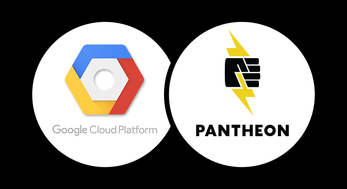

Pantheon has switched infrastructure providers from Rackspace to Google Cloud Platform. This switch requires no downtime, as we actually did it *six months ago*! Read the announcement [here](https://pantheon.io/blog/pantheon-moves-google-cloud-platform).
