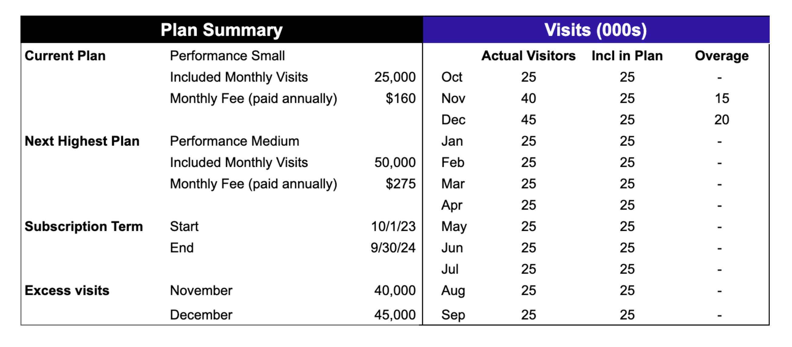
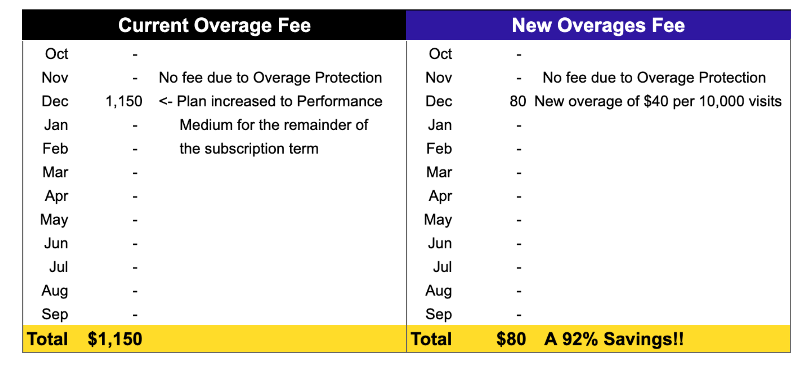

## What is changing?
Great news! Pantheon is simplifying the way we calculate and apply site visit overages. This change will help reduce excess billing and unplanned costs should a site exceed its plan limits.

This change is effective for site visits on or after January 1, 2024.  In order to transition to the new overages model and allow you, the customer, to digest this change Pantheon will not run an overages process in February 2024.  This new program will be formally launched in March 2024 and the initial month’s processing will encompass usage from January and February of 2024.  

### The new overage charge policy
Effective for usage starting on January 1, 2024, overages will be billed $40 for each 10,000 unique site visits (a unique site visit is defined as a specific IP address and user agent combination over a 24-hour period) or portion thereof that exceeds the amount of included unique visits in the subscription.  This applies uniformly to all sites running on the platform at all subscription levels.

In addition, with Overage Protection, all Pantheon customers, except for Basic plans and monthly subscriptions, will have one month of overages waived every 12 months during the subscription term.  For simplicity, the 12-month period will follow a calendar year running from January through December. This Overage Protection will be applied automatically on the first month of each plan year where your site is over the included unique visits in the subscription- you do not have to do a thing.

Lastly, for new customers coming onto the platform for the first time there will be a three-month grace period starting with your service start date (the day a site is first  moved from a Sandbox to a commercial plan) where no overages will be incurred.  This allows you the time to get calibrated on the platform and focus on what is most important: the successful launch of your web site(s) on Pantheon!

### The prior overage charge policy
Prior to this change, if a site exceeded the unique site visits included in the subscription plan, the plan would be automatically upgraded to a higher plan level that was a better fit for the amount of unique site visits. Many times that increase would result in a surprise to customers, who hadn’t budgeted for increasing the plan for the remainder of the subscription term, and the cost would be more than what customers thought was fair. **We listened, and we’re making this change to make Pantheon a brand you trust even more**.

## Will you show me an example of how this works?
### Example scenario
Assume you purchase an annual Performance Small plan that includes 25,000 unique monthly site visits starting October 1st. The cost of a Performance Small plan is $160 per month (paid annually).  Note that the next plan level up is a Performance Medium plan that includes 50,000 unique monthly site visits is $275 per month (paid annually).

During the holiday season, you have 40,000 unique site visits in November and 45,000 in December, before returning to less than 25,000 monthly unique site visits during the rest of your contract term (Jan-Sep).

#### Overage fee under the new policy
Under the new policy, you will simply pay a one-time fee of:
$   0 	for November’s extra 15,000 visits because Overage Protection allows 1
free month of overages, and
$ 80 	for December’s extra 20,000 visits.

#### Overage fee under the old policy
Because you exceeded the plan limits of 25,000 for two consecutive months, under the old policy your plan would have been automatically upgraded to the Performance Medium plan starting in December. This would have increased your monthly cost from $160 to $275 a month, or an additional $115 per month. Since the plan change occurred in December and you still had 9 months remaining on your term, this increase would have cost $1,035 extra, which would be charged to your credit card in January or you would have received an additional invoice for plans on contract.

#### Comparison of the new vs. old overage fee
As you can see in this example, the new overage fee is a total of $80 vs. the cost for the upgraded plan under the prior policy would have increased your cost $1,035 –- the new policy saves you 92%!

### Updated documentation
We've updated our [Overage Policy documentation](/guides/account-mgmt/traffic/overages) to align with the new policy and provide more specifics, such as additional benefits for new site launches and qualifying nonprofit organizations.
