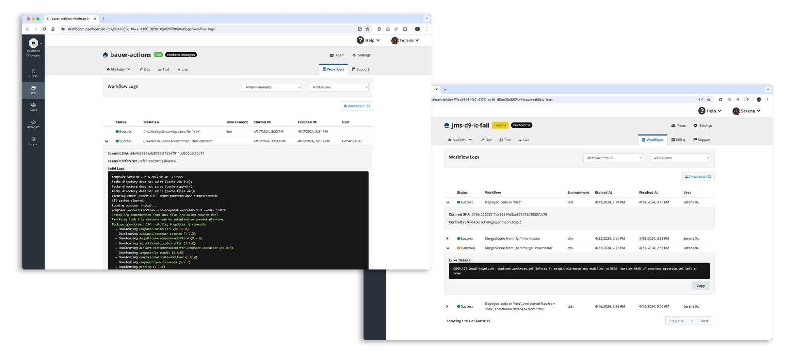

We're announcing Workflow Logs, a powerful new feature for enhanced visibility and troubleshooting operations on the Pantheon platform. The feature can be accessed directly from your site dashboard, adjacent to the Support tab.

## Key features
* **Status overview**: View key information on the status of workflows, including progress statuses, along with additional details such as start time, end time, initiating team member, and environment.
* **In-depth details**: Access code sync, error details, build logs, and Quicksilver posted messages from the expandable sections.
* **Filtering**: The workflows displayed comprise a curated list of user-relevant workflows. Further narrow your focus by utilizing filters to quickly find specific workflows by environment or completion status.
* **Archiving**: Export all visible workflows to a CSV file for archival purposes with the **'Download to CSV'** button.

[View all features](/workflow-logs)

## Request early access

If you're interested in getting early access to Workflow Logs, we invite you to join our early access program. Simply fill out the [request form](https://docs.google.com/forms/d/e/1FAIpQLSfky2c4oEOv6Wyq9drp0oxh8hhP3Zkphb_e1GlV7RK_aHzvug/viewform) to apply. This will allow you to start using the feature and provide us with valuable feedback to help improve it further.

Our team will continuously enhance Workflow Logs through a planned list of improvements as well as collected feedback throughout the early access program.
