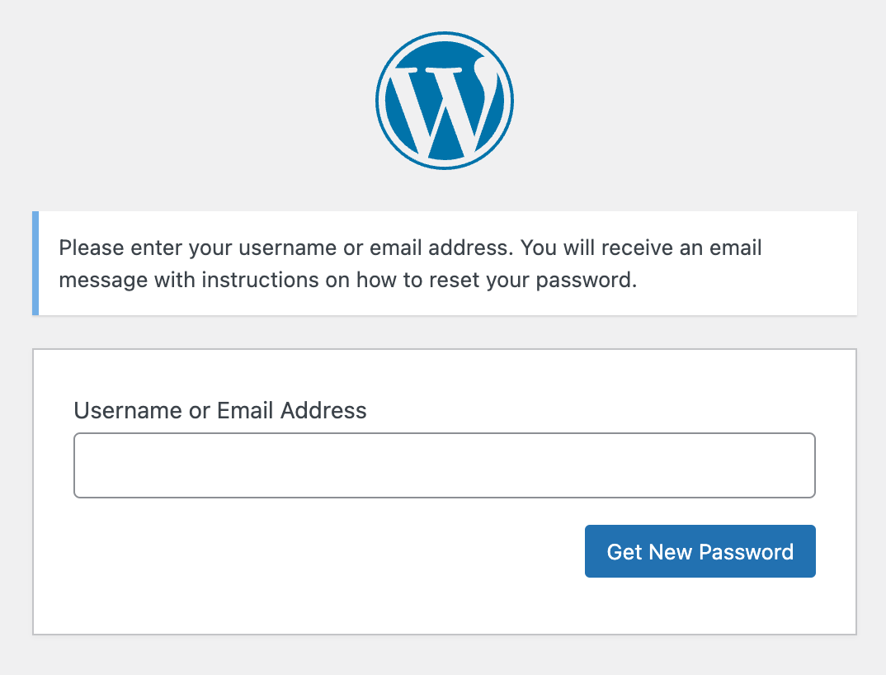

Beginning this week, Pantheon will begin cutting over individual WordPress and Drupal sites to use Sendgrid's API for the delivery of outgoing email initiated by these CMSes. We expect all sites to be cut over by May 31st. This change is happening at the platform level, not CMS code or configuration, and therefore requires no action by customers. This change should not be noticeable by most customers aside from increased reliability of emails initiated by WordPress and Drupal.

WordPress and Drupal core can trigger transactional emails for behaviors like the "Forgot Password" flow that allows someone to reset their password after receiving an email.

Historically Pantheon has relied on a local MTA (postfix) to send these messages and it has been common for such emails to be categorized as spam or otherwise fail. For teams for whom the delivery of such transactional emails is crtical to operation, we have recommended relying on third party services and continue to do so even as we make our platform-level emails more reliable with this switch to Sendgrid.
