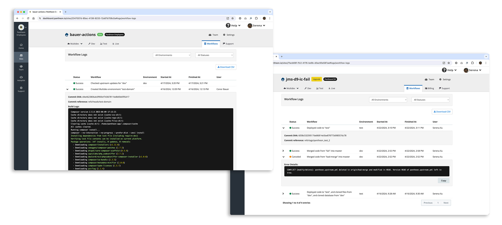

We’re excited to announce the launch of Workflow Logs, a powerful new feature enhancing visibility and streamlining troubleshooting operations on the Pantheon platform. Accessible directly from your site dashboard, next to the Support tab located in the top right corner, Workflow Logs provide critical insights for effectively managing your workflows.

## Key features:
* **Status overview**: View key information on the status of workflows, including progress statuses, along with additional details such as start time, end time, initiating team member, and environment.
* **In-depth details**: Access code sync, error details, build logs, and Quicksilver posted messages from the expandable sections.
* **Filtering**: The workflows displayed comprise a curated list of user-relevant workflows. Further narrow your focus by utilizing filters to quickly find specific workflows by environment or completion status.
* **Archiving**: Export all visible workflows to a CSV file for archival purposes with the 'Download to CSV' button.

[View all features](/workflow-logs)

Our team will continuously enhance Workflow Logs through a planned list of improvements and ongoing feedback collection.
