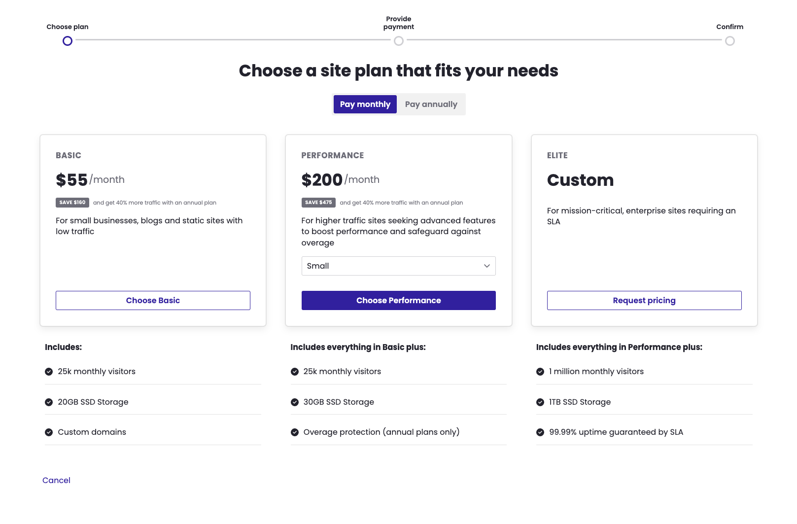

Pantheon has revamped the user flow for managing site plans, enhancing the overall checkout experience with streamlined processes and improved usability.

### Highlights
- **Streamlined user flow:** The new design simplifies the checkout process and improves plan comparisons, resulting in a smoother and more intuitive experience.
- **Adhere to accessibility standards:**  We've improved inclusivity and usability by meeting accessibility guidelines and enhancing navigation for all users.
- **Align with the Pantheon Design System:** This ensures consistent visual design, layout, and user interface elements across our platform.

For instructions on selecting your site plan, please visit our [documentation](/guides/launch/plans/).
