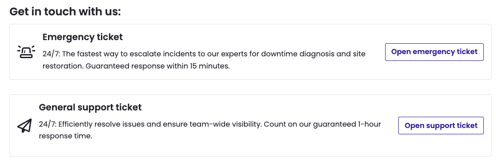

In our ongoing commitment to enhance the clarity of our support options, we are renaming Pantheon's '**On-call help**' to '**Emergency ticket**.' This phased rollout will first impact support at the workspace level, with changes to site-level support coming in the next phase.

For users accessing support from the site level, you will still see 'On-call help' for now. Rest assured, this is simply a name change, and it does not impact the scope of our service. The same level of support will continue to be provided.

### Emergency ticket
Available exclusively to Platinum and Diamond customers, this option is for business-critical issues requiring immediate attention. Emergency tickets are escalated directly to our Support team, including during off-hours, ensuring a rapid response and resolution.

### General support ticket
Available to Gold, Platinum, and Diamond customers for other support needs. Gold customers should use this option for site downtime or urgent issues, which will be handled promptly.
Learn more about [support features for different account tiers](/guides/support/#support-features-and-response-times).

