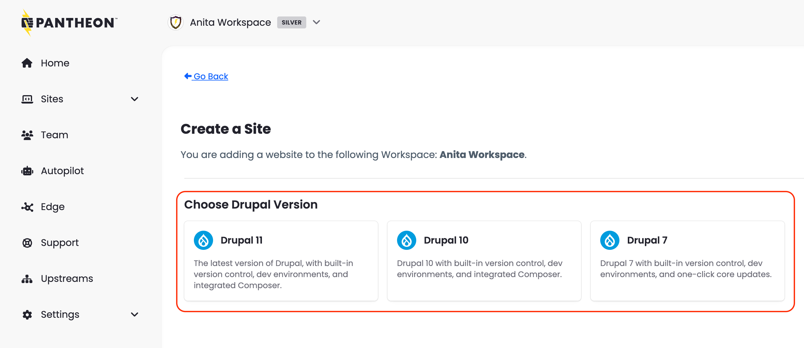

Drupal 11 is now available as an option when creating a new Drupal site on Pantheon. Previously, in order to create a new Drupal 11 site you had to first create a Drupal 10 site and then manually upgrade to Drupal 11 via Composer.

See [related documentation](/guides/getstarted/addsite/#create-a-new-cms-site) for how to create new CMS sites on Pantheon.
