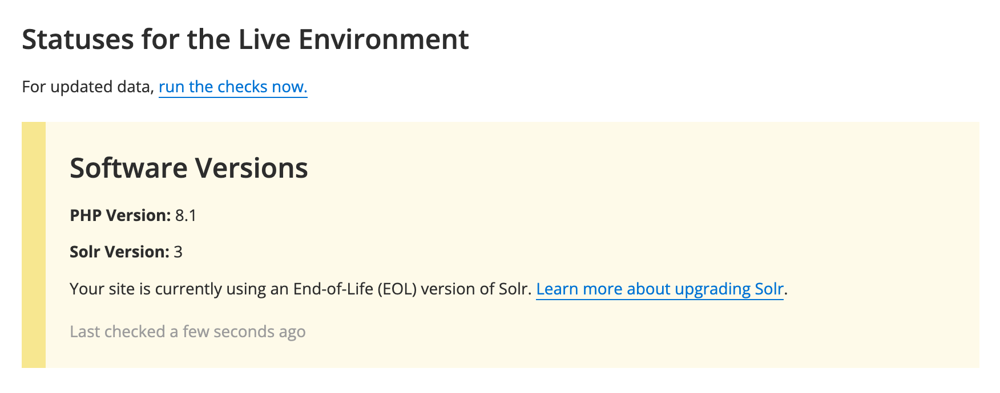

We have rolled out a new **Site Status Block** to improve visibility into software versions, helping customers track whether their site’s software is end-of-life (EOL).

## Features and Access
- **Location**: Access the status block via **Pantheon Dashboard** > **Site** > **Status**.
- **Software Coverage**: The block shows version information for **PHP** and **Solr**.

### PHP Version Status
- PHP 8.0 and below are [end-of-life](https://www.php.net/supported-versions.php). [Upgrade to PHP 8.2](https://docs.pantheon.io/guides/php/php-versions) or above for full security coverage.

### Solr Version Status
- Pantheon provides Solr versions 3 and 8. Version 3 is end-of-life. We recommend [upgrading to Solr 8](https://docs.pantheon.io/guides/solr-drupal/solr-drupal#configure-the-version). Solr 8 support for Drupal 7 is in progress.

### Redis Recommendation
- Redis versions aren’t shown in the new block currently, but we recommend [upgrading to Redis 6.2](https://docs.pantheon.io/pantheon-yml#specify-a-redis-version).

This addition helps you easily monitor and maintain your site's software for improved performance and security. For more information on other reports you can run on the Status tab, see the following:

* [Launch Check - WordPress Performance and Configuration Analysis](/guides/wordpress-pantheon/wordpress-launch-check)
* [Launch Check - Drupal Performance and Configuration Analysis](/drupal-launch-check)