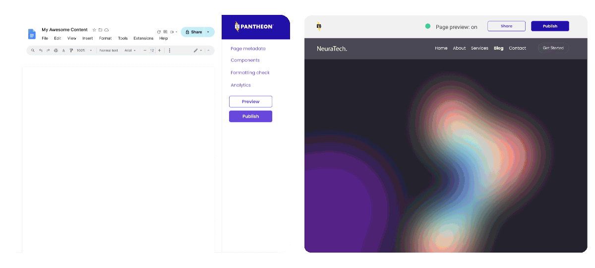

Pantheon is now accepting customers into a [private beta for our Content Publisher](https://pantheon.io/platform/content-publisher).

With Pantheon Content Publisher, your team can now safely publish content directly from Google Docs to Drupal, WordPress, or Next.js sites—quickly and seamlessly. Skip the extra steps and empower everyone who writes and collaborates can participate in publishing to the web.

## Here’s what you can expect:

* **Docs > Website:** Draft, edit, preview, and publish faster without leaving Google Docs.
* **Live preview:** See exactly how your content will look before it goes live and see changes in real-time.
* **Seamless collaboration:** Use comments and suggestions in Google Docs to streamline teamwork.
* **Control:** Manage permissions and oversee all published docs from a central dashboard.
* **Components:** Use your sites components (React or SDC), insert them in Google docs and preview how they look prior to publishing.
* **Safe:** Avoid copy-paste mistakes and ensure content accuracy.

Be among the first to experience Pantheon Content Publisher — request [beta access](https://pantheon.io/platform/content-publisher) today!
