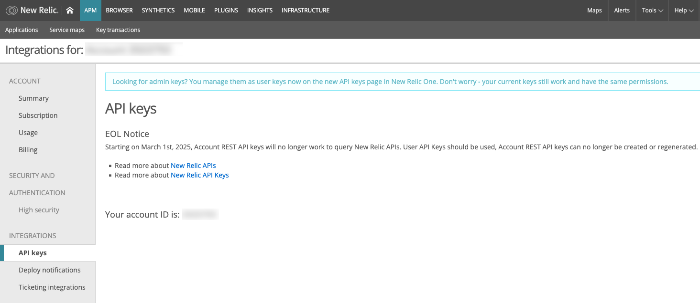
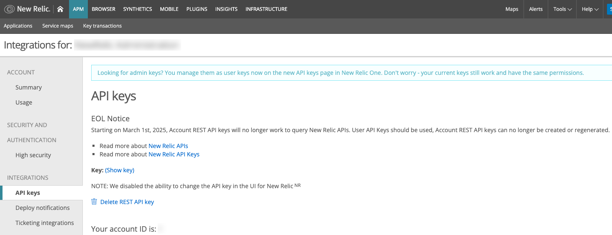

_**Editorial note:** The date for when this change will occur was originally published as March 1, 2025 but has since been updated to March 3, 2025._

To improve API security, New Relic will retire legacy REST API keys on **March 3, 2025**. These keys are used to access REST API v2 endpoints. To continue to utilize these endpoints, you will need to generate a new API Key. You can read more about this end-of-life in [this Forum post](https://forum.newrelic.com/s/hubtopic/aAXPh0000008RJBOA2/upcoming-endoflife-rest-api-keys).

## How to check if you're affected
Not all accounts use REST API keys. To check if you need to take action:

1. In New Relic, click on your **profile icon** (bottom left) and select **API Keys**.
1. Click **REST API Key** on the right side of the page.

  This will load the legacy New Relic UI. The following image is an example of an account that _does not_ have a REST API key associated with it.

  

1. If a key is listed, your account uses a REST API key. If no key appears, your account is unaffected.

  The following image is an example of an account that has a REST API key associated with it. Note that when present, you have options to show the key (which will show the first few characters, not the entire key) and delete it.

  

**Tip**: REST API keys start with the prefix **NRAA** or a random combination of letters and numbers.

## What to do if you have a REST API key

1. **Create a new user API key** — this can be done in the [New Relic UI](https://docs.newrelic.com/docs/apis/intro-apis/new-relic-api-keys/) or via [NerdGraph](https://docs.newrelic.com/docs/apis/nerdgraph/examples/use-nerdgraph-manage-license-keys-user-keys/).
1. **Replace the old REST API key** with the new user API key in your environment.

## What happens if you don’t update your keys by March 3rd?
If you don’t replace the old keys by the deadline, any workflows relying on these keys will stop functioning as intended. Generating a new key and replacing the old key will restore functionality.