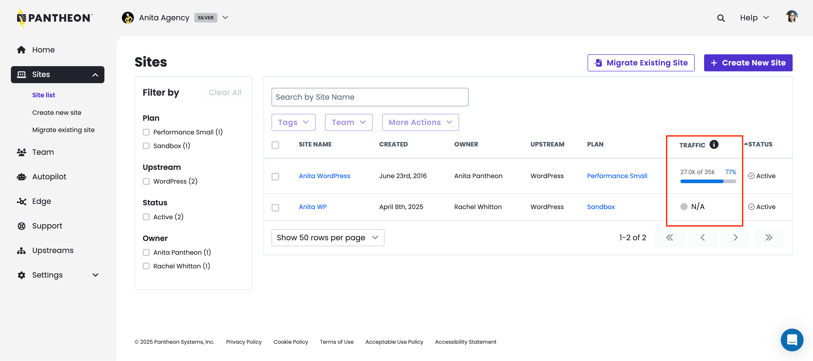

We've added a new **Traffic** column to the site list of workspaces, enabling clearer visibility into traffic usage across all sites. This data resets at the end of your billing period. The metric visualized in this context is [**Site Visits**](/guides/account-mgmt/traffic#site-visits). 

## Key Benefits
* **Transparent Usage Insights:** See exactly how much traffic each site is using in relation to its plan.
* **Simplified Billing Reconciliation:** Eliminate guesswork when matching traffic usage across multiple sites. 
* **Portfolio-Level Clarity:** For teams managing many sites, this view offers a clean roll-up and drill-down experience that makes it easier to manage resources.

For more details on how to measure site traffic, see [related documentation](/guides/account-mgmt/traffic).

_**Editorial note:** [Automated overages are still currently paused for all users](release-notes/2024/08/overage-charges-updates). This change is to help you better monitor site traffic._
