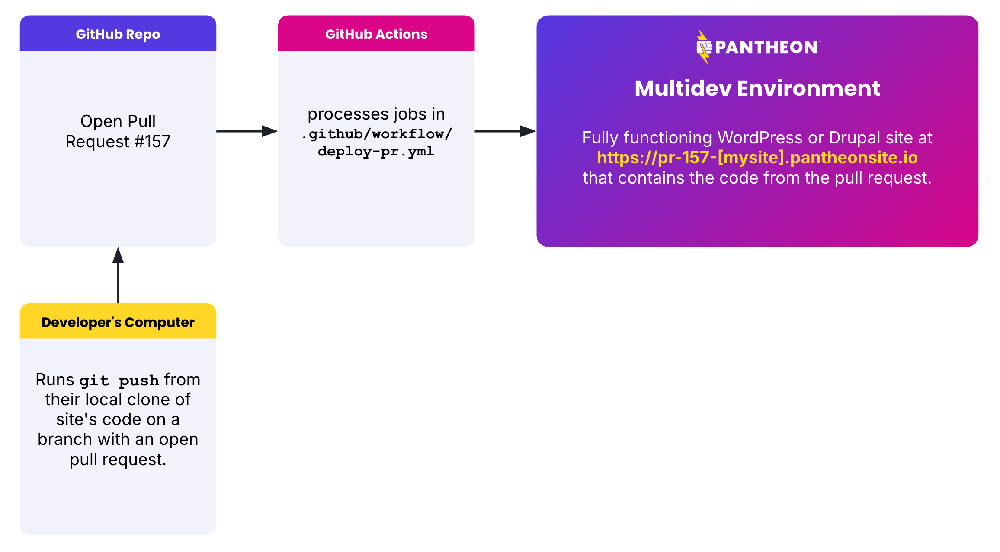
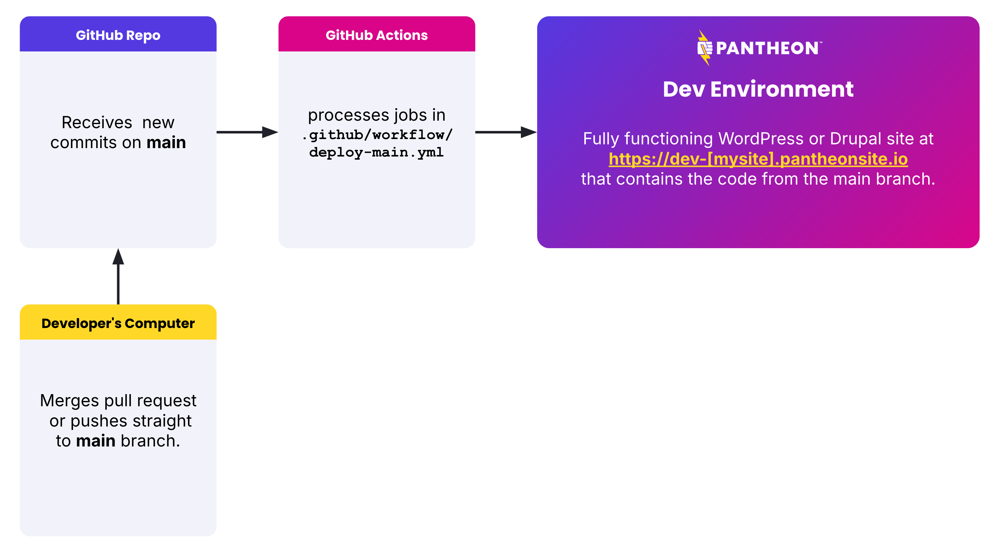

[Today we releasing a new "Push to Pantheon" GitHub Action](https://github.com/pantheon-systems/push-to-pantheon).
This Action provides a reusable step so that, in a few lines of yml, teams using [GitHub Actions](https://github.com/features/actions) and Pantheon together can push their code from GitHub to Pantheon inside of a larger workflow that they control.

This Action is designed to create [a Multidev](https://docs.pantheon.io/guides/multidev) environment environment for each pull request:



Here is the configuration that would go within a `.github/workflows/deploy-pr.yml` file to accomplish this workflow.

```
jobs:
  push:
    permissions:
      deployments: write
      contents: read
      pull-requests: read
    runs-on: ubuntu-latest
    steps:
    - uses: actions/checkout@v4
    - name: Push to Pantheon
      uses: pantheon-systems/push-to-pantheon@0.6.0
      with:
        ssh_key: ${{ secrets.PANTHEON_SSH_KEY }}
        machine_token: ${{ secrets.PANTHEON_MACHINE_TOKEN }}
        site: ${{ vars.PANTHEON_SITE }}
```

The Action can push code to the Pantheon Dev environment upon pull request merges (or direct pushes to a `main` branch).



See [the readme file within the repository](https://github.com/pantheon-systems/push-to-pantheon) for full usage instructions.

While this Action is already in use on live websites we recommend testing it thoroughly with your own sites before fully relying on it.
Prior to the 1.0.0 release, we recommend that only teams with pre-existing continuous integration experience adopt this Action.
In addition to this Action that is meant for teams interested in customing their Continuous Integrations workflows, we are also developing [a direct GitHub Integration meant for simplicity](/release-notes/2025/05/github-application).

For questions and support, [please use the issue queue on the repository](https://github.com/pantheon-systems/push-to-pantheon/issues).
For more background on why we made this Action and how it fits in our ecosystem, see [this blog post from Director of Developer Relations, Steve Persch](http://www.pantheon.io/blog/github-action).
