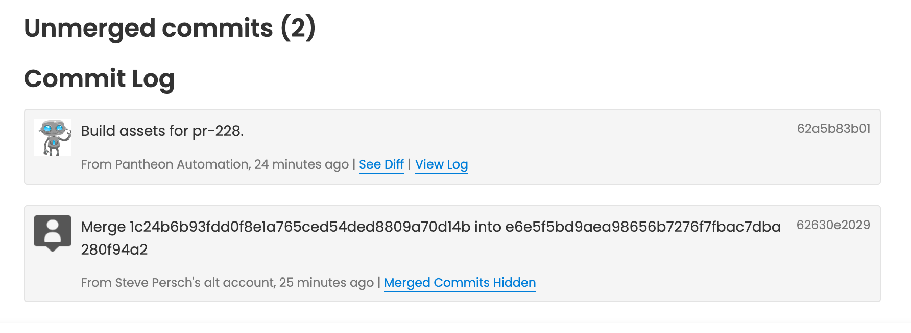

We have released [version 0.6.1](https://github.com/pantheon-systems/push-to-pantheon/releases/tag/0.6.1) of the ['Push to Pantheon' GitHub Action](https://github.com/pantheon-systems/push-to-pantheon). This version updates the version of the [Terminus GitHub Action](https://github.com/pantheon-systems/terminus-github-actions) dependency, updates documentation in the [README](https://github.com/pantheon-systems/push-to-pantheon/blob/0.x/readme.md), and updates the default git user and email for build asset commits to match existing standards (Pantheon Automation). This is also the first version available in the [GitHub Action Marketplace](https://github.com/marketplace/actions/deploy-site-to-pantheon).



For more details, please refer to the [0.6.1 release notes](https://github.com/pantheon-systems/push-to-pantheon/releases/tag/0.6.1). To update to the latest version, modify your workflow file to use `0.6.1`:

```yaml
uses: pantheon-systems/push-to-pantheon@0.6.1
```
