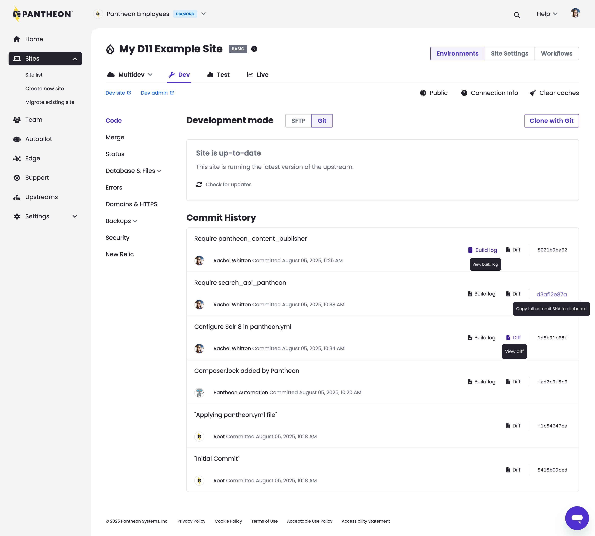

A new beta experience for a freshly modernized Site Dashboard is rolling out across the platform starting now and will be available to all users over the coming weeks. If you want access immediately (without waiting for the platform rollout to finish) you can [submit this form](https://forms.gle/jzERvoCUzD7U7iqs7). 

### Enable the new beta experience 

Once rolled out, users will be prompted to toggle this new beta experience from the site list of a given Workspace:  

When the toggle is “on,” the new beta experience of the site dashboard will be enabled. All site dashboards opened from this view will use the new beta experience.

<Alert title="Note" type="info">

Please note the toggle setting is specific to each user. If multiple users have access to the workspace, the toggle’s setting (on /off) will NOT impact others. 

</Alert>

### What to expect 

* **Same functionality, familiar workflows** – No need to relearn anything. Your day-to-day tasks remain unchanged.
* **Modern, accessible design** – We’ve made significant improvements to align with the latest usability design standards, enhancing readability, contrast, and navigation.
* **Performance improvements under the hood** – While this beta may feel mostly visual, we’ve reworked key infrastructure for long-term speed and reliability.
* **Small but powerful UX upgrades** – New conveniences like one-click to copy the commit SHA, along with other thoughtful touches for enhanced usability.

### Other details
* **Sections in progress** – A few parts of the dashboard are still in development and will roll out over the course of the beta program:
  * Site team
  * Domain management
  * New Relic 
* **Easily switch back** – If you need to, you still have access to the current dashboard.
* **Share feedback** – We have a dedicated Slack channel for beta participants where you can easily ask questions and discuss feedback with the Pantheon product and engineering team. To request an invite, [submit this form](https://forms.gle/jzERvoCUzD7U7iqs7).

