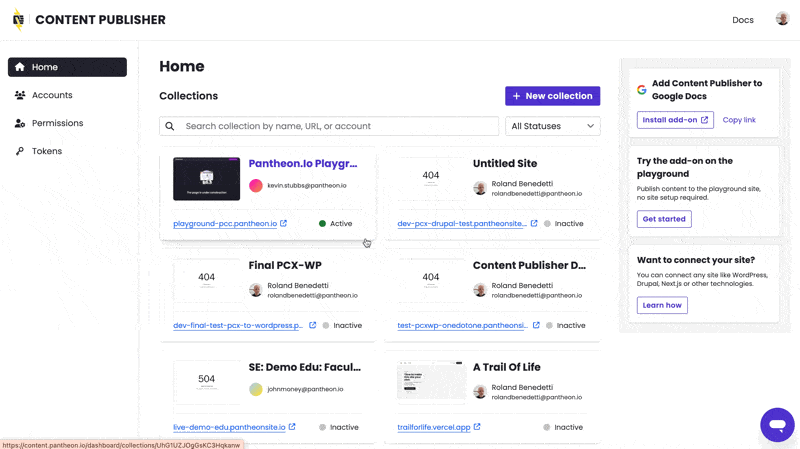
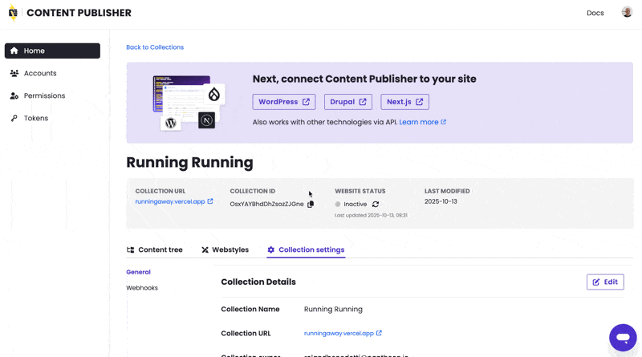
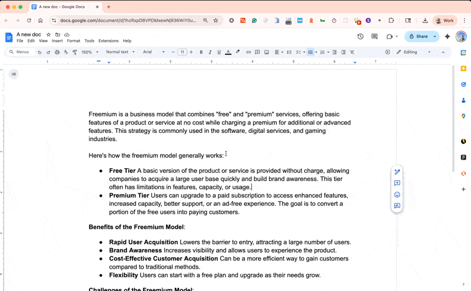

We’ve been releasing a few improvements and bug fixes to Content Publisher over the last week. Here are the main changes:
## Disconnect your Google Workspace connected accounts.
Content Publisher allows you to connect one or several Google Workspace to your Content Publisher content workspace. This feature is called [Connected Account](https://docs.content.pantheon.io/accounts). Until now, you would only be able to connect accounts but not to disconnect, this was managed by our support team when needs be. We added the ability for you to disconnect accounts, without losing any of your content.

## Refresh the status of your collections.
Content Publisher allows you to connect your content collections to your website(s) in order to publish content there. This connection happens on the website side. To work properly, Content Publisher needs to monitor the status of your website’s connection to Content Publisher. This monitoring was asynchronous and not frequent enough. We accelerated the frequency and speed of this check and also added a button to let you refresh your site connection status in case the background check was not up to date. This ensures that your website's connection status is always up-to-date, providing a more reliable publishing experience.

## Improve connectivity from gmail.com
To better let individual users experience the solution, it is now possible to use Content Publisher playground with your gmail personal account.

We also released several minor bug fixes, UX enhancements and formatting issues which don’t affect the functionalities but all improve the end user experience.