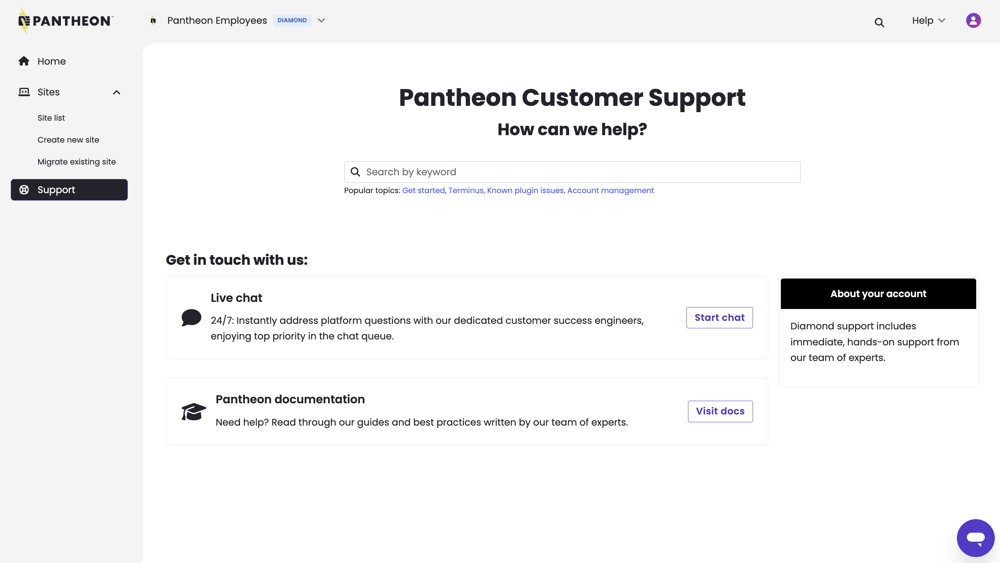

Effective October 22, 2025, the "Unprivileged" user role will be transitioned to a new "Contributor" role. Permissions will remain exactly the same, except that Contributors will have limited access to Workspaces in the Pantheon Dashbard. This update is to ensure that all Pantheon users have access to the modern dashboard experience. 

No action is needed by site owners or workspace administrators. 

## Key changes
* The name will change from Unprivileged to Contributor 
* Contributors will have limited access to Workspaces:

| Workspace Context             | Contributor Permission     | 
|:----------------------------- |:-------------------------- |
| Home                          |⚠️ <Popover title="" content="Total number of sites and team members are not shown." />|
| Sites > Site list             |⚠️ <Popover title="" content="Only sites they create and sites they have been added to will be shown." />|
| Sites > Create new site       |✔|
| Sites > Migrate existing site |✔|
| Team                          |❌|
| Autopilot                     |❌|
| Edge                          |❌|
| Support                       |⚠️ <Popover title="" content="The option to start a live chat and search documentation will be shown, but they cannot open tickets or see workspace ticket history." /> |
| Upstreams                     |❌|
| Settings > Billing            |❌|
| Settings > Profile            |❌|

Users assigned this role will retain access solely to the sites for which they have been explicitly granted permission. They will not be authorized to modify Workspace configurations, access billing information, create custom upstreams, or perform other administrative functions. If these users are in multiple Workspaces, they will continue to have access to the Workspace Selector to change which Workspace they are currently working in.

Here's what you can expect a Contributor to see when accessing the Workspace home context: 

