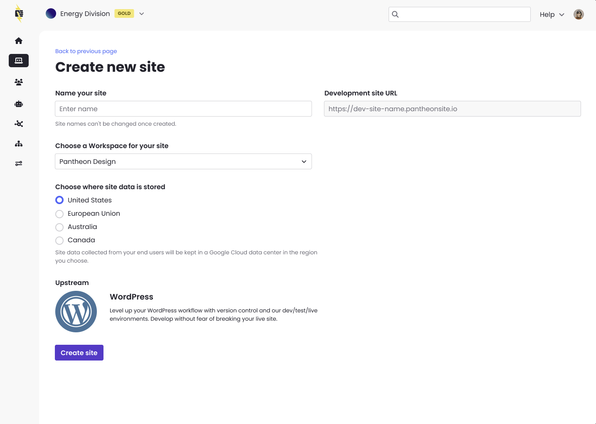
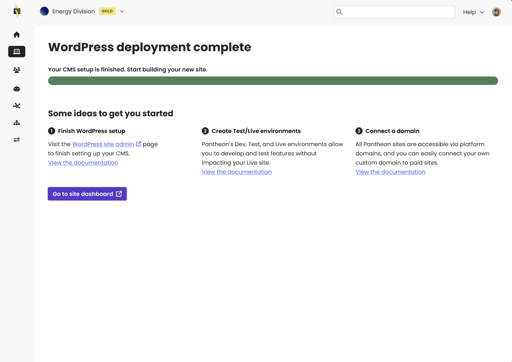

Pantheon has rolled out a modernized site creation experience across the platform and is now available for all Pantheon users on the Pantheon dashboard. 

## What to expect
* Same functionality, fewer loading screens – The process and workflow is the same, with fewer “loading” screens.
* Modern design – We’ve made improvements to align with the latest usability design standards.
* Redesigned final step - When your site deployment is complete, documentation and a link to complete setting up the site (in Drupal or WordPress) is immediately available to you on a redesigned screen.

Share questions and feedback in our Community Slack.
