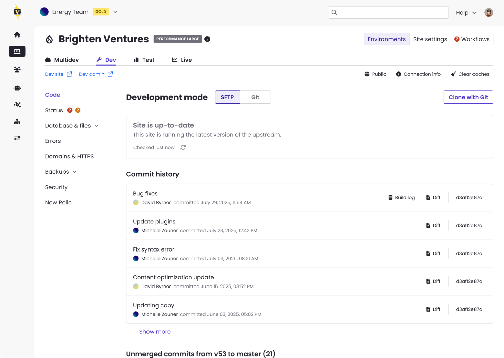
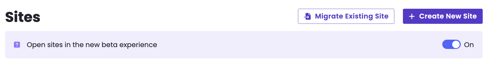

The beta site dashboard experience is now the default experience for Professional Workspace dashboard users. On login, Professional Workspace users will find that their site dashboards have been upgraded. Users can opt out for now by turning the beta experience ‘off’ via a toggle on their Site List page.

## How to access
The beta experience is controlled with a toggle on the Site List page.

When the toggle is **“on,”** the site dashboard beta will be enabled. All sites that a user has access to in that workspace will open in the new beta experience when their name is clicked in the site list. 

**Please note the toggle setting is specific to each user.** If multiple users have access to the workspace, the toggle’s setting (on /off) will NOT impact others. 

## What to expect 

✅ **Same functionality, familiar workflows** – No need to relearn anything. Your day-to-day tasks remain unchanged.

✅ **Modern, accessible design** – We’ve made significant improvements to align with the latest usability design standards, enhancing readability, contrast, and navigation.

✅ **Performance improvements under the hood** – While this beta may feel mostly visual, we’ve reworked key infrastructure for long-term speed and reliability.

✅ **Small but powerful UX upgrades** – New conveniences like one-click to copy the commit SHA, along with other thoughtful touches for enhanced usability.

## Other details worth sharing?
* **Easily switch back** – If you need to, you still have access to the current dashboard.
* **Share feedback** – There is a link at the top of the beta site dashboard called ‘Submit beta feedback’ you can use to share feedback with the team.
