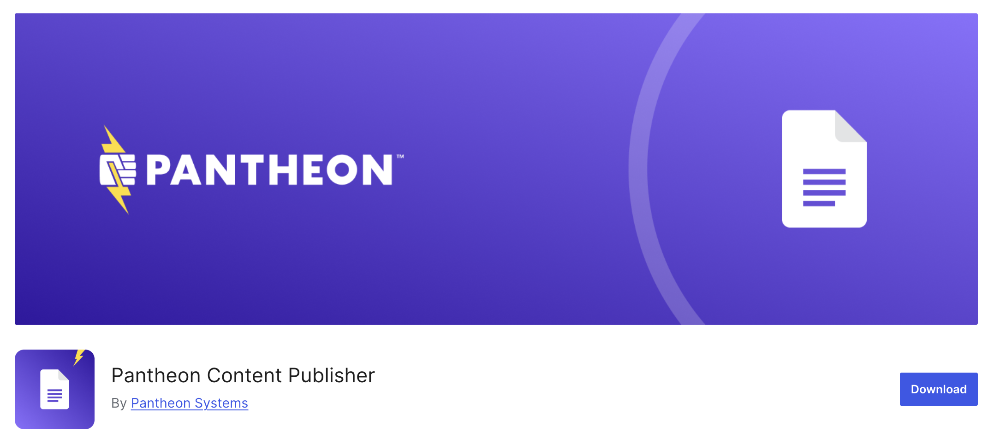

The **Pantheon Content Publisher** plugin is now officially available in the [WordPress Plugin Repository](https://wordpress.org/plugins/pantheon-content-publisher/). You can now install or update it directly from your WordPress dashboard.

We recommend that all customers switch their sites to the WordPress.org–hosted version to take advantage of seamless updates and improved long-term support. By switching, you’ll:

- **Receive automatic update notifications** and one-click upgrades within the WordPress admin panel  
- **Stay up to date** with the latest security, stability, and compatibility improvements  
- **Benefit from WordPress’s official distribution system**, including built-in changelogs, and version tracking  

Switching to the [repository version](https://wordpress.org/plugins/pantheon-content-publisher/) helps ensure your site runs the most stable and officially supported release of the plugin.