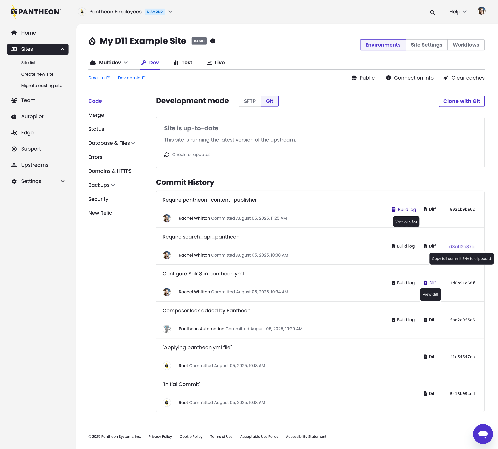

Starting today, the new Site Dashboard enters General Availability for Professional Workspaces. 

Previously, enabling the new experience required users to opt in via a toggle located at the top of the Site List tab. That toggle has been removed from Professional Workspaces and the new experience is no longer optional and cannot be disabled.

Personal Workspaces are not impacted by todays change, and still require opting in to enable the new experience.

<Alert title="Note" type="info">

The following highlights what users can expect in the new experience. Note these items have not been added or impacted by todays change but were delivered by our earlier [Beta release](/release-notes/2025/08/site-dashboard-beta#what-to-expect).

</Alert>

* **Same functionality, familiar workflows** – No need to relearn anything. Your day-to-day tasks remain unchanged.
* **Modern, accessible design** – We’ve made significant improvements to align with the latest usability design standards, enhancing readability, contrast, and navigation.
* **Performance improvements under the hood** – While this may feel mostly visual, we’ve reworked key infrastructure for long-term speed and reliability.
* **Small but powerful UX upgrades** – New conveniences like one-click to copy the commit SHA, along with other thoughtful touches for enhanced usability.

