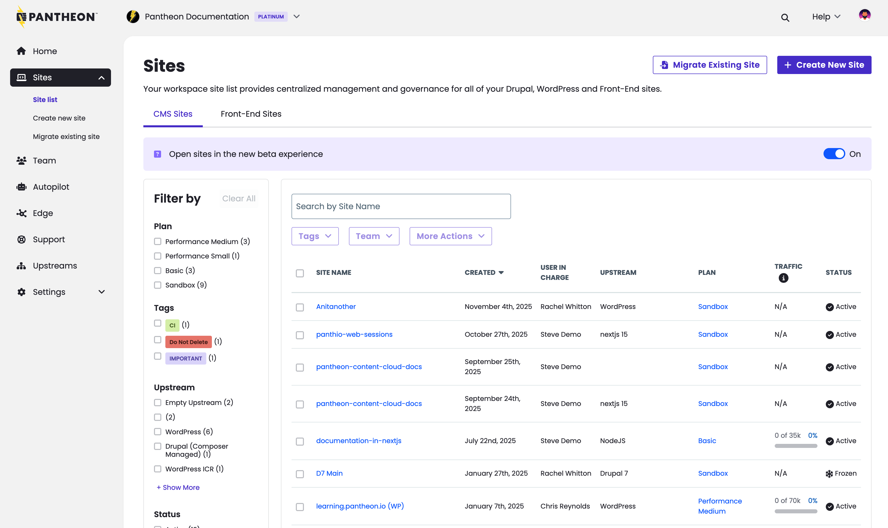

Today, Pantheon's support for Next.js enters [Private Beta](https://pantheon.io/redirect/nextjs/request-access-cta). We encourage anyone running a Next.js site on Front-End Sites [to migrate to our updated infrastructure using this guide](https://pantheon.io/redirects/docs/nextjs/migrating-from-front-end-sites).

Pantheon is investing in updated infrastructure to support Next.js and sunsetting our Front-End Sites offering. For more information, check out [this blog post](https://pantheon.io/redirects/nextjs/beta-blog-post) from Director of Developer Relations, Steve Persch.

What's changing for Pantheon's Next.js support:

* Next.js sites are shown on the Workspace Dashboard within the Site List with your existing WordPress and Drupal sites.

* The Site Dashboard UI is now consistent across frameworks:

* Creating Next.js sites works from both [the command line](https://pantheon.io/redirects/docs/nextjs/cli-tools) and the dashboard:

* [Global CDN now covers Next.js site’s horizontally scalable containers](https://docs.pantheon.io/nextjs/architecture).

For more information on Next.js on Pantheon, see new documentation pages including:

* [Next.js Overview](https://pantheon.io/redirects/docs/nextjs/cli-tools)
* [Runtime Architecture](https://pantheon.io/redirects/docs/nextjs/architecture)
* [Hello World Tutorial](https://pantheon.io/redirects/docs/nextjs/hello-world-tutorial)
* [Content Publisher Tutorial](https://pantheon.io/redirects/docs/nextjs/content-publisher-tutorial)
* [How to migrate from Front-End Sites](https://pantheon.io/redirects/docs/nextjs/migrating-from-front-end-sites)
* [How to manage environment variables](https://pantheon.io/redirects/docs/nextjs/environment-variables)
