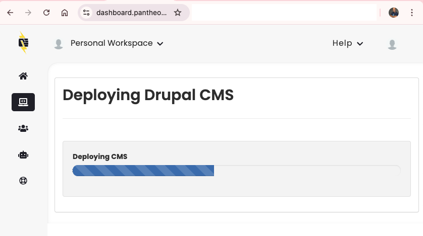
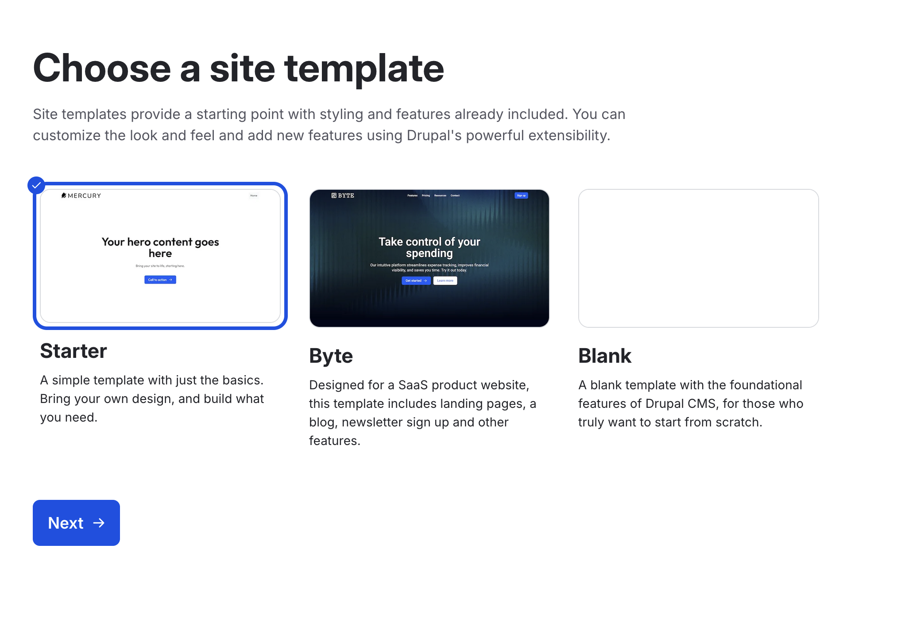
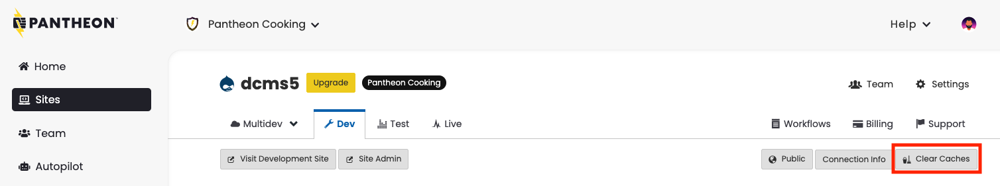

# Drupal CMS

[Drupal CMS](https://www.drupal.org/about/drupal-cms) is a wrapper around Drupal Core.
Drupal CMS builds on the concept of [Recipes](https://www.drupal.org/docs/extending-drupal/drupal-recipes) to [radically reduce the amount of time and expertise required to stand up common functionality](https://pantheon.io/blog/drupal-cms-innovations).
In particular, Drupal CMS is aimed at Marketers and Content Editors who commonly use Drupal, but who may not have the technical expertise to install and configure modules themselves.

For Pantheon's developer-centric community, Drupal CMS can be used as a reference point and proving ground for recipes.

After trial usage of recipe combinations in sandbox sites, experienced development teams can then replicate their favorite recipes on new or pre-existing live sites, or provide those recipes for an easy deployment on their sites for less experienced users.

Recipes also reduce the time and knowledge it requires to install and setup some functionalities and modules. While in the past installing some specific modules would require having a minimum knowledge of what we are installing, how to configure them, etc, in the era of the Drupal recipes adding new functionality to any site has been highly simplified.

### Drupal CMS 2.0

CMS 2.0 introduces several architectural changes over the 1.x release. See the following sections for more details:

* [Upgrading from Drupal CMS 1.x to 2.0](#upgrading-from-drupal-cms-1x-to-20)
* [Changes from CMS 1.0 to 2.0](#changes-from-cms-10-to-20)


## Installing Drupal CMS on Pantheon

Drupal CMS can be installed in a fresh sandbox site on Pantheon.
[This link will take you straight to site creation with Drupal CMS in the dashboard](https://dashboard.pantheon.io/sites/create?upstream_id=462d08e2-3322-48a1-b150-f12a075eaabe).



If you prefer, you can also create a new site with Drupal CMS using [Terminus](/terminus):

```bash
terminus site:create <your_site_name> "Your Site Name" drupal-cms-composer-managed --org=<your_optional_org_id>
```

After the site creation process provisions a database, code, and other resources, use the browser-based installer to set up your Drupal CMS site.



## Troubleshooting common issues with Drupal CMS

In addition to Recipes, Drupal CMS elevates other new technical constructs within Drupal that can be challenging to troubleshoot or raise the importance of workflow clarity.

### Timeouts and Errors during Drupal CMS Installation

Selecting a large number of recipes during installation seems to correlate with an increased likelihood of timeouts and errors.

These timeouts can result in a partially completed installation where the site displays a generic error:

> **The website encountered an unexpected error. Try again later.**

When this happens, the watchdog logs (`drush watchdog:show`) will typically show `PluginNotFoundException` errors for one or more entity types, such as:

- `The "klaro_app" entity type does not exist.`
- `The "webform_submission" entity type does not exist.`
- `The "easy_email" entity type does not exist.`
- `The "simple_sitemap" entity type does not exist.`
- `The "search_api_task" entity type does not exist.`

This indicates that certain modules were enabled during installation but their database tables were not fully created before the timeout occurred.

#### Resolving installation errors

1. Clear caches via the dashboard or Terminus:

    

    ```bash
    terminus drush <site>.<env> -- cache:rebuild
    ```

1. If the above step did not resolve the issue, run database updates. This will create any missing entity tables:

    ```bash
    terminus drush <site>.<env> -- updatedb -y
    terminus drush <site>.<env> -- cache:rebuild
    ```

1. If the above steps do not resolve the issue, wipe your database and install again. Wiping can be done via the [dashboard](/site-dashboard) or [Terminus](/terminus/commands/env-wipe).

[See this GitHub issue for more discussion of timeouts and errors during Drupal CMS installation.](https://github.com/pantheon-upstreams/drupal-cms-composer-managed/issues/1)

### Project Browser

Project Browser in Drupal is a tool designed to simplify the process of discovering, evaluating, and installing modules directly from within the Drupal administrative interface. It provides a user-friendly interface that allows site administrators and developers to search for modules, view detailed information about them, and install them without needing to leave Drupal or manually download and upload module files.

#### Project Browser and file system write access

Adding modules and recipes to a site using assumes some version-controlled files and directories are writable by the web server and it also presumes that there is only one web server.

On Pantheon sites, Test and Live environments are locked down for security purposes, and therefore not writable.
Also, on some plans, Test and Live environments have multiple containers that can serve web requests.
This means that Project Browser can only be used on Pantheon in the Dev and Multidev environments when those environments are in SFTP mode.

After using Project Browser to install modules, you must [commit and push the changes to your codebase in order to deploy them to Test and Live](/drupal-configuration-management).

#### Project Browser and Pantheon-provided Composer scripts

If you intend to use Project Browser, first remove the composer scripts that Pantheon provides on site creation. These scripts hook into the Composer lifecycle and can interfere with the Project Browser's ability to install modules and recipes.

Pantheon's upstream configuration scripts are most useful for teams that create and maintain their own upstreams or distributions.
They also provide some helper functionality like keeping the PHP versions declared in `composer.json` in sync with those declared in `pantheon.yml`.

To remove these scripts:

1. Delete the `upstream-configuration` entry from the `repositories` section of `composer.json`:

    ```json
            {
                "type": "path",
                "url": "upstream-configuration"
            }
    ```

1. Delete the `"upstream-configuration` entry from the `require` section of `composer.json`:


    ```json
            "pantheon-upstreams/upstream-configuration": "dev-main",
    ```

1. Delete the `autoload`, `scripts`, and `scripts-descriptions` entries that reference `upstream-configuration` or `DrupalComposerManaged` from `composer.json`.

   **Drupal CMS 1.x sites:**

   ```json
       "autoload": {
           "classmap": [
               "upstream-configuration/scripts/ComposerScripts.php"
           ]
       },
       "scripts": {
           "pre-update-cmd": [
               "DrupalComposerManaged\\ComposerScripts::preUpdate"
           ],
           "upstream-require": [
               "DrupalComposerManaged\\ComposerScripts::upstreamRequire"
           ]
       },
       "scripts-descriptions": {
           "upstream-require": "Add a dependency to an upstream. See https://pantheon.io/docs/create-custom-upstream for information on creating custom upstreams."
       },
   ```

   **Drupal CMS 2.x sites:**

   ```json
       "autoload": {
           "classmap": [
               "upstream-configuration/scripts/ComposerScripts.php"
           ]
       },
       "scripts": {
           "pre-update-cmd": [
               "DrupalComposerManaged\\ComposerScripts::preUpdate"
           ],
           "post-update-cmd": [
               "@php -r \"@unlink('vendor/bin/composer');\"",
               "DrupalComposerManaged\\ComposerScripts::postUpdate"
           ]
       },
   ```

   <Alert title="Note" type="info">

   For CMS 2.x sites, keep the `@php -r "@unlink('vendor/bin/composer');"` line in `post-update-cmd`. Only remove the `DrupalComposerManaged\\ComposerScripts::postUpdate` entry.

   </Alert>

1. Delete the `upstream-configuration` directory from the root of your project:

```bash
rm -rf upstream-configuration
```

[See this GitHub issue for more discussion of updated guidance for these scripts.](https://github.com/pantheon-systems/documentation/issues/9420)

## Upgrading from Drupal CMS 1.x to 2.0

<Alert title="Warning" type="danger">

Drupal CMS 2.0 removes several modules and content types that were included in 1.x. If your site relies on any of the removed packages, upgrading without preparation could result in data loss or a broken site. Always test in a Multidev environment before applying changes to Dev, Test, or Live.

</Alert>

### What changed in CMS 2.0

For a full list of changes, see the [Drupal CMS 2.0.0 release notes on Drupal.org](https://www.drupal.org/project/cms/releases/2.0.0).

Key changes that affect Pantheon sites:

- The `drupal_cms_olivero` theme is removed and replaced by `byte`. After upgrading, your site will show a "missing or invalid theme" error until you switch themes.
- Several content type recipe packages (`drupal_cms_blog`, `drupal_cms_page`, `drupal_cms_news`, `drupal_cms_events`, `drupal_cms_case_study`, `drupal_cms_person`, `drupal_cms_project`) have been replaced by `drupal_cms_site_template_base`.
- New Composer plugins such as `drupal/site_template_helper` must be added to the `allow-plugins` section of `composer.json`, or Integrated Composer builds will fail.
- The `automatic_updates` module is marked as obsolete and should be uninstalled after upgrading.

### Recommended upgrade steps

1. **Create a Multidev environment** to test the upgrade without affecting your live site:

   ```bash
   terminus multidev:create <site>.dev cms2-upgrade
   ```

2. **Review your content**: Identify any content stored in the content types being removed (Blog, Page, News, Events, Case Study, Person, Project). Plan to migrate or recreate this content using site templates before upgrading.

3. **Update your `composer.json`** in the Multidev environment to use CMS 2.0 packages:
   - Update CMS package version constraints from `^1` to `^2`
   - Remove deprecated packages listed above
   - Replace `drupal/drupal_cms_analytics` with `drupal/drupal_cms_google_analytics`
   - Add `drupal/site_template_helper` to `allow-plugins`
   - Add `@beta` stability flags for any content type modules you want to keep

4. **Run updates**:

   ```bash
   terminus drush <site>.cms2-upgrade -- updatedb -y
   terminus drush <site>.cms2-upgrade -- cache:rebuild
   ```

5. **Fix the theme**: After upgrading, switch from the missing `drupal_cms_olivero` theme to `byte`:

   ```bash
   terminus drush <site>.cms2-upgrade -- theme:install byte
   terminus drush <site>.cms2-upgrade -- config:set system.theme default byte -y
   terminus drush <site>.cms2-upgrade -- theme:uninstall drupal_cms_olivero
   terminus drush <site>.cms2-upgrade -- cache:rebuild
   ```

6. **Clean up obsolete extensions**:

   ```bash
   terminus drush <site>.cms2-upgrade -- pm:uninstall automatic_updates -y
   ```

7. **Verify the site**: Check that all pages load correctly, content is intact, and there are no errors in the watchdog logs:

   ```bash
   terminus drush <site>.cms2-upgrade -- watchdog:show --count=50
   ```

8. **Merge to Dev** once you've confirmed everything works as expected in the Multidev environment.

## Applying Recipes from Drupal CMS to existing sites

Recipes from Drupal CMS can be applied to existing Drupal 11 sites using Drush.

For instance, the Remote Video can be installed on an existing site via Drush through Terminus through:

```
terminus drush <site>.<env> -- recipe "../recipes/drupal_cms_remote_video"
```

Again, these recipes should only be applied in development environments where [configuration can be exported and committed to Git](/drupal-configuration-management).

