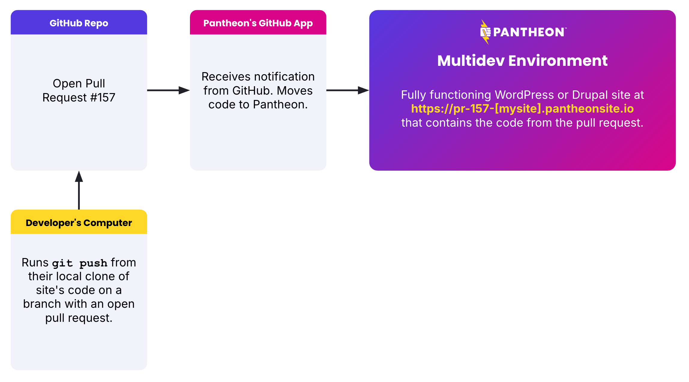

Pantheon's GitHub Application directly integrates a GitHub repository with a Pantheon site.
This allows you to use GitHub as your code repository while still using Pantheon to run your site.

The GitHub Application is currently in private Beta. [Request access for your Pantheon workspace here](https://docs.google.com/forms/d/e/1FAIpQLSf0vYrRbPQBxR-hT8kGJ4bEdYPtpkTtfDvPM89xD2dNZeqLqA/viewform).

Once enabled, this application accommodates a pull request workflow where a Multidev environment is created for each pull request. This allows you to test the code in the pull request before merging it.



Merging pull requests, or pushing code to the `main` branch of the GitHub repository, will automatically deploy the code to the Pantheon development environment.


## Creating a new site

Once accepted into the private Beta, you must install the [Terminus Repository Plugin](https://github.com/pantheon-systems/terminus-repository-plugin).
This is a public Terminus plugin that can be installed normally, e.g. `terminus self:plugin:install terminus-repository-plugin`.
Usage instructions for the specific site creation commands are included in the [README](https://github.com/pantheon-systems/terminus-repository-plugin/blob/main/README.md#creating-a-new-site).

## Try the pull request workflow

To get comfortable using the workflow, you might want to do a few practice pull requests.

First, after the site is created, install the CMS (WordPress or Drupal) within the Dev environment.
Then create the Test and Live environments.

### Make a pull request

Make a local clone of the GitHub repository and make a change to the code.
For example, you could add your favorite plugin or module.

```bash
git clone git[@github](https://github.com/github).com:<your_organization_name>/<your_site_id>.git
```

Make a new branch and then push to GitHub to open a pull request.

```bash
git checkout -b <branch_name>
git push --set-upstream origin <branch_name>
```

Once the pull request is open, the GitHub Application will automatically create a new Multidev environment on Pantheon.

When the Multidev environment is created, you will be able to see it in the Pantheon dashboard.
Verify that your change is working by visiting the Multidev environment URL.

### Merge the pull request

Once you are happy with the change, you can merge the pull request and the GitHub Application will automatically deploy the code to the Pantheon Dev environment.

## Assumptions of GitHub Application

### Multidev is available at to customers with Gold or higher plans

This GitHub Application is designed to work with Multidev environments. Multidev is available to customers on [Gold or higher plans](/guides/multidev). If you are on a lower plan, you can still use the GitHub Application, but you will not be able to use the Multidev features.

### Build processes happen on Pantheon

Our separate [GitHub Action](/github-actions) is designed for more customized workflows that might involve building code elsewhere and deploying to Pantheon. The GitHub Application is designed for teams that want to use Pantheon as their build server.

Currently, Pantheon executes a `composer install` command through our [Integrated Composer](/guides/integrated-composer) feature.
If you need compilation of front-end assets in your WordPress or Drupal theme through something like `npm run build` you should use [our GitHub Action](https://github.com/pantheon-systems/push-to-pantheon) now and [follow this item on our roadmap for eventual inclusion of such functionality within a Pantheon-prodived build step](https://roadmap.pantheon.io/c/115-github-gitlab-and-bitbucket-integration).

### Security and Permissions

The main purpose of the Pantheon GitHub Application is to create a mapping between a repository on GitHub and a website on Pantheon.
Configuring the Application requires granting permission to Pantheon to read one or more GitHub repositories.
This permission granting is tracked at the [Pantheon Workspace](/guides/account-mgmt/workspace-sites-teams/workspaces) level.

People who are members of a Pantheon Workspace and have the Developer role or higher can see all sites in the Workspace.
This means they can see sites on Pantheon even if their corresponding _Github account_ doesn't have permission to view the site's GitHub repository.

<Alert title="Permission to create repositories in a GitHub Organization extends to members of a Pantheon workspace" type="danger" >

When configuring Pantheon's GitHub Application you will have the choice between granting access to individually selected repositories or "all" repositories within your GitHub organization.

Selecting "all repositories" can be more convenient because it allows for faster creation of new repositories and sites. However, by granting Pantheon the "all repositories" permission you also grant that permission to every member of the Pantheon Workspace who has a Developer role or higher.
Depending on the size and nature of your company, you may not want your Pantheon Workspace members to have this permission, especially they are not members of your GitHub organization.

</Alert>

## Limitations prior to General Availability

The GitHub Application is currently in private Beta.

We will address these limitations before the application is made generally available.

### Limited to new projects created by the Terminus

Activating the GitHub Application presently runs through a Terminus command that creates a new site on Pantheon and a new GitHub repository. The GitHub Application does not yet support retrofitting existing GitHub repositories or Pantheon sites.
Follow [this issue](https://github.com/pantheon-systems/terminus/issues/2683) in the queue to find out when this limitation is removed.

### No On Server Development  (SFTP Mode)

New sites made with the GitHub Application do not support "[SFTP Mode](/guides/sftp)" which allows version controlled files to be altered via SFTP or simply by the CMS changing files, as is common with operations like `drush config-export`. We know this limitation will stop some teams from using this application and [we are seeking feedback on how important it is to support this style of working when using 3rd party repositories](https://roadmap.pantheon.io/c/115-github-gitlab-and-bitbucket-integration).

## Support

Before this functionality is made generally available, please direct questions and feedback to [the issue queue on the related Terminus plugin](https://github.com/pantheon-systems/terminus-repository-plugin) rather than general support channels.
