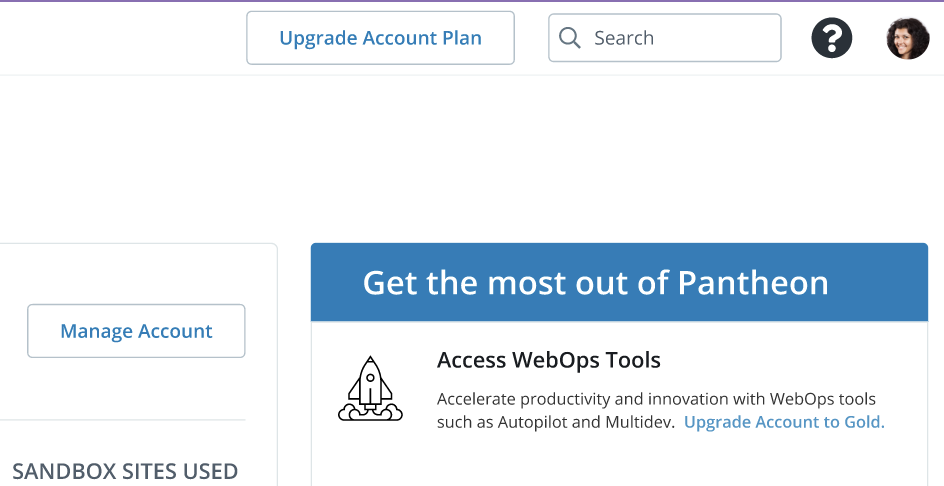
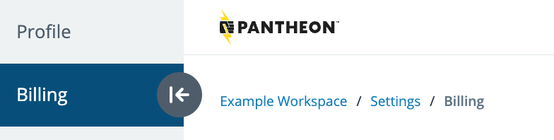

With a Professional Workspace, you can upgrade the associated [Account Plan](https://pantheon.io/plans/pricing) to gain additional features and enhanced support:

## Silver Account Plan

New Professional Workspaces start with a Silver Account Plan by default. The Silver Account Plan is free and offers basic WebOps tools and features. 

## Gold Account Plan 

Professional Workspaces with a Gold Account Plan provide additional collaboration tools such as [Multidev](/guides/multidev), [Custom Upstreams](/guides/custom-upstream), and [Autopilot](/guides/autopilot) with automated visual regression testing. 

To upgrade your Professional Workspace Account Plan to Gold:

1. [Go to the workspace](/guides/account-mgmt/workspace-sites-teams/workspaces#switch-between-workspaces), or [create one](/guides/account-mgmt/workspace-sites-teams/workspaces#create-a-professional-workspace).

1. Click **Upgrade Account Plan** in the banner at the top of the page.

  

1. On the **Select Account Plan** page, click **Select Plan** under Gold, and follow the prompts to add a Payment Method.

1. Once your payment method is accepted, you will be redirected to a Billing page with your Account Subscription details.

  

<Alert title="Note"  type="info" >

Now that you have a Professional Workspace with a Gold Account Plan, you can [add it as a Supporting Workspace](/guides/account-mgmt/workspace-sites-teams/teams#add-a-supporting-organization-to-site) to your site(s) to take advantage of your new features. If you do not yet have a paid site plan, you must purchase one separately from your gold account tier. Site plans are not included in your purchase of a Professional Gold Account Plan.

</Alert>

## Platinum & Diamond Account Plan

Platinum and Diamond Account Plans offer all the tools and features of the Gold Account Plan, and include features that benefit large teams and enterprise organizations such as direct access to experts, advanced support, and more. [Contact Sales](https://pantheon.io/contact-sales) for more information about upgrading to a Platinum or Diamond Account Plan.

## Agency Partner Program

The [Agency Partner Program](https://pantheon.io/partners) is open to web agencies and digital service providers that build and manage sites on Pantheon. All Agency Partners access the same full platform regardless of tier — [Multidev](/guides/multidev), [Custom Upstreams](/guides/custom-upstream), [Autopilot](/guides/autopilot), and more. Your tier affects commission rates and end-customer discounts, not your access to platform features.

Tiers are based on sourced ARR over the trailing twelve months and are reviewed bi-annually:

| Tier | Existing Portfolio ARR | New Business ARR |
|---|---|---|
| Community | $0 | $0 |
| Premier | $25,000+ | $5,000+ |
| Strategic | $100,000+ | $25,000+ |

As an Agency Partner, you receive access to:

- Partner portal for lead registration, commission tracking, sales enablement, and training
- A listing in the [Agency Partner Directory](https://directory.pantheon.io/agencies)
- Commission incentives: Wallet, Lead Bounty, and PayGo Spiff
- End-customer discounts: Premier partners can offer 10% off Year 1; Strategic partners can offer 15% off Year 1

For more information, visit the [Agency Partner Program page](https://pantheon.io/partners) or download the [Agency Partner Program Guide](https://pantheon.io/resources/guide/pantheon-partner-program-guide).

