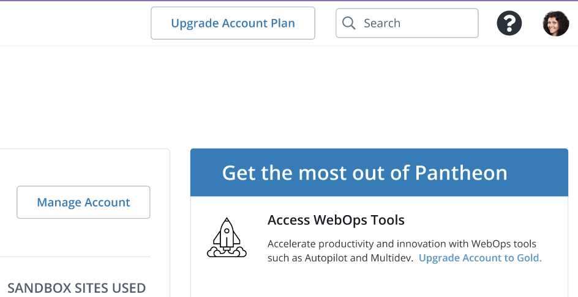
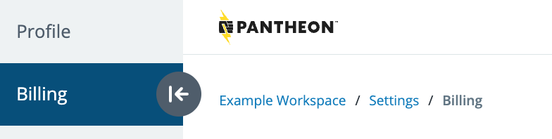

With a Professional Workspace, you can upgrade the associated [Account Plan](https://pantheon.io/plans/pricing) to gain additional features and enhanced support:

## Silver Account Plan

New Professional Workspaces start with a Silver Account Plan by default. The Silver Account Plan is free and offers basic WebOps tools and features. 

## Gold Account Plan 

Professional Workspaces with a Gold Account Plan provide additional collaboration tools such as [Multidev](/guides/multidev), [Custom Upstreams](/guides/custom-upstream), and [Autopilot](/guides/autopilot) with automated visual regression testing. 

To upgrade your Professional Workspace Account Plan to Gold:

1. [Go to the workspace](/guides/account-mgmt/workspace-sites-teams/workspaces#switch-between-workspaces), or [create one](/guides/account-mgmt/workspace-sites-teams/workspaces#create-a-professional-workspace).

1. Click **Upgrade Account Plan** in the banner at the top of the page.

  

1. On the **Select Account Plan** page, click **Select Plan** under Gold, and follow the prompts to add a Payment Method.

1. Once your payment method is accepted, you will be redirected to a Billing page with your Account Subscription details.

  

<Alert title="Note"  type="info" >

Now that you have a Professional Workspace with a Gold Account Plan, you can [add it as a Supporting Workspace](/guides/account-mgmt/workspace-sites-teams/teams#add-a-supporting-organization-to-site) to your site(s) to take advantage of your new features. If you do not yet have a paid site plan, you must purchase one separately from your gold account tier. Site plans are not included in your purchase of a Professional Gold Account Plan.

</Alert>

## Platinum & Diamond Account Plan

Platinum and Diamond Account Plans offer all the tools and features of the Gold Account Plan, and include features that benefit large teams and enterprise organizations such as direct access to experts, advanced support, and more. [Contact Sales](https://pantheon.io/contact-sales) for more information about upgrading to a Platinum or Diamond Account Plan.

## Agency Partner Program
The [Agency Partner Program](https://pantheon.io/partners) is open to web agencies and digital service providers that help clients create, run, and evolve the sites that matter.

Pantheon provides one governed platform across WordPress, Drupal, Next.js, and other framework paths - so partners can move fast, stay in control, and choose the right approach for each client.

All Agency Partners access the same full Pantheon platform regardless of tier, including [Multidev](/guides/multidev), [Custom Upstreams](/guides/custom-upstream), and [Autopilot](/guides/autopilot). Tier affects program economics, support, and go-to-market benefits.

For the October 2026 launch, tiers are based on lifetime sourced and influenced revenue. Tiering criteria may change in future program periods; refer to the current program terms for the latest details.

The October program launch expands the partner experience with formal Market Development Funds (MDF), updated incentive and revenue-share options, more ways to use Partner Wallet funds, and broader co-sell, co-marketing, enablement, and partner-community resources. Program terms may evolve, so refer to the current [Agency Partner Program Guide](http://partners.pantheon.io) for the latest details.

As an Agency Partner, you receive access to:

* Partner portal for lead registration, incentive tracking, sales enablement, training, and program resources
* The full Pantheon platform across supported framework paths
* A listing in the [Agency Partner Directory](https://directory.pantheon.io/agencies), available to Premier and Strategic partners
* Incentives that recognize eligible contract and PayGo revenue, subject to current program terms
* Partner Wallet options for deploying eligible funds as direct commission, approved MDF, or Pantheon Professional Services
* Partner enablement, community, co-sell, and co-marketing opportunities
* Preferred pricing support for end customers through partners; this update does not change the preferred pricing offering

For more information, visit the [Agency Partner Program page](https://pantheon.io/partners).

