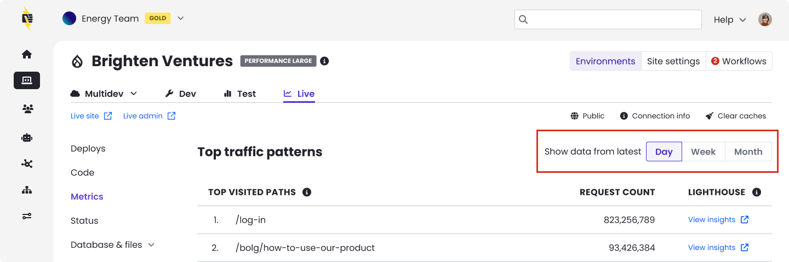
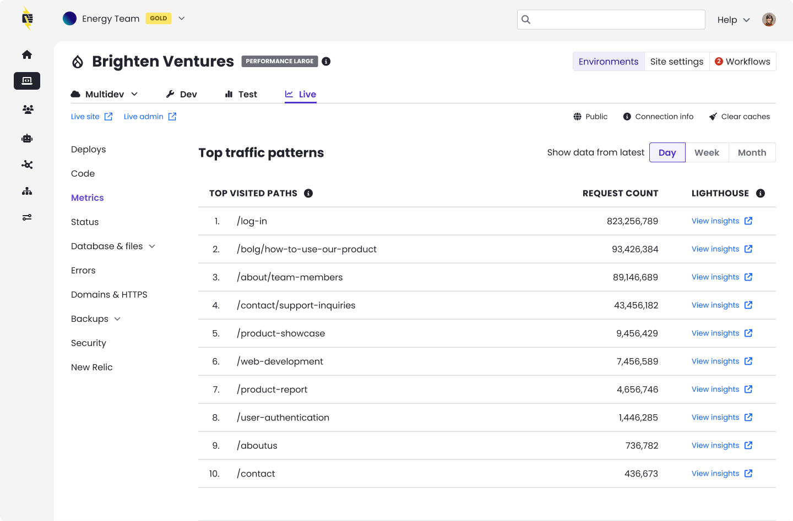
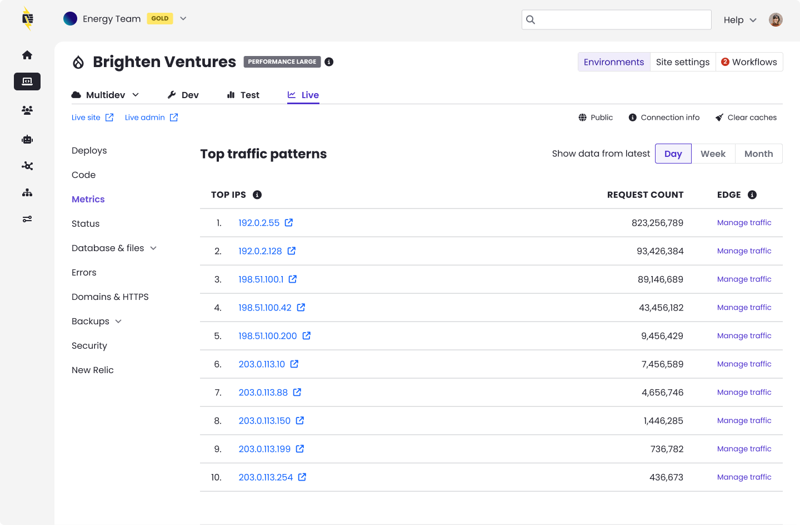

Access Metrics through the Live tab of the Site Dashboard once a [Live environment has been initialized](/guides/getstarted/addsite/#create-the-live-environment). The number of unique visits displayed in Pantheon’s Site Dashboard determines the traffic Pantheon will apply for evaluating use on your site under your pricing plan. The Site Dashboard also includes other information you may use to project future traffic, including number of pages served.

To access metrics for another environment, use the [Terminus](/terminus) `metrics` command:

```bash{promptUser: user}
terminus metrics <site>.<env>
```
## Workspace Traffic Insights 
The workspace site list provides a traffic column for high-level usage visibility across all sites, showing data for the [**Site Visits**](#site-visits) traffic metric. This data resets at the end of your billing cycle. 


## Access Metrics

1. Navigate to the **<Icon icon="wavePulse" /> Live** environment of the Site Dashboard.
1. Click **<Icon icon="charts" /> Metrics**.
1. Toggle displayed date ranges by clicking **Day**, **Week**, or **Month**:
  

## Available Metrics

The number of unique visits displayed in Pantheon’s Site Dashboard represents the traffic measurement Pantheon will apply for evaluating use on your site under your pricing plan. The Site Dashboard also includes the number of pages served, to help evaluate trends, and project future traffic. Traffic information is refreshed daily.

The data comes directly from our Global CDN, which tracks _all_ requests for resources on Pantheon. However, many known bots and crawlers do not count towards site traffic limits, nor do we meter requests for static assets (images, PDFs, CSS, JS, etc.).

* [Visits](#site-visits)
* [Pages Served](#pages-served)
* [Cache Hit Ratio](#cache-hit-ratio)
* [Top Traffic Patterns](#top-traffic-patterns)

### Visitor

A visitor is a person or device who/that receives information from the site. The platform counts each visitor once per day, regardless of the number of times they return that day or the number of pages they visit that day.

### Site Visits

We consider a Site Visit as a [200-level](https://en.wikipedia.org/wiki/List_of_HTTP_status_codes#2xx_Success) (as well as 303, 304, 305) response code in response to a visitor, and we identify unique consumers as a combination of user agent (device/browser) and IP address (network source), as shown in the diagram below.

### Pages Served

Think of this as something that gets delivered to the visitor. Pages served is the number of requests for resources generated by the CMS (WordPress or Drupal). Most commonly these are HTML web pages, but they also include non-HTML resources such as JSON, RSS, or XML-RPC. These are typically used for bringing data into the site from another source (e.g., a list of places on a map).

The number of Pages Served allowed for each Site Plan is five times the maximum monthly Site Visits.

For both metrics, the platform counts based on the total volume of requests, which includes visitors receiving pages (or other CMS-generated resources) which are served from our Global CDN cache.


As shown here, visits and visitors have different meanings. If two visitors go to the site, and one opens another page but the other leaves, that would be tracked as two visitors and three pages served. If one of those visitors returns again the next day, it would be counted as two visitors, three visits, and four pages served.

### Cache Hit Ratio

An important performance benchmark is the number of requests that can be served from the Global CDN. This metric does not affect site traffic measurements for the Site Plan. Serving requests from cache rather than by the CMS allows visitors to experience a faster response and removes load from the site's server resources. A cached request is served from the nearest edge endpoint without any delay, while a request to the CMS must be individually processed and loaded. A high cache hit ratio greatly improves the browsing experience and site performance.

A low Cache Hit Ratio may be caused by:

- Sites with mainly authenticated traffic have a low cache hit ratio because authenticated traffic is never cached. This includes both logged in site users as well as admin actions.
- A low or missing `max-age` header in the response from the CMS. This means cached pages are not stored or are invalidated too quickly. You may view this header and others with the [Configure and Verify Edge Caching](/guides/global-cdn/global-cdn-caching) guide.
- Setting a cookie on page requests bypasses the GCDN cache. Refer to [Debugging Cookies and Global CDN](/guides/global-cdn/global-cdn-caching#debugging-cookies-and-global-cdn) for more information.

Learn more about how to enable and improve caching in the [Pantheon Global CDN](/guides/global-cdn) guide.

### Top Traffic Patterns 
The Top Traffic Patterns section of the Site Metrics dashboard gives you a detailed breakdown of which pages, IP addresses, and user agents are generating the most requests to your site. Use this data to identify aggressive crawlers or scrapers you may want to [block manually when troubleshooting traffic events](/guides/account-mgmt/traffic/remedy#dos-attack-mitigation), and to prioritize caching and performance optimization based on the specific pages receiving the highest traffic.



You can toggle the displayed date range by clicking **Day**, **Week**, or **Month** at the top of the section. Data is refreshed every minute.

<Alert type="info" title="Note">

**Top traffic patterns** data includes both counted and uncounted visits. This means you will see all successful and redirected requests hitting your site, including traffic from known bots that Pantheon does not bill for. For details on what counts toward your plan, see [Counted Visits](#counted-visits) and [Uncounted Visits](#uncounted-visits).

</Alert>

#### Top visited paths
This table lists the most frequently requested pages and resources on your site, ranked by request count. Each row shows the URL path and the total number of requests it received during the selected time period.



**What you can do with this data**

* **Identify your highest-traffic pages**: These are your best candidates for caching and performance optimization. Ensuring these pages are served from cache can significantly improve load times.
* **Spot unexpected paths**: If you see paths you don’t recognize or paths receiving unexpectedly high traffic relative to your site's typical patterns (e.g., admin endpoints, XML-RPC), this may indicate automated activity or misconfigured redirects.
* **Run performance audits**: Click **View Insights** next to any path to launch a Lighthouse audit. This analyzes performance, accessibility, SEO, and best practices for that specific page and each audit produces a score and specific recommendations you can act on to improve load times, search rankings, and overall site quality.

#### Top IPs
This table displays the individual IP addresses generating the highest volume of requests to your site, along with each IP’s request count.



**What you can do with this data**

* **Check for abusive IPs**: Click the any IP address link to look it up. This helps you determine whether the source is a legitimate user, a known bot, or a potentially malicious actor.
* **Manage traffic at the edge**: Click ‘Manage traffic’ in the Edge column to configure traffic rules using AGCDN (Advanced Global CDN). This allows you to block, rate-limit, or redirect requests from specific IPs at the CDN level, before they reach your application server.
* **Identify traffic patterns**: A single IP generating a disproportionately high number of requests may indicate a bot, scraper, or brute-force attempt. Compare the IP’s request volume against normal traffic levels to assess whether action is needed.

<Alert type="info" title="Understand automated traffic sources">

Not all automated traffic is unwanted. Many requests that appear to come from bots are actually triggered by real human activity. For example, when someone asks an AI assistant a question or uses a browser with built-in search features, those tools send requests to your site on behalf of that person. Google alone operates multiple user agents, most of which are driven by actual user intent rather than random crawling. Blocking these requests could prevent real visitors from finding your content. Before taking action on any IP or user agent, consider whether that traffic may be delivering value to your business, such as improving your visibility in search results, AI-powered recommendations, or voice assistant responses.

</Alert>

#### Top User Agents
A user agent identifies the software making requests to your site — typically a browser, operating system, or automated tool. This table shows which user agents are generating the most traffic, sorted by request count.


**What you can do with this data**

* **Distinguish human traffic from bots**: Common browsers like Chrome, Safari, and Firefox will appear as standard user agent strings. Bot traffic often includes identifiers such as Googlebot, Bingbot, or AI crawler names.
* **How to evaluate automated traffic**: [Click the IP link](#top-ips) to look up its owner. Search engine crawlers and AI-powered tools driven by user intent generally benefit your site's visibility. If a source is generating unusually high request volume and you can't identify a clear benefit, consider blocking it through [Advanced Global CDN (AGCDN)](/guides/agcdn) or your site's robots.txt file.
* **How to evaluate user agents**: Copy the User Agent string into a parser, such as [BrowserScan](https://www.browserscan.net/user-agent) or [WhatIsMyBrowser](https://explore.whatismybrowser.com/useragents/parse/) to parse and see the details on the user agent.
* **Block unwanted user agents**: If you identify aggressive scrapers or unwanted crawlers, you can block them by adding entries to your site’s robots.txt file or by using PHP to block specific user agents. See [Block User Agents in Drupal or WordPress](/guides/account-mgmt/traffic/remedy#block-user-agents-in-drupal-or-wordpress) for detailed instructions.

### Understanding Your Traffic Data

The request counts shown in Top Traffic Patterns represent all requests reaching your site through Pantheon’s Global CDN. This includes both traffic that counts toward your plan’s visit limit and traffic that does not (such as known bot requests and static assets).

Some things to keep in mind when reviewing this data:

* **Request counts differ from analytics tools**: Pantheon tracks every request to the platform, while tools like Google Analytics only track pageviews where a tracking snippet fires in a browser. See the FAQ section for a detailed comparison.
* **Bot traffic is reflected**: Known bots like Googlebot appear in these tables even though Pantheon does not count them toward your plan’s visit limit. This is valuable information for understanding the full picture of what’s hitting your site.
* **Use this data alongside the charts above**: The Visits, Pages Served, and Cache Hit Ratio charts at the top of the Metrics page give you trend data over time. The Top Traffic Patterns tables below complement the charts by showing you trends across all your site’s traffic, showing you exactly which pages, IPs, and user agents are driving that traffic.

## How Do You Know if a Visit Counts?

### Counted Visits

A visit counts if it is one of the following:

- Valid

- Not a surreptitious bot

- Returns a [200-level](https://en.wikipedia.org/wiki/List_of_HTTP_status_codes#2xx_Success) response that originates from PHP, or returns a [300-level](https://en.wikipedia.org/wiki/List_of_HTTP_status_codes#3xx_Redirection) response of 303, 304, or 305.

- Additionally, if that visit is from a unique IP and user agent combination for the day, then that counts as a unique visitor that day as well.

### Uncounted Visits

The traffic measurement model below describes interactions excluded from your site's visit count. Our exclusion metric model relies partly on customer feedback. [Contact support](/guides/support/contact-support) to request that Pantheon consider additional exclusions if you experience issues with your site.

A visit does not count if it is one of the following:

- Invalid (originating from a known bot or crawler)

  - A high-performance response to crawlers supports SEO, which is one of the reasons Pantheon is the platform of choice for our customers. Although it places load on the platform, Pantheon excludes select automated traffic from legitimate crawlers and bots that would otherwise count towards your website's total traffic. Refer to the _visits_ definition above regarding the combination of datasets to determine traffic metrics. Pantheon excludes certain activity on your Site Dashboard (e.g., Google bot user agent).

  - Some bots and crawlers present themselves as end-user browsers. This makes their behavior difficult to distinguish from human end users. Some bots exhibiting this behavior, while they claim to be regular browsers, remain distinctive enough to exclude from billing.

  - To block specific bots and crawlers from your site, [add them to `robots.txt`](/bots-and-indexing#indexing-your-pantheon-site) or [use PHP to block specific User Agents](/guides/account-mgmt/traffic/remedy#block-user-agents-in-drupal-or-wordpress).

- A non-unique or repeated IP address for a given day

- A response from a static asset, such as images, PDFs, CSS, JS, etc.

- Uses excessive bandwidth

  - Individual sites consuming excessive bandwidth may be contacted separately by Pantheon for monitoring and actions required to address any plan abuse.

- A redirect

  - The platform does not count the following [300-level](https://en.wikipedia.org/wiki/List_of_HTTP_status_codes#3xx_Redirection) redirect responses: 301, 302, 307, 308.

- A 404 or other client error

  - Client errors are returned as [400-level](https://en.wikipedia.org/wiki/List_of_HTTP_status_codes#4xx_Client_errors) responses, and do not count as part of plan traffic limits.


## FAQs
### Why doesn't Pantheon's traffic metrics match my other analytics?
Website traffic is an important indicator of a successful website. Analytics suites (e.g. Google Analytics, Similarweb, Mixpanel) each serve a different purpose from Pantheon’s Site Dashboard.

<Alert title="Note"  type="info" >

Google Analytics doesn’t count most bots and search engines because it's a metric of visitors and not data transfer. AJAX requests and other requests that aren't from a browser may not be counted because Google Analytics only counts actual pages loaded in a browser.

</Alert>

Pantheon tracks every single request to the platform. In contrast, analytics tools will typically only track complete "pageviews" on an HTML page containing a tracking snippet that can fire off a subsequent request to the analytics platform.

This table shows some of the reasons why traffic in the Dashboard may differ from your analytics suite:

|                                                 | Counts as Traffic | Counts for Analytics |
|:------------------------------------------------|:-----------------:|:--------------------:|
| **API Request**                                 |        Yes        |          No          |
| **Known and Self-identified Bots**              |        No         |          No          |
| **Unknown and Incognito Bots**                  |        Yes        |          No          |
| **Load Testing and Third-party Monitoring**     |        Yes        |          No          |
| **Content pre-fetching**                        |        Yes        |       Sometimes      |
| **Pages without a tracking asset**              |        Yes        |          No          |
| **User closes browser before tracking loads**   |        Yes        |          No          |
| **User with adblocker enabled**                 |        Yes        |       Sometimes      |

Analytics implementations can be variable. It may be that your analytics solution isn't tracking all pages served for good reason. For example, you may exclude CMS administrators to give you a view of "visitors only."

Content pre-fetching increasingly plays a role in driving up traffic metrics without having the same impact on visitor-centric analytics. Speculatively loading pages in the background is a common tactic to improve the user experience on the web, which we support people using. However, this does generate more overall traffic from the perspective of the platform.

### How often is data collected?
Data is updated daily, shortly after midnight UTC, with data for the previous day.

### How long do you keep the data?
Data is retained for the following amounts of time:

| Period  | Data Retention |
| ------- | -------------- |
| Day     | 28 days        |
| Week    | 12 weeks       |
| Month   | 12 months      |

### Can I download or access the raw data directly?
Raw data is not currently available.

### Can I check metrics from the command line with Terminus?
Yes! Access to metrics via the Terminus [`env:metrics`](/terminus/commands/env-metrics) command. [Install Terminus](/terminus/install) or update to the [current release](/terminus/updates#updates) for access to the `env:metrics` command.

### What traffic is excluded from Pantheon's metrics?
Certain activities are generally excluded from the calculation of visits and pages served on a case-by-case basis at Pantheon’s discretion, and subject to Pantheon’s [Acceptable Usage Policy](https://legal.pantheon.io) (AUP). Customers may request that Pantheon consider excluding traffic sources by [contacting support](/guides/support/contact-support) if they experience particular issues with configuring their site for any of the following:

- Static Assets
- 404 and other Client Errors
- Bots and Crawlers

### What about redirects?
Only requests with a 200-level status count as pages served, so 301 redirects will not be included in metrics.

### Are multiple user agents on the same originating IP address counted separately?
Yes. For example, multiple devices on the same home network visiting your site would each be considered a unique visitor.

### What about load tests or penetration tests?
Load tests and other performance reviews of the Pantheon platform are generally prohibited by our [AUP](https://legal.pantheon.io). Although it may result in significant traffic spikes, Pantheon fully supports customers choosing to load test their site (excluding the platform). Contact [Pantheon Support](/guides/support/contact-support/) prior to performing such tests to make them aware there will be an extraordinary event that should be considered.

If you identify an underlying issue that may affect the platform, please let us know. If an issue is identified with your codebase, Pantheon can [recommend a Partner](https://directory.pantheon.io/agencies?docs) or connect you with our [Professional Services](/guides/professional-services) team to help you with remediation.

### What about Denial of Service and other attacks?
Malicious actors can create unplanned events in traffic, and this is not a fair measure of value a customer receives from our platform. We ask that customers help us identify and support the investigation of these issues. On a case by case basis, Pantheon may choose to waive overages in its judgment weighing factors such as how many clients are affected, to what degree could this have been addressed by customers, and how uniquely Pantheon is positioned to help our customers resolve these issues.

Malicious actors are different from unwanted traffic, which may be unique to a customer’s preferences for the targeted audience of their site. From a traffic measurement perspective, Pantheon is focused on omitting traffic that is objectively malicious.
