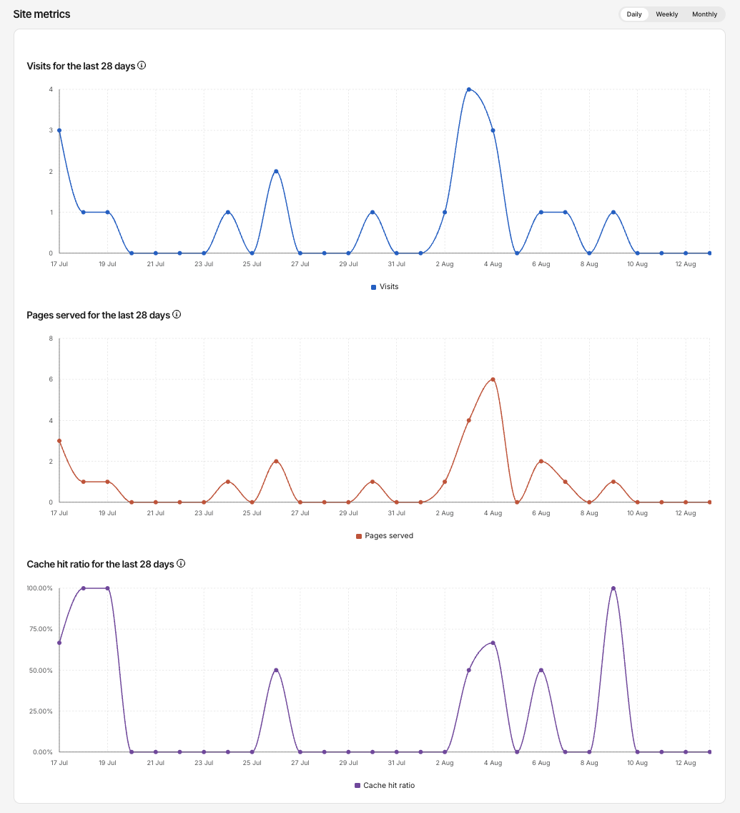
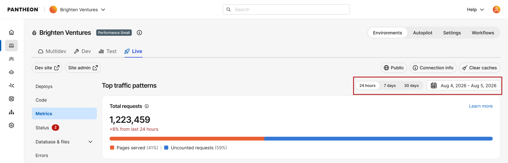
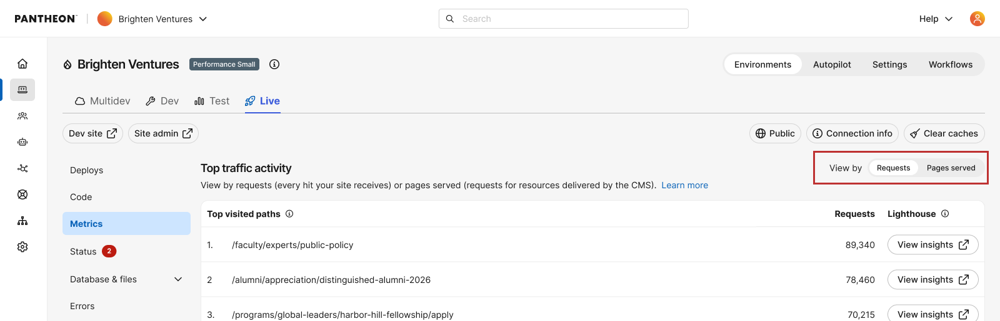
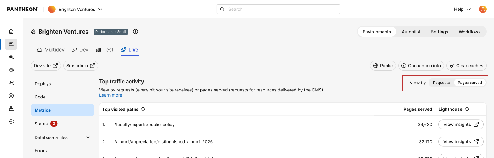
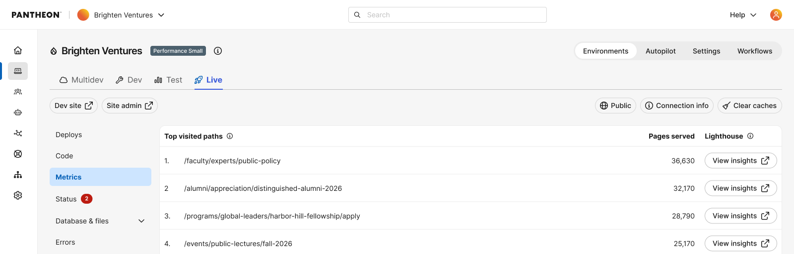
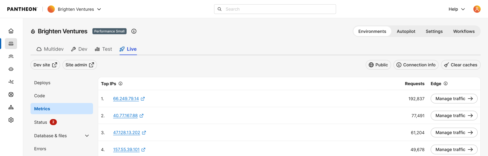
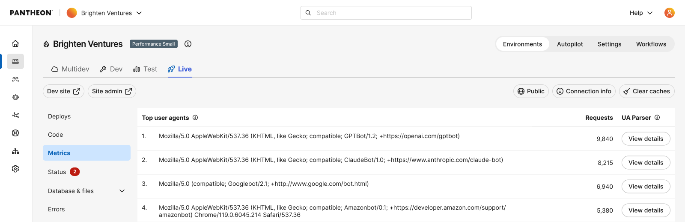

## Key Traffic Metrics 

Access Metrics through the Live tab of the Site Dashboard once a [Live environment has been initialized](/guides/getstarted/addsite/#create-the-live-environment). The number of unique visits displayed in Pantheon’s Site Dashboard determines the traffic Pantheon will apply for evaluating use on your site under your pricing plan. The Site Dashboard also includes other information you may use to project future traffic, including number of pages served.

To access metrics for another environment, use the [Terminus](/terminus) `metrics` command:

```bash{promptUser: user}
terminus metrics <site>.<env>
```
To understand how Visits, Pages Served, and Cache Hit Ratio are defined and calculated, see [Measuring Site Traffic](/guides/account-mgmt/traffic/measure). For the detailed per-path/IP/user-agent breakdown, see [Top Traffic Patterns](#top-traffic-patterns) below. For a portfolio-wide view across every site in your workspace, see [Workspace Insights](/guides/account-mgmt/traffic/workspace).

### Access Metrics

1. Navigate to the **<Icon icon="wavePulse" /> Live** environment of the Site Dashboard.
1. Click **<Icon icon="charts" /> Metrics**.
1. Toggle displayed date ranges by clicking **Day**, **Week**, or **Month**:
  

## Top Traffic Patterns 
The Top Traffic Patterns section of the Site Metrics dashboard gives you a detailed breakdown of which pages, IP addresses, and user agents are generating the most requests to your site. Use this data to identify aggressive crawlers or scrapers you may want to [block manually when troubleshooting traffic events](/guides/account-mgmt/traffic/remedy#dos-attack-mitigation), and to prioritize caching and performance optimization based on the specific pages receiving the highest traffic.



You can toggle the displayed date range by clicking **Day**, **Week**, **Month** or a cutom time range at the top of the section.

<Alert type="info" title="Note">

Pages Served filtering and the Total Requests breakdown below are available only for sites migrated to Pantheon's next-generation Global CDN (GCDN). If your site is still on the legacy CDN, see the [Global CDN migration guide](/guides/global-cdn/next-gen-global-cdn) to migrate and unlock this and other newer traffic insight features.

</Alert>

### Requests vs. Pages Served
Each Top Traffic Sources table (Top Visited Paths, Top IPs, Top User Agents) includes a **Requests / Pages Served** toggle:

* **Requests** shows everything hitting your site that isn't a static asset — every successful and redirected request, including traffic that doesn't count toward your plan, such as known bots. Static assets (images, PDFs, CSS, JS, etc.) are filtered out of these tables in both views to keep the data focused on meaningful traffic patterns rather than asset noise.
  
* **Pages Served** filters the same table down further to only the requests that count toward billing.
  

A **Total Requests** breakdown bar above the tables shows the overall split for the selected time period: the percentage of Pages Served vs. the percentage of uncounted requests. This gives you an at-a-glance sense of how much of your total traffic is actually billable before you dig into individual paths, IPs, or user agents.

### Top visited paths
This table lists the most frequently requested pages and resources on your site, ranked by request count. Each row shows the URL path and the total number of requests it received during the selected time period.



**What you can do with this data**

* **Identify your highest-traffic pages**: These are your best candidates for caching and performance optimization. Ensuring these pages are served from cache can significantly improve load times.
* **Spot unexpected paths**: If you see paths you don’t recognize or paths receiving unexpectedly high traffic relative to your site's typical patterns (e.g., admin endpoints, XML-RPC), this may indicate automated activity or misconfigured redirects.
* **Run performance audits**: Click **View Insights** next to any path to launch a Lighthouse audit. This analyzes performance, accessibility, SEO, and best practices for that specific page and each audit produces a score and specific recommendations you can act on to improve load times, search rankings, and overall site quality.

### Top IPs
This table displays the individual IP addresses generating the highest volume of requests to your site, along with each IP’s request count.



**What you can do with this data**

* **Check for abusive IPs**: Click the any IP address link to look it up. This helps you determine whether the source is a legitimate user, a known bot, or a potentially malicious actor.
* **Manage traffic at the edge**: Click ‘Manage traffic’ in the Edge column to configure traffic rules using AGCDN (Advanced Global CDN). This allows you to block, rate-limit, or redirect requests from specific IPs at the CDN level, before they reach your application server.
* **Identify traffic patterns**: A single IP generating a disproportionately high number of requests may indicate a bot, scraper, or brute-force attempt. Compare the IP’s request volume against normal traffic levels to assess whether action is needed.

<Alert type="info" title="Understand automated traffic sources">

Not all automated traffic is unwanted. Many requests that appear to come from bots are actually triggered by real human activity. For example, when someone asks an AI assistant a question or uses a browser with built-in search features, those tools send requests to your site on behalf of that person. Google alone operates multiple user agents, most of which are driven by actual user intent rather than random crawling. Blocking these requests could prevent real visitors from finding your content. Before taking action on any IP or user agent, consider whether that traffic may be delivering value to your business, such as improving your visibility in search results, AI-powered recommendations, or voice assistant responses.

</Alert>

### Top User Agents
A user agent identifies the software making requests to your site — typically a browser, operating system, or automated tool. This table shows which user agents are generating the most traffic, sorted by request count.



**What you can do with this data**

* **Distinguish human traffic from bots**: Common browsers like Chrome, Safari, and Firefox will appear as standard user agent strings. Bot traffic often includes identifiers such as Googlebot, Bingbot, or AI crawler names.
* **How to evaluate automated traffic**: [Click the IP link](#top-ips) to look up its owner. Search engine crawlers and AI-powered tools driven by user intent generally benefit your site's visibility. If a source is generating unusually high request volume and you can't identify a clear benefit, consider blocking it through [Advanced Global CDN (AGCDN)](/guides/agcdn) or your site's robots.txt file.
* **How to evaluate user agents**: Copy the User Agent string into a parser, such as [BrowserScan](https://www.browserscan.net/user-agent) or [WhatIsMyBrowser](https://explore.whatismybrowser.com/useragents/parse/) to parse and see the details on the user agent.
* **Block unwanted user agents**: If you identify aggressive scrapers or unwanted crawlers, you can block them by adding entries to your site’s robots.txt file or by using PHP to block specific user agents. See [Block User Agents in Drupal or WordPress](/guides/account-mgmt/traffic/remedy#block-user-agents-in-drupal-or-wordpress) for detailed instructions.

### Understanding Your Traffic Data

The request counts shown in Top Traffic Patterns represent all requests reaching your site through Pantheon’s Global CDN. This includes both traffic that counts toward your plan’s visit limit and traffic that does not (such as known bot requests and static assets).

Some things to keep in mind when reviewing this data:

* **Request counts differ from analytics tools**: Pantheon tracks every request to the platform, while tools like Google Analytics only track pageviews where a tracking snippet fires in a browser. See the [FAQ section](/guides/account-mgmt/traffic/measure#faqs) for a detailed comparison.
* **Bot traffic is reflected**: Known bots like Googlebot appear in these tables even though Pantheon does not count them toward your plan’s visit limit. This is valuable information for understanding the full picture of what’s hitting your site.
* **On GCDN-migrated sites, you can filter this directly**: rather than cross-referencing the exclusion list on the [Measuring Site Traffic](/guides/account-mgmt/traffic/measure) page to figure out what's billable, switch the table to the Pages Served view to see only counted requests for that path, IP, or user agent.
* **Use this data alongside the charts above**: The Visits, Pages Served, and Cache Hit Ratio charts on the [Measuring Site Traffic](/guides/account-mgmt/traffic/measure) page give you trend data over time. The Top Traffic Patterns tables here complement those charts by showing you exactly which pages, IPs, and user agents are driving that traffic.