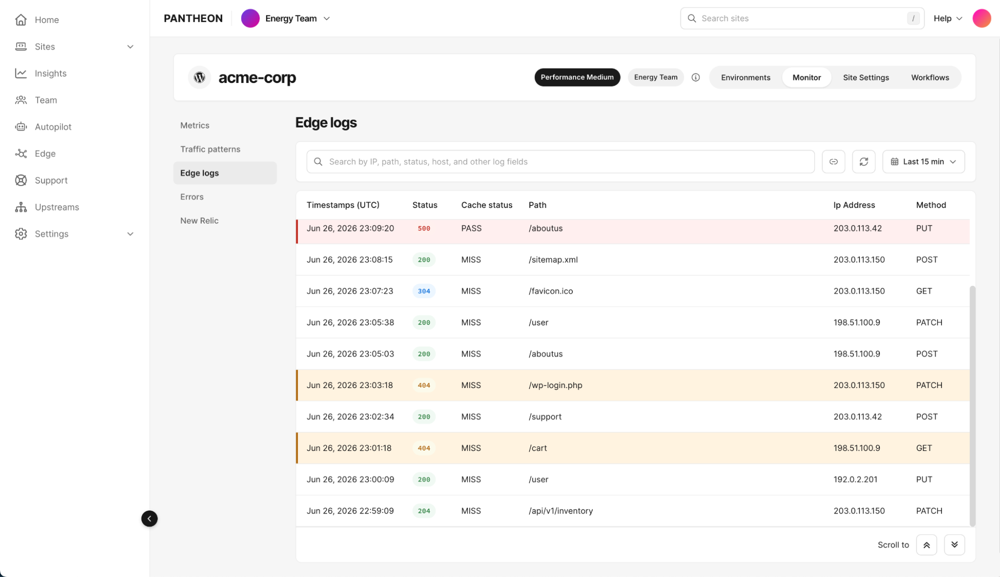
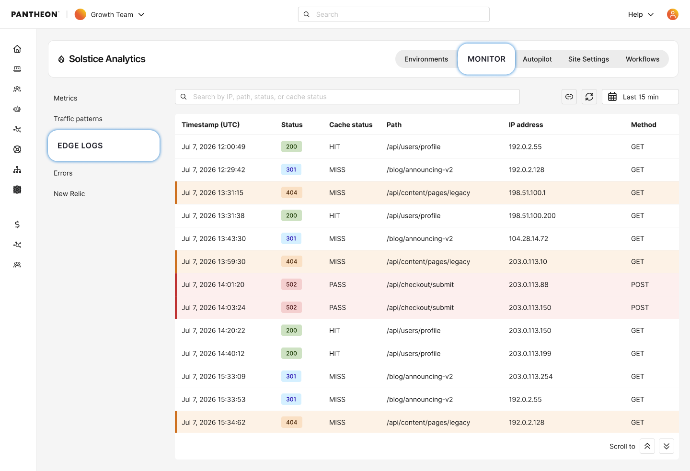
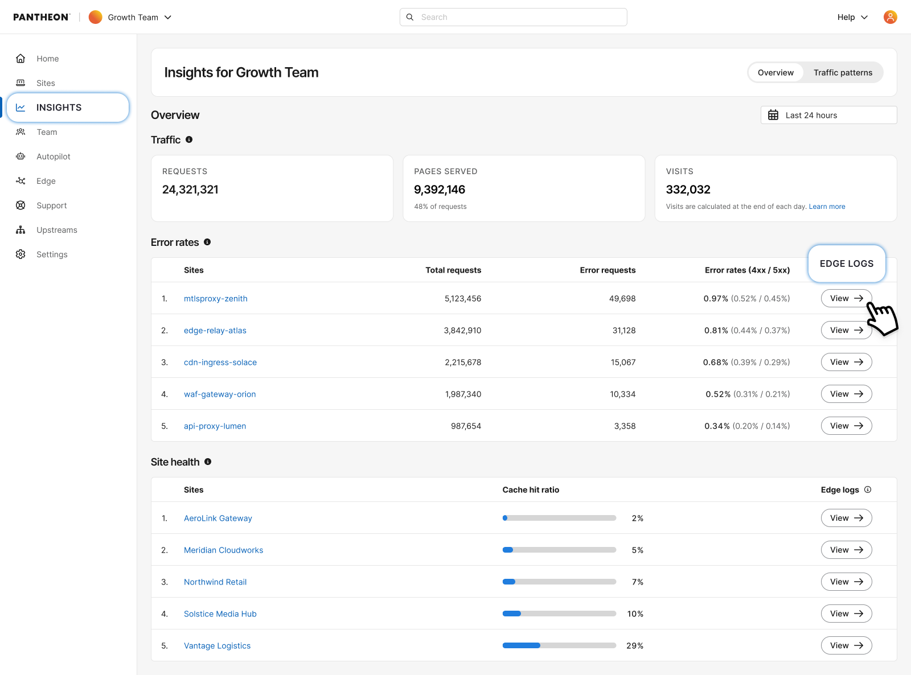
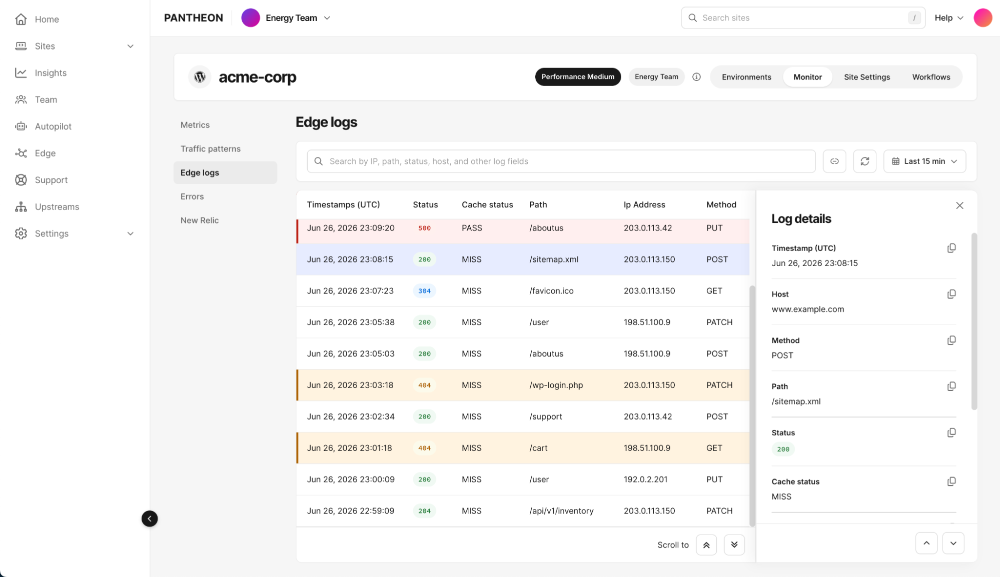
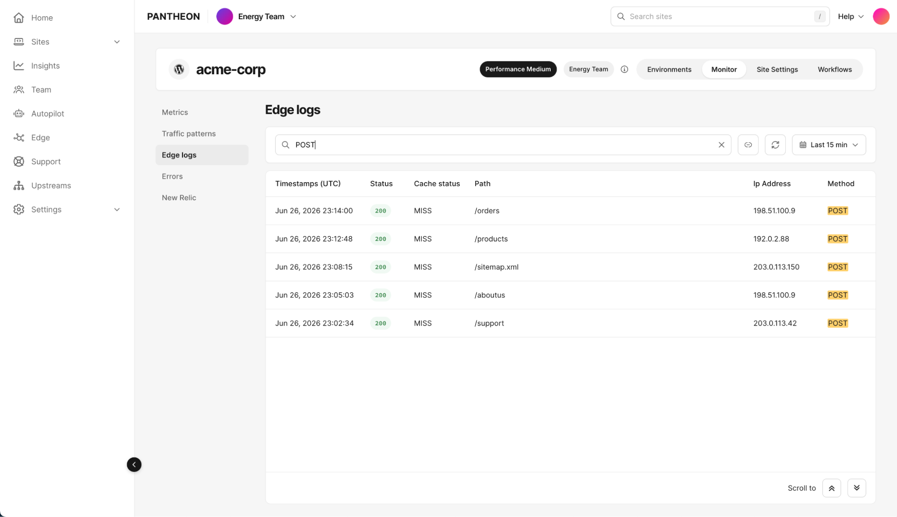
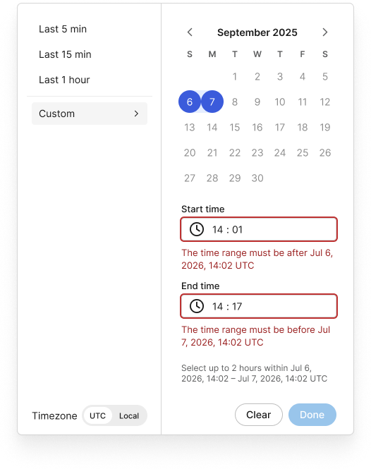

Edge Logs gives you direct, self-service visibility into the individual HTTP requests hitting your site at the edge. Search recent traffic, narrow to a specific time window, and drill into a single request's full detail to investigate any anomaly or to verify site changes.

<Alert title="Note" type="info">

This feature requires your site to be on our [next-generation Global CDN](/guides/nextgen-gcdn). If your workspace includes sites still on our legacy Global CDN, your performance overview will only reflect migrated sites.

If you have not started or completed your migration, [visit our documentation](/guides/nextgen-gcdn/setup) to get started.

</Alert>

## Availability 
Edge Logs is available for the Live environment only. Edge Logs does not show traffic for Dev, Test, and Multidev environments.

## Accessing Edge Logs
From your site's dashboard, toggle the Monitor tab. Use the inner vertical navigation to open **Edge Logs**. The page loads showing the most recent 15 minutes of traffic, sorted by timestamp – the most recent entries first.

You can also access Edge Logs by clicking **View logs** from a row in the Workspace Insights Overview. Accessing from Insights will direct you to a pre-filtered view correlated with the metric of focus. For example, if you clicked to view a site that was flagged for high error rates, the Edge Logs view will pre-filter for 500 errors.

## Understanding the log table
Each row in the table represents a single request and shows:

| Column                                                  | Description                         | 
|:------------------------------------------------------- |:----------------------------------- |
| Timestamp     | When the request hit the edge. Toggle between UTC and your local timezone     | 
| Status        | HTTP status code, color-coded – green (2xx/3xx), yellow (4xx), red (5xx)      | 
| Cache status | Cloudflare's cache status for the request – see Cache statuses below           | 
| Path          | The request path, e.g. `/api/users/profile`                                   | 
| IP address    | The requesting client's IP                                                    | 
| Method        | GET, POST, etc.                                                               | 

### Cache statuses 

| Status        | Meaning                                                                        | 
|:--------------- |:---------------------------------------------------------------------------- |
| `HIT`           | Served from our CDN’s cache                                                  | 
| `MISS`          | Cacheable, but not in cache yet – served from origin                         | 
| `EXPIRED`       | Was cached, but expired – served from origin                                 | 
| `STALE`         | Served from cache past expiration because origin couldn't be reached         | 
| `REVALIDATED`   | Origin confirmed the cached copy was still valid                             | 
| `UPDATING`      | Served slightly-stale cache while it refreshes in the background             | 
| `BYPASS`        | Eligible for cache, but this response wasn't cacheable                       | 
| `DYNAMIC`       | Not eligible for cache – always goes to origin                               | 
| `NONE/UNKNOWN`  | No cache lookup applies (e.g. a WAF block, redirect, or Worker response)     |

Click any row to open its detail drawer, which includes everything above plus:
* **Host** – the hostname the request was made to
* **User agent** – the requesting client's user agent string
* **ASN** – the autonomous system number associated with the requesting IP

## Searching logs
Edge Logs has a single, open text field. Type a value – an IP address, a path, a status code, a cache status, or a combination – and submit the search. Results don't update as you type; you need to submit the query to run it. Matched text is highlighted in the results.

## Time window and data retention
Edge Log data is retained for **24 hours**. There's no way to view or search anything older than that within the product.

The time window control defaults to **Last 15 minutes** on page load. Your options are:

| Option                           | Span                         | 
|:-------------------------------- |:---------------------------- |
| Last 5 minutes                   | Rolling                      | 
| Last 15 minutes (default)        | Rolling                      | 
| Last 1 hour                      | Rolling                      | 
| Custom                           | A fixed start/end time you choose, up to a maximum span of **2 hours**, positioned anywhere within the last 24 hours |

**The 2-hour span is a hard maximum for any single query** – whether you're using a rolling preset or Custom. If you need to review the full 24-hour retention window, run multiple searches, using Custom to move your 2-hour window back through the day (for example: 12:00 AM–2:00 AM, then 2:00 AM–4:00 AM, and so on). This is a real limitation worth knowing up front if you're used to picking one wide range and scanning it – Edge Logs is built for targeted lookback, not a full-day scan in one pass.

Custom time selection also lets you toggle between UTC and local time, and will warn you if a chosen window is likely to take a while to load, encouraging you to narrow it further for faster results.

### Refreshing
Edge Logs does not auto-update or stream live traffic. Results reflect the moment your query ran. Click the refresh button to re-run your current search and time window and pull in anything new.

## Result limits
A single query returns up to **1,000 rows**. If more results exist for your search and time window, you'll see:

> Showing the first 1,000 results. Narrow your time range or search to see additional results.

Narrowing your time window or refining your search is the way to see results beyond the first 1,000 – there's no pagination beyond that cap.

## Sharing a view
Click the link icon in the toolbar to copy a permalink to your current view – it encodes your search, time window, and results. Anyone you share it with sees the same view, provided they have access to the site – permalinks respect existing site-level permissions; someone without site access can't view the linked data by following the link.

Because permalinks are subject to the same 24-hour retention as everything else in Edge Logs, a link can age out:

* **If part of the linked time range has aged past 24 hours but part is still available**, Edge Logs automatically adjusts to show what's left, with a banner:
  * **Some results are no longer available** – Part of this linked time range has aged past the 24-hour retention window. Showing what's still available.
* **If the entire linked time range has aged past 24 hours**, you'll see:
  * **This link has expired** – The linked time range has aged past the 24-hour retention window and can no longer be viewed.

## Troubleshooting
### No logs found
Adjust your time range, search, or refresh to see logs. This means your search and time window combination didn't match any available requests within the retention period.

### Failed to load logs
Refresh or adjust the time range to try again. This indicates the query itself couldn't complete.

## FAQ
### Why can't I see anything older than 24 hours? 
Edge Log data is only retained for 24 hours. For longer-term log storage, talk to your team about log fowarding options outside of Edge Logs.

### Why can't I filter by a specific field? 
The current version of Edge Logs uses a single full-text search across all fields rather than field-specific filters. Structured filtering will be available in follow-up a release.

### Can I watch traffic update live after I make a change? 
Yes. However, you will need to manually click the button to refresh. Click refresh to pull in the latest requests after making a change like an IP block or cache rule update.
