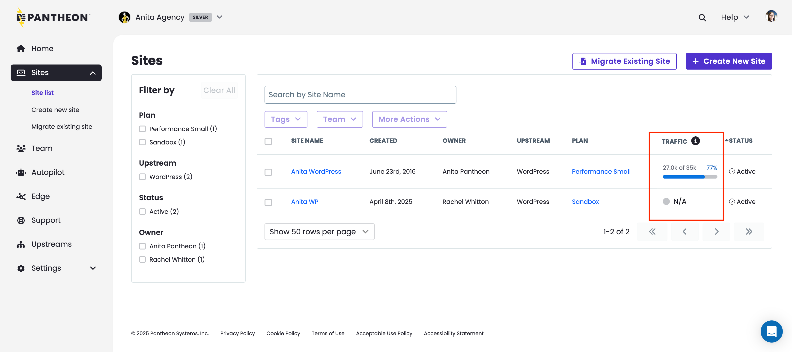
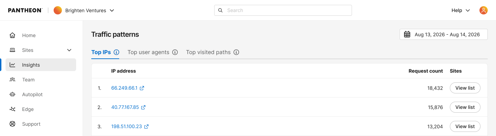
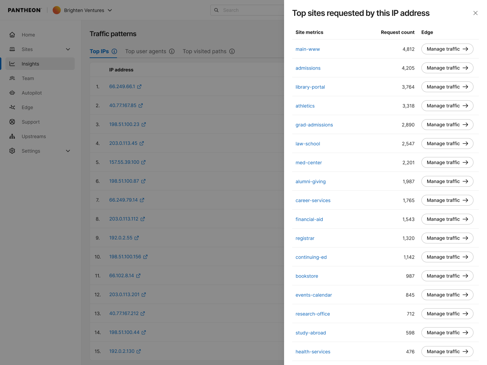
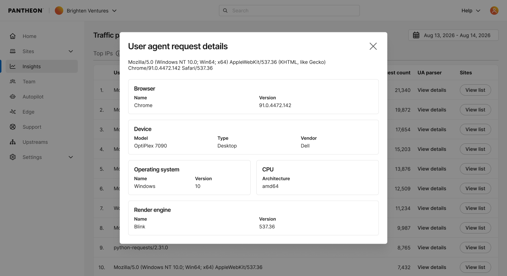

## Site List Traffic Field
The workspace site list provides a traffic column for high-level usage visibility across all sites, showing data for the [**Site Visits**](/guides/account-mgmt/traffic/measure#site-visits) traffic metric. This data resets at the end of your billing cycle. 

## Workspace Insights Navigation Area
For a deeper portfolio-wide view, the workspace **Insights** page aggregates traffic patterns across every site in your workspace, parallel to the site-level [Top Traffic Patterns](/guides/account-mgmt/traffic#top-traffic-patterns) tables but rolled up across your whole workspace. It includes three tabs:

* **Top IPs** — the IP addresses generating the most requests across all sites in the workspace.
* **Top User Agents** — the user agents generating the most requests across the workspace.
* **Top Visited Paths** — the most-requested paths across all the sites in the workspace. Rankings are calculated per site, so the same path on different sites appears as separate entries rather than being combined into a single total. 

<Alert type="info" title="Note">

Workspace Insights are available only for sites migrated to the new Pantheon's Global CDN (GCDN). Sites still on the legacy CDN are not included in this view. If none of the sites in your workspace have migrated to the new GCDN, you will not see the Ingishts area in your Workspace dashboard. If only a portion of your sites have migrated, your workspace-level totals and rankings are partial — they don't represent your full portfolio. See the [Global CDN migration guide](/guides/global-cdn/next-gen-global-cdn) to migrate remaining sites.

</Alert>

### Recently migrated sites 
A site's first 30 days on GCDN/Cloudflare will show incomplete historical data in Workspace Insights – early data reflects only what's been collected since migration, not a full historical picture. After 30 days, the data will be complete.  

### Drilling down
* On **Top IPs** and **Top User Agents**, clicking **View list** opens a drawer showing the per-site breakdown for that IP or user agent — how many requests it generated on each site in the workspace. Sites are listed by name, ranked by request volume. In the drawer, you can click on any of the site names to be directed to the site dashboard.
* On **Top Visited Paths**, clicking **View site** opens a drawer showing the site corresponding to the path. You can click on the site name to be directed to the site dashboard.

### Deeper traffic investigation
#### Investigating an IP address
Click any IP address in Top IPs to open AbuseIPDB with that IP pre-filled, taking you directly to its abuse report. This lets you quickly check whether an IP has a history of malicious activity, is a known bot or scraper, or belongs to a legitimate service, streamlining your investigation. 

#### Parsing a user agent
Next to any row in Top User Agents, click **View details** to open a modal with the user agent parsed into browser, device, and OS information — useful for confirming whether a high-volume agent is a real browser, a known bot, or something to investigate further.

