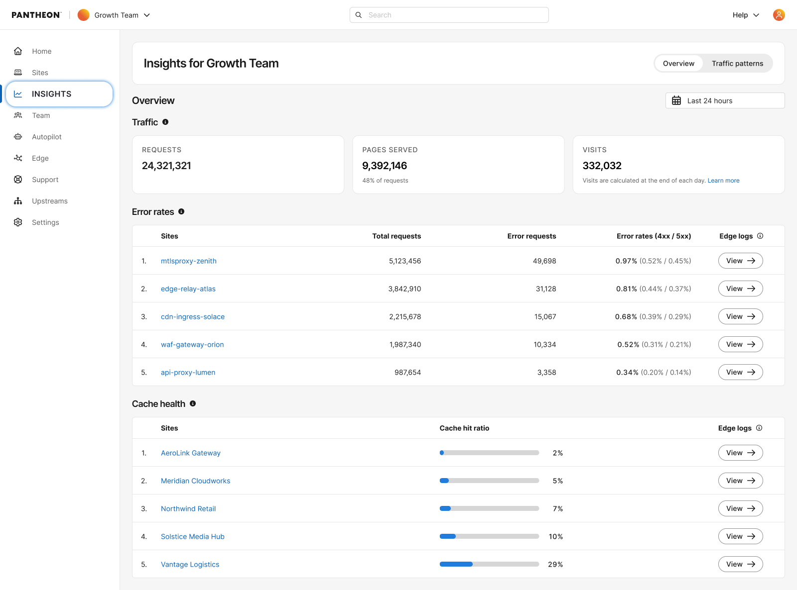
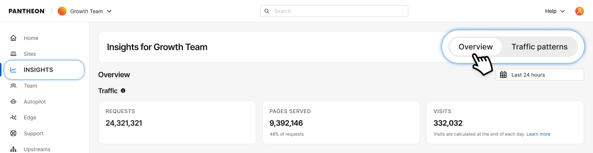
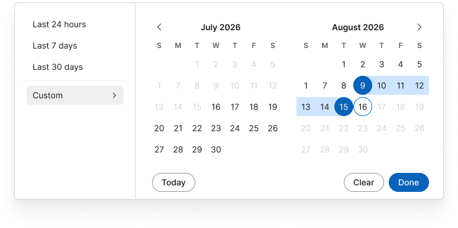

If you're managing a large portfolio of sites, you can understand the health of all the sites and which ones may need attention with Workspace Performance Overview. This feature rolls up traffic and health signals across your whole workspace and automatically surfaces your worst-performing sites, so you can spot problems at a glance and jump straight to investigating them, instead of hunting site by site.

**Access:** Go to Insights for your workspace. The Overview tab opens by default; Traffic Patterns sits alongside it. Use the toggle at the top of the page to switch between the two.

<Alert title="Note" type="info">

This feature requires your site to be on our [next-generation Global CDN](/guides/nextgen-gcdn). If your workspace includes sites still on our legacy Global CDN, your performance overview will only reflect migrated sites.

If you have not started or completed your migration, [visit our documentation](/guides/nextgen-gcdn/setup) to get started.

</Alert>

## Traffic summary
The top 3 cards highlight your workspace's total **Requests**, **Pages Served**, and **Visits** for the selected date range – a quick read on how much traffic your whole portfolio is handling.

## Caching health
Two ranked tables, side by side, surfacing your worst-performing sites so you don't have to check them one by one:

* **Error rates** – your top 5 sites by error rate, with error rate %, total requests, total error count, and a breakdown of 4xx vs. 5xx errors for each. Sites with errors are sorted worst-first (highest error rate at top). All sites in the workspace are eligible for this ranking regardless of traffic volume.
* **Cache hit ratio** – your top 5 sites by cache hit ratio, sorted worst-first (lowest ratio at top), shown with an inline progress bar. This table covers Cloudflare sites only; the page shows how many of your workspace's sites currently have Cloudflare data, since coverage may be partial during the CDN migration. Sites need a minimum amount of traffic in the selected window to appear in this ranking, so very low-traffic sites won't show up here even if their ratio looks poor.

Clicking a **site name** in either table takes you to that site's own dashboard. Each row also has a link into that site's [Edge Logs](/guides/account-mgmt/edge-logs) – this opens Edge Logs without any pre-filled search, so you'll need to enter your own search criteria once there.

### Date ranges 
You can choose **Last 24 hours**, **Last 7 days**, or **Last 30 days** (date-only – no time-of-day picker).
* **Last 24 hours** is a true rolling window.
* **Last 7 days** and **Last 30 days** are not rolling windows in the same sense: they cover full calendar days (UTC) plus however much of today has elapsed so far. For example, selecting "Last 7 days" at 10:43am UTC shows the prior 6 full UTC days plus today's data so far – not a strict trailing 7×24 hours.
  
   

  
## FAQs
### Why don't all my sites show up in the Caching Health table?
Two reasons: this table only includes Cloudflare sites (Fastly sites are excluded, not averaged in), and a site needs a minimum amount of traffic in the selected window to appear, so very low-traffic sites are left out to avoid misleading percentages. The Error Rates table doesn't have this traffic minimum – every site in your workspace is eligible there.

### Why don't all my sites show up in the Error Rates table?
Two reasons: this table only includes Cloudflare sites (Fastly sites are excluded, not averaged in), and a site needs a minimum amount of traffic in the selected window to appear, so very low-traffic sites are left out to avoid misleading percentages. 

### How are the top 5 sites in each table chosen, and in what order?
Error Rates sorts worst-first by error rate – the overall error rate of 400x and 500x. The highest is at the top. Caching Health sorts worst-first by cache hit ratio, with the lowest at top. If two sites tie, the one with higher request volume in the selected window is listed first.

### If I change the date range, does it update both tables and the traffic cards at once?
Yes. The date-range picker at the top of the page applies to everything on the Overview tab – the traffic summary cards and both Site health tables all reflect the same window.

### Can I see more than the top 5 sites, or adjust how many show up?
Not in this release – each table is fixed at the 5 worst-performing sites. A way to see more sites or set your own cutoff is a possible future addition to the functionality.

### What's the difference between clicking a site's name versus clicking its Edge Logs link?
Clicking the site name takes you to that site's own dashboard. Clicking the Edge Logs link takes you straight to that site's Edge Logs instead, so you can start digging into individual requests. The two go to different places, and neither is pre-filtered.
