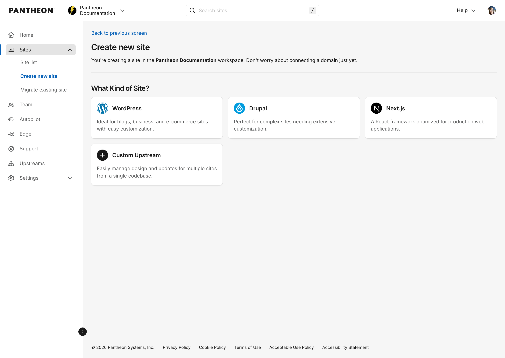
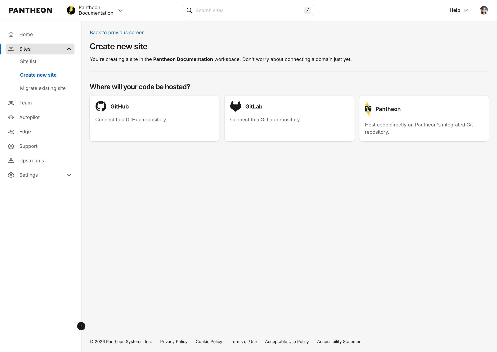
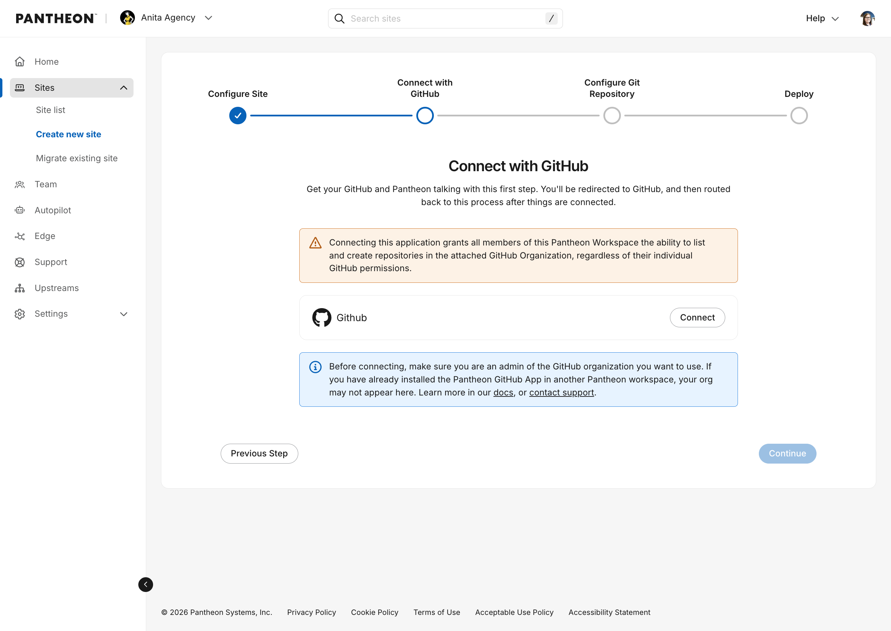
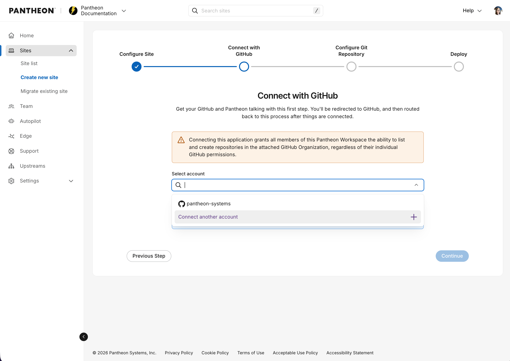
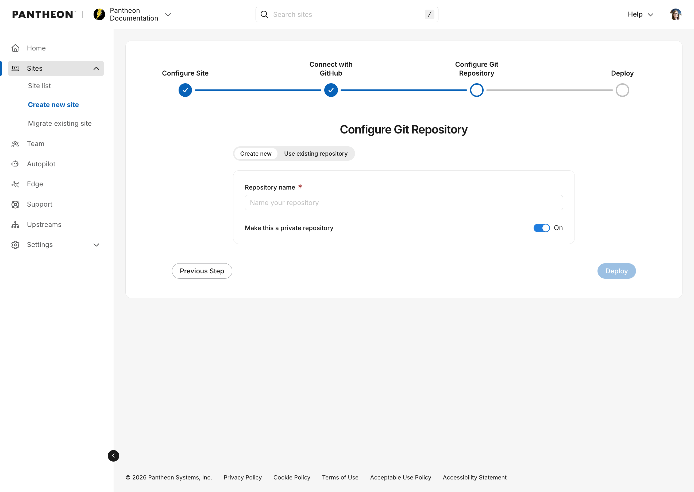
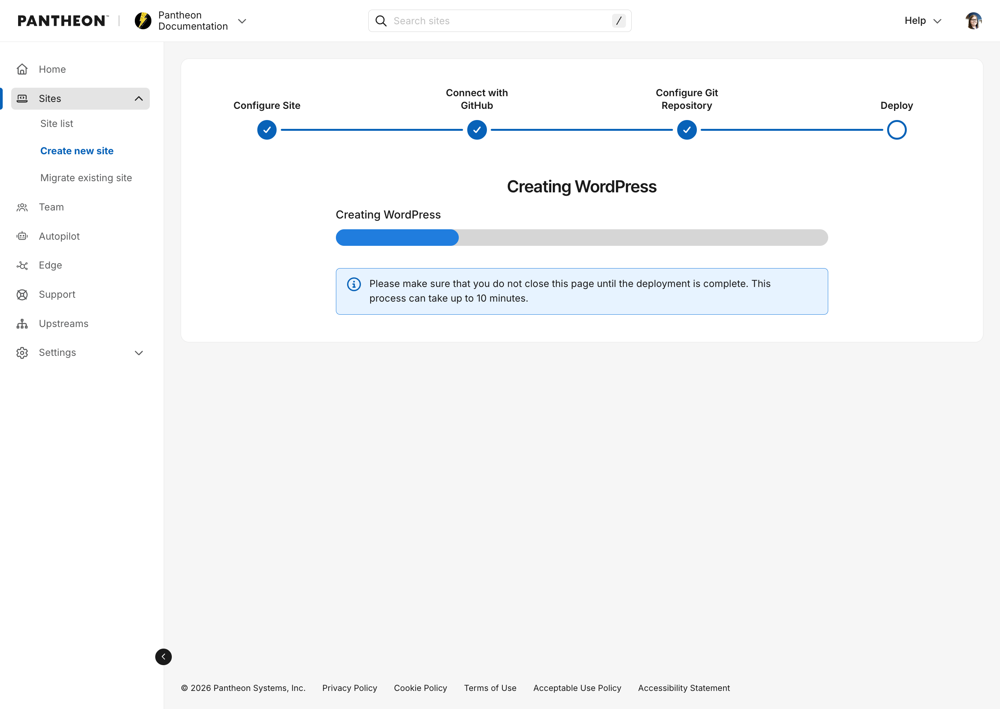
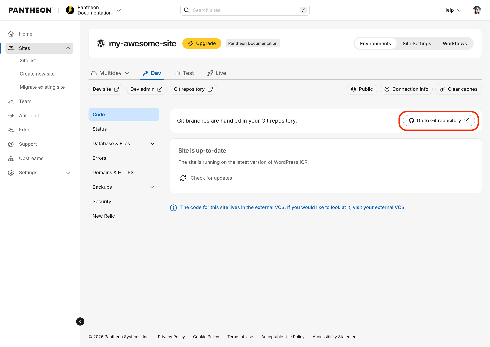
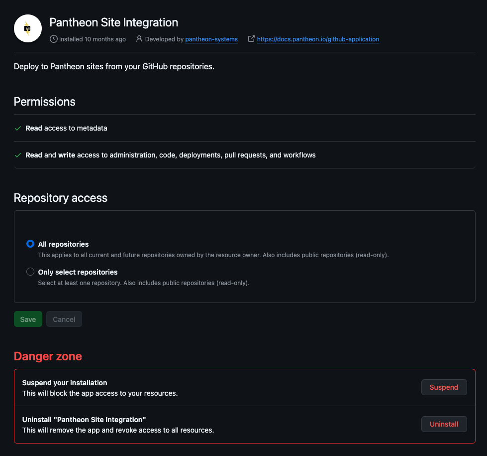

This page provides instructions for setting up a new site using Pantheon's external repository integration for GitHub. You can create new sites through the Pantheon Dashboard or via Terminus. You can also connect sites using existing repositories.

## Requirements 

* Gold, Platinum or Diamond Workspace on Pantheon 
* [Pantheon GitHub Application](https://github.com/apps/pantheon-site-integration): 
  * Must be installed by a user who is both a GitHub organization admin and a member of the corresponding Pantheon workspace. 
  * Other workspace members cannot install the app themselves. 
  * The GitHub organization admin must complete the installation first, and then any workspace member can create sites using repositories the app has access to.
  * The GitHub Application cannot be used with GitHub Enterprise Server.
* Before connecting an existing repository to a new Pantheon site, it must use Pantheon's expected file structure: 
  * [WordPress Repository Specification](/guides/external-repositories/setup-wordpress)
  * [Drupal Repository Specification](/guides/external-repositories/setup-drupal)


## Connect a repo to a new site
### From the Pantheon Dashboard 
1. Go to your [Professional Workspace](/guides/account-mgmt/workspace-sites-teams/workspaces#switch-between-workspaces), and select the **Create New Site** button.

1. Choose WordPress, Drupal or Next.js from the Create New Site page

	

1. Enter site name, and select desired region. Then click Create Site. 

1. Choose GitHub in the following prompt: 

	


1. Click the Connect button:

	

	<Alert title="Note" type="danger">

	If you are part of a GitHub organization, the application must be installed by an *owner* of the GitHub organization. The user who installs the application must have the correct permissions.

	If you have previously connected the GitHub application to a site in a *different* Pantheon organization, see [the instructions below](#configure-prompts) for connecting your GitHub application to *another* Pantheon organization.

	</Alert>

1.  Once connected, you should see a dropdown with your user or organization listed. Select your user/organization and click Continue.

	

1. You will be prompted to create a new repository or use an existing one.

	<Alert title="Note" type="info">

	If you choose to use an existing repository, it must already be set up as a Pantheon site repository (e.g. with a pantheon.yml file and a structure that Pantheon sites typically have). For details, see the following: 
      * [WordPress Repository Specification](/guides/external-repositories/setup-wordpress)
      * [Drupal Repository Specification](/guides/external-repositories/setup-drupal)
	
	If you don't have an existing repository ready, you can create a new one. This will be created in the GitHub organization or user that was connected to the application.

	</Alert>

	

	After naming your repository (the Pantheon site name will be automatically filled in when you click inside the Repository name field), click Deploy. 
	
	In the background, a Pantheon site environment will be initialized and a new git repository on GitHub will be created with the starter upstream code. This may take several minutes. Be sure to leave this screen up until it changes.

	

After the site is created, you will be redirected to your Pantheon Site Dashboard. You should also see a new repository for the site on GitHub and a Pantheon dashboard link to take you there.



### From the command-line interface
1. Use the `terminus site:create` command (see [documentation](/terminus/commands/site-create)) with the following flags:

	* `<upstream ID|machine name>` — Any upstream your Pantheon user has access to, e.g. `nextjs16`, `WordPress`, or an upstream UUID. If omitted, a list of available upstreams will be displayed.
	* `--org=<organization name|ID>` — The Pantheon organization. Required for sites using an external VCS provider.
	* `--vcs-provider=github` — Required for GitHub repositories.
	* `--vcs-org=<GitHub organization or username>` — The GitHub organization or username that owns the repository. If omitted, you will be prompted to choose from existing connections or add a new one.
	* `--repository-name=<repository name>` — The name of the repository to create on GitHub. Must be unique to the user or organization.
	* `--no-create-repo` - (optional) Only used when connecting an existing repository, tells Terminus not to create a new repository and instead connect to the one specified by `--repository-name`.

	```bash{promptUser: user}
	terminus site:create <pantheon site name> <site label> <upstream name|ID> --org=<organization name|ID> --vcs-provider=github --vcs-org=<GitHub organization|username> --repository-name=<GitHub repository name>
	```

	<Alert type="info" title="Note">

	To connect an existing repository from the command-line, pass the `--no-create-repo` flag. This will connect the new site to your existing repository specified by `--repository-name`.

	</Alert>

1. Once the command is issued, the site creation process will begin to initialize the Pantheon site environment and the GitHub repository. This may take several minutes. Be sure not to close your terminal window before the process is complete. The command will output logs to the terminal during the process. When you see `Site creation workflow completed successfully.` and `Waiting for site dev environment to become available...` you should be able to see the site in your sites list in the Pantheon dashboard and see the build workflow in progress.

1. When the workflow is complete, you will see `Code repository cloned successfully to the current directory.` and the dashboard link in the log.

## Troubleshooting

### Configure prompts

If you find yourself at a screen that asks you to *configure* the app, it typically means you've already installed the GitHub Application and connected it to another Pantheon organization. You will need to connect the application to this organization using `terminus vcs:connection:link`. See the documentation in [Usage](/guides/external-repositories/usage).


