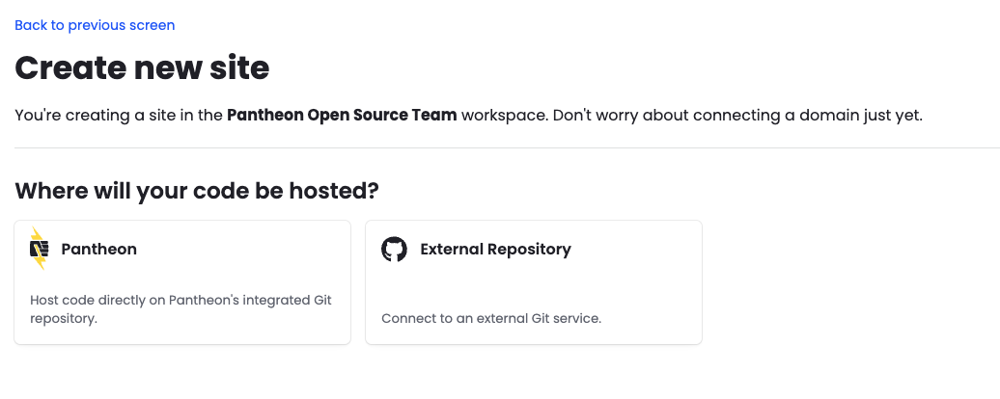

This page provides instructions for setting up a new site using Pantheon's external repository integration. You can create new sites through the Pantheon Dashboard (GitHub only) or via Terminus (GitHub and GitLab). You can also connect sites using existing repositories.

## Creating a new site with a new repository

<TabList>

<Tab title="Via the Pantheon Dashboard">

<Alert title="Note" type="info">

Dashboard-based site creation is currently supported for **GitHub** only. GitLab support via the Dashboard is planned for a future release. To create a site with a GitLab repository, use Terminus.

</Alert>

1. Choose WordPress, Drupal or Next.js from the Create New Site page

	

1. Select **External Repository** as the location for your site's codebase.

	

1. Connect your GitHub account.

	

	<Alert title="Note" type="danger">

	If you are part of a GitHub organization, the application must be installed by an *owner* of the GitHub organization. The user who installs the application must have the correct permissions.

	If you have previously connected the GitHub application to a site in a *different* Pantheon organization, see the instructions below for connecting your GitHub application to *another* Pantheon organization.

	</Alert>

1. Click the Connect button.

	After authorizing the GitHub application, you may be redirected to the initial site creation step to name the site and choose the region. Once continuing past that, you should see a dropdown with your user or organization listed. Select your user/organization and click Continue.

	

1. You will be prompted to create a new repository or use an existing one.

	<Alert title="Note" type="info">

	If you choose to use an existing repository, it must already be set up as a Pantheon site repository (e.g. with a pantheon.yml file and a structure that Pantheon sites typically have). If you don't have an existing repository ready, you can create a new one. This will be created in the GitHub organization or user that was connected to the application.

	</Alert>

	

	After naming your repository (the Pantheon site name will be automatically filled in when you click inside the Repository name field), wait for your site to be created. In the background, a Pantheon site environment will be initialized and a new git repository on GitHub will be created with the starter upstream code. This may take several minutes. Be sure to leave this screen up until it changes.

	

After the site is created, you will be redirected to the Builds page of your new site. You should also see a new repository for the site on GitHub and a Pantheon dashboard link to take you there.


</Tab>

<Tab title="Via Terminus (GitHub)">

1. Use the `terminus site:create` command (see [documentation](/terminus/commands/site-create)) with the following flags:

	* `<upstream ID|machine name>` — Any upstream your Pantheon user has access to, e.g. `nextjs16`, `WordPress`, or an upstream UUID. If omitted, a list of available upstreams will be displayed.
	* `--org=<organization name|ID>` — The Pantheon organization. Required for sites using an external VCS provider.
	* `--vcs-provider=github` — Required for GitHub repositories.
	* `--vcs-org=<GitHub organization or username>` — The GitHub organization or username that owns the repository. If omitted, you will be prompted to choose from existing connections or add a new one.
	* `--repository-name=<repository name>` — The name of the repository to create on GitHub. Must be unique to the user or organization.

	```bash{promptUser: user}
	terminus site:create <pantheon site name> <site label> <upstream name|ID> --org=<organization name|ID> --vcs-provider=github --vcs-org=<GitHub organization|username> --repository-name=<GitHub repository name>
	```

1. Once the command is issued, the site creation process will begin to initialize the Pantheon site environment and the GitHub repository. This may take several minutes. Be sure not to close your terminal window before the process is complete. The command will output logs to the terminal during the process. When you see `Site creation workflow completed successfully.` and `Waiting for site dev environment to become available...` you should be able to see the site in your sites list in the Pantheon dashboard and see the build workflow in progress.

1. When the workflow is complete, you will see `Code repository cloned successfully to the current directory.` and the dashboard link in the log.

</Tab>

<Tab title="Via Terminus (GitLab)">

<Alert title="GitLab token expiration" type="danger">

GitLab does not allow non-expiring personal access tokens. You must set an expiration date when creating your token. When your token expires, Pantheon will no longer be able to detect code changes or trigger builds. [Refresh your token](#adding-or-refreshing-a-gitlab-connection) using `terminus vcs:connection:add` before it expires.

</Alert>

<Alert title="Note" type="info">

You will be prompted for your GitLab token and group name the **first time** you create a GitLab-connected site in a Pantheon organization. Terminus stores the connection after that — subsequent site creations in the same organization will use the existing connection without re-prompting for a token.

</Alert>

Your GitLab token must be a **legacy personal access token** (not a fine-grained token) with the `api` and `write_repository` scopes. You can pass the token directly using `--vcs-token` to avoid the interactive prompt.

1. Use the `terminus site:create` command (see [documentation](/terminus/commands/site-create)) with the following flags:

	* `<upstream ID|machine name>` — Any upstream your Pantheon user has access to.
	* `--org=<organization name|ID>` — The Pantheon organization. Required for sites using an external VCS provider.
	* `--vcs-provider=gitlab` — Required for GitLab repositories.
	* `--vcs-org=<GitLab group name>` — The GitLab group name or username that owns the repository. If omitted, you will be prompted to choose from existing connections or add a new one.
	* `--repository-name=<repository name>` — The name of the repository to create on GitLab. Must be unique to the group or user.
	* `--vcs-token=<token>` *(optional)* — Pass your legacy GitLab personal access token directly to skip the interactive prompt.
	* `--vcs-host=<hostname>` *(optional)* — The domain of your self-hosted GitLab instance — the hostname your team uses to access GitLab, e.g. `git.example.com`. Omit this flag when using GitLab.com.

	```bash{promptUser: user}
	terminus site:create <pantheon site name> <site label> <upstream name|ID> --org=<organization name|ID> --vcs-provider=gitlab --vcs-org=<GitLab group name> --repository-name=<GitLab repository name>
	```

	For self-hosted GitLab instances, add `--vcs-host`:

	```bash{promptUser: user}
	terminus site:create <pantheon site name> <site label> <upstream name|ID> --org=<organization name|ID> --vcs-provider=gitlab --vcs-org=<GitLab group name> --repository-name=<GitLab repository name> --vcs-host=<your-gitlab-domain>
	```

1. Once the command is issued, the site creation process will begin. This may take several minutes. Keep your terminal open until the process is complete.

### Adding or refreshing a GitLab connection

To register a new GitLab connection with a Pantheon organization, or to refresh an expired token, use `terminus vcs:connection:add`:

```bash{promptUser: user}
terminus vcs:connection:add <organization-id> --vcs-provider=gitlab
```

You will be prompted to enter your GitLab group name or path. You will also be prompted for your legacy personal access token (`api` and `write_repository` scopes) unless you pass it directly with `--vcs-token=<token>`. For a self-hosted instance, add `--vcs-host=<hostname>`, where `<hostname>` is the domain of your self-hosted GitLab instance (e.g. `git.example.com`).

</Tab>

</TabList>

## Creating a new site with an existing repository

Pantheon's external repository integration allows you to maintain your site's source code in a GitHub or GitLab repository while deploying to Pantheon. When you push code to your repository, Pantheon automatically syncs and deploys the changes.

For this integration to work, your repository must include certain Pantheon-specific configuration files alongside your CMS code. The exact requirements differ between WordPress and Drupal.

### WordPress vs. Drupal

The two CMS platforms take different approaches to Pantheon integration:

| | WordPress | Drupal |
|---|---|---|
| **Core files** | Committed to the repository | Not committed — built by Integrated Composer on deploy |
| **Pantheon platform settings** | Manually included as `wp-config-pantheon.php` | Auto-generated by the `pantheon-systems/drupal-integrations` Composer package |
| **Web root** | Repository root (`/`) | Subdirectory (`/web/`) |
| **Dependency management** | Manual (plugins/themes committed to repo) | Composer (`composer.json` + `composer.lock` committed; dependencies built on deploy) |
| **Build step** | None | `composer install` runs on deploy |

Select the guide for your CMS to get started:

- [WordPress Repository Specification](/guides/external-repositories/setup-wordpress)
- [Drupal Repository Specification](/guides/external-repositories/setup-drupal)

### Via Terminus

To connect a new Pantheon site to an existing repository via Terminus, pass `--no-create-repo`. This tells Terminus not to create a new repository and instead connect to the one specified by `--repository-name`.

<TabList>

<Tab title="GitHub">

```bash{promptUser: user}
terminus site:create <pantheon site name> <site label> <upstream name|ID> --org=<organization name|ID> --vcs-provider=github --vcs-org=<GitHub organization|username> --repository-name=<existing-repo-name> --no-create-repo
```

</Tab>

<Tab title="GitLab">

```bash{promptUser: user}
terminus site:create <pantheon site name> <site label> <upstream name|ID> --org=<organization name|ID> --vcs-provider=gitlab --vcs-org=<GitLab group name> --repository-name=<existing-repo-name> --no-create-repo
```

</Tab>

</TabList>

### Common issues

If you find yourself at a screen that asks you to *configure* the app, it typically means you've already installed the GitHub Application and connected it to another Pantheon organization. You will need to connect the application to this organization using `terminus vcs:connection:link`. See the documentation in [Usage](/guides/external-repositories/usage).


## More Resources

- [Terminus Commands](/terminus/commands/site-create) - Documentation for the `terminus site:create` command
- [Next.js Documentation](https://nextjs.org/docs) - Official Next.js documentation
