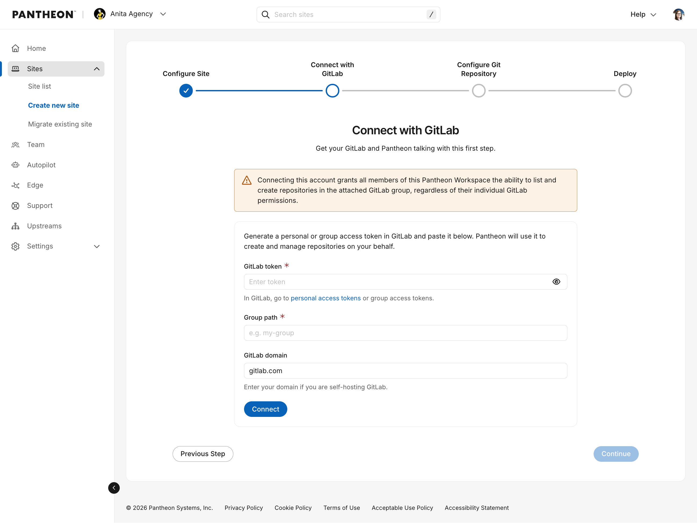
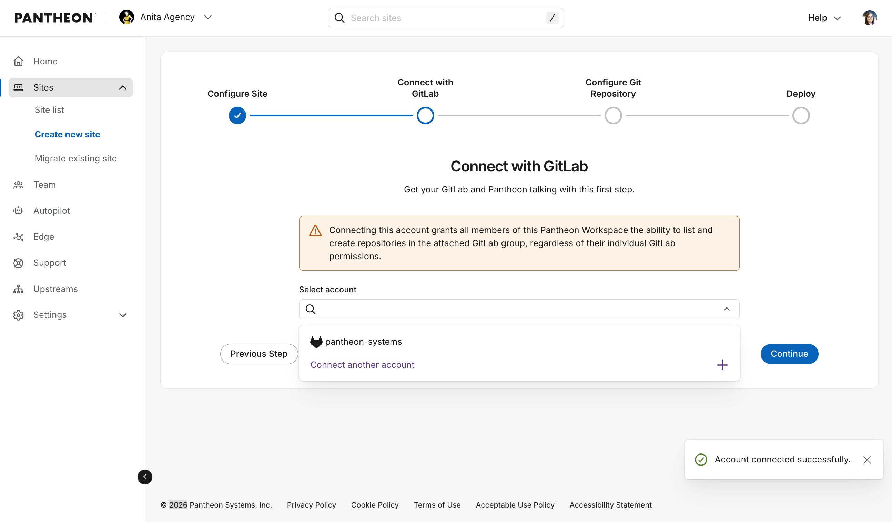
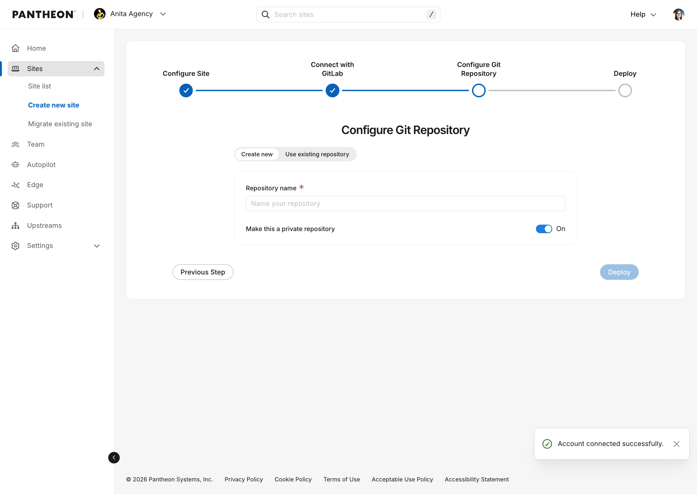
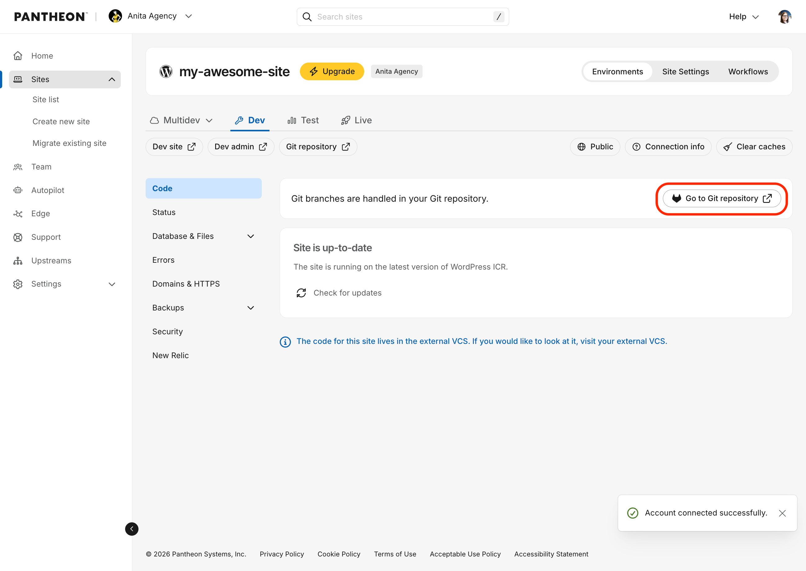

This page provides instructions for setting up a new site using Pantheon's external repository integration for GitLab. You can create new sites through the Pantheon Dashboard or via Terminus. You can also connect sites using existing repositories.

## Requirements
* Gold, Platinum or Diamond Workspace on Pantheon 
* A new or existing [GitLab group](https://docs.gitlab.com/user/group/)  
* A [legacy personal access token](https://docs.gitlab.com/user/profile/personal_access_tokens/) or a [group access token](https://docs.gitlab.com/user/group/settings/group_access_tokens/) (requires group role of Maintainer or higher)
  * Configure scope to include `api` and `write_repository` permissions
* Before connecting an existing repository to a new Pantheon site, it must use Pantheon's expected file structure: 
  * [WordPress Repository Specification](/guides/external-repositories/setup-wordpress)
  * [Drupal Repository Specification](/guides/external-repositories/setup-drupal)

<Alert title="GitLab token expiration" type="danger">

GitLab does not allow non-expiring personal access tokens. You must set an expiration date when creating your token. When your token expires, Pantheon will no longer be able to detect code changes or trigger builds. 

[Refresh your token](#adding-or-refreshing-a-gitlab-connection) using `terminus vcs:connection:add` before it expires.

</Alert>


## Connect a repo to a new site
### From the Pantheon Dashboard 
1. Go to your [Professional Workspace](/guides/account-mgmt/workspace-sites-teams/workspaces#switch-between-workspaces), and select the **Create New Site** button.

1. Choose WordPress, Drupal or Next.js from the Create New Site page

	

1. Enter site name, and select desired region. Then click Create Site. 

1. Choose GitLab in the following prompt: 

	

1. Provide your token, enter your group name, and enter your GitLab domain: 

	<Alert title="Note" type="info">

	You will be prompted for your GitLab token and group name the **first time** you create a GitLab-connected site in a Pantheon organization. Terminus stores the connection after that — subsequent site creations in the same organization will use the existing connection without re-prompting for a token.

	</Alert>

	


1. Once connected, you should see a dropdown with your group listed. Select your group and click Continue.

	

1. You will be prompted to create a new repository or use an existing one.

	<Alert title="Note" type="info">

	If you choose to use an existing repository, it must already be set up as a Pantheon site repository (e.g. with a pantheon.yml file and a structure that Pantheon sites typically have). For details, see the following: 
      * [WordPress Repository Specification](/guides/external-repositories/setup-wordpress)
      * [Drupal Repository Specification](/guides/external-repositories/setup-drupal)
	
	If you don't have an existing repository ready, you can create a new one. This will be created in the GitLab group that was connected to the application.

	</Alert>

	

	After naming your repository (the Pantheon site name will be automatically filled in when you click inside the Repository name field), click Deploy. 
	
	In the background, a Pantheon site environment will be initialized and a new git repository on GitLab will be created with the starter upstream code. This may take several minutes. Be sure to leave this screen up until it changes.

	

After the site is created, you will be redirected to your Pantheon Site Dashboard. You should also see a new repository for the site on Gitlab and a Pantheon dashboard link to take you there.




### From the command-line interface

1. Use the `terminus site:create` command (see [documentation](/terminus/commands/site-create)) with the following flags:

	* `<upstream ID|machine name>` — Any upstream your Pantheon user has access to.
	* `--org=<organization name|ID>` — The Pantheon organization. Required for sites using an external VCS provider.
	* `--vcs-provider=gitlab` — Required for GitLab repositories.
	* `--vcs-org=<GitLab group name>` — The GitLab group name or username that owns the repository. If omitted, you will be prompted to choose from existing connections or add a new one.
	* `--repository-name=<repository name>` — The name of the repository to create on GitLab. Must be unique to the group or user.
	* `--vcs-token=<token>` *(optional)* — Pass your legacy GitLab personal access token directly to skip the interactive prompt.
	* `--vcs-host=<hostname>` *(optional)* — The domain of your self-hosted GitLab instance — the hostname your team uses to access GitLab, e.g. `git.example.com`. Omit this flag when using GitLab.com.
	* `--no-create-repo` - (optional) Only used when connecting an existing repository, tells Terminus not to create a new repository and instead connect to the one specified by `--repository-name`.

	<Alert type="info" title="Note">

	To connect an existing repository from the command-line, pass the `--no-create-repo` flag. This will connect the new site to your existing repository specified by `--repository-name`.

	</Alert>


	```bash{promptUser: user}
	terminus site:create <pantheon site name> <site label> <upstream name|ID> --org=<organization name|ID> --vcs-provider=gitlab --vcs-org=<GitLab group name> --repository-name=<GitLab repository name>
	```

	For self-hosted GitLab instances, add `--vcs-host`:

	```bash{promptUser: user}
	terminus site:create <pantheon site name> <site label> <upstream name|ID> --org=<organization name|ID> --vcs-provider=gitlab --vcs-org=<GitLab group name> --repository-name=<GitLab repository name> --vcs-host=<your-gitlab-domain>
	```

1. Once the command is issued, the site creation process will begin. This may take several minutes. Keep your terminal open until the process is complete.

## Troubleshooting
### Adding or refreshing a GitLab connection

To register a new GitLab connection with a Pantheon organization, or to refresh an expired token, use `terminus vcs:connection:add`:

```bash{promptUser: user}
terminus vcs:connection:add <organization-id> --vcs-provider=gitlab
```

You will be prompted to enter your GitLab group name or path. You will also be prompted for your token unless you pass it directly with `--vcs-token=<token>`. The token must be a legacy personal access token or a group access token with `api` and `write_repository` scopes. Group access tokens also require a **Maintainer** role or higher. For a self-hosted instance, add `--vcs-host=<hostname>`, where `<hostname>` is the domain of your self-hosted GitLab instance (e.g. `git.example.com`).