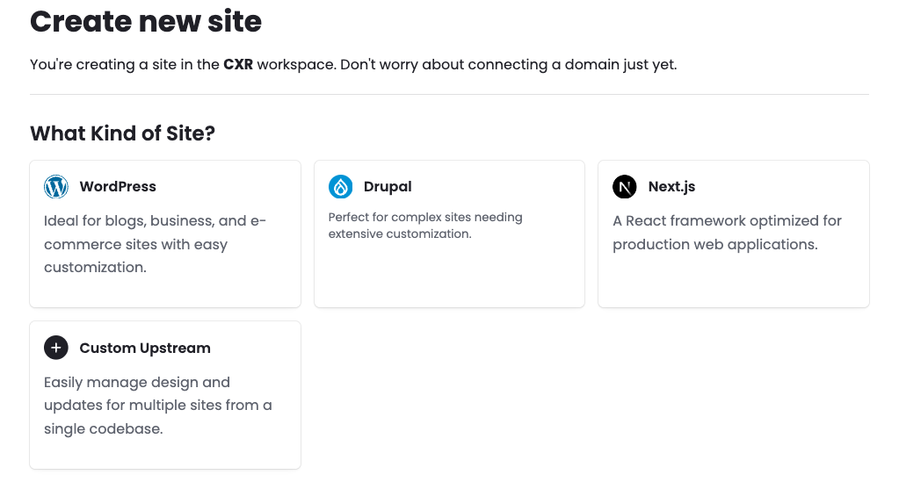
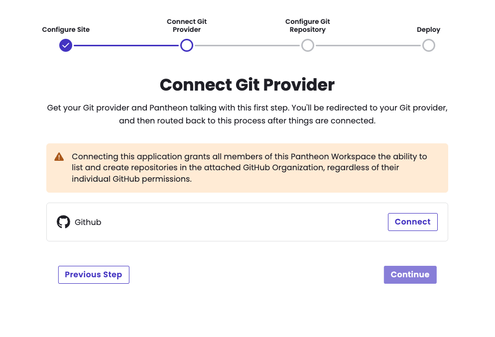
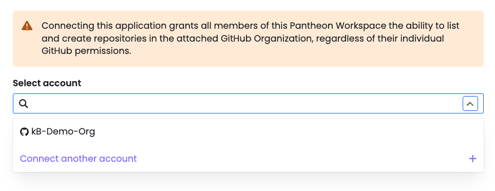
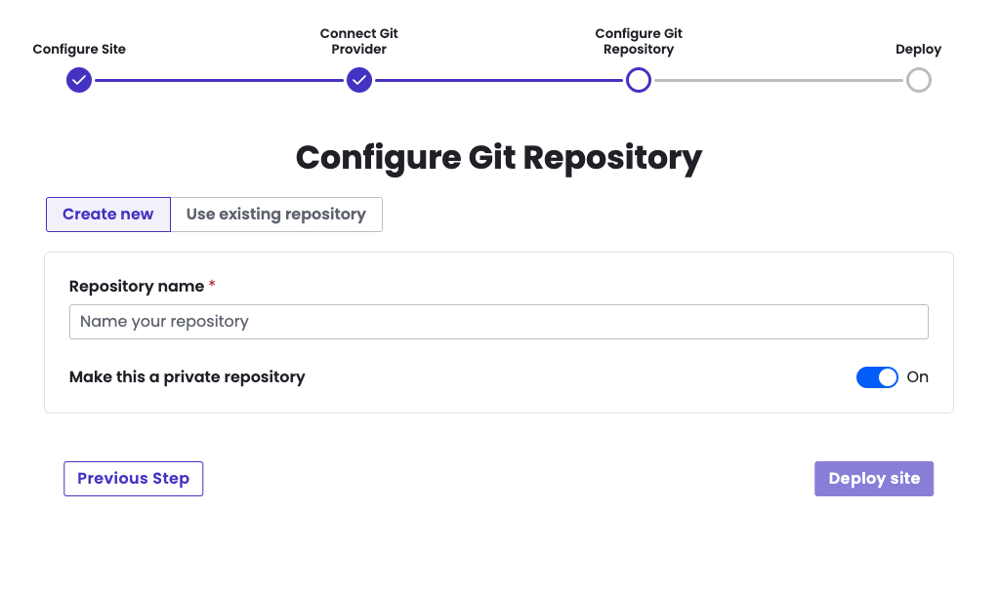
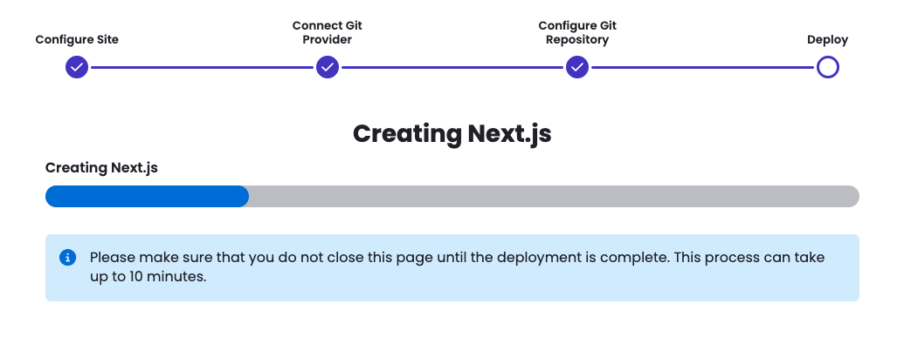
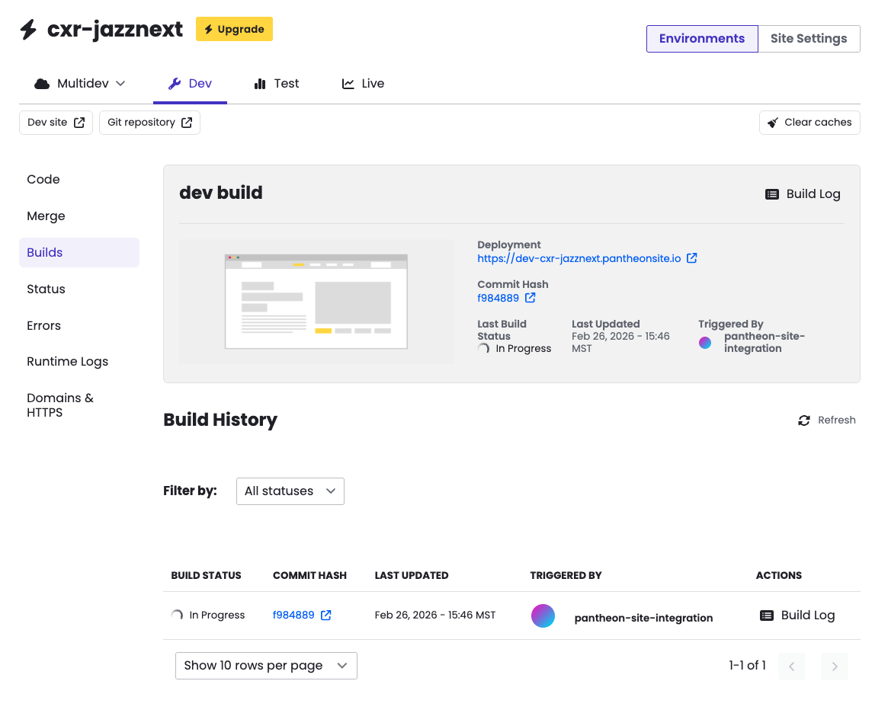
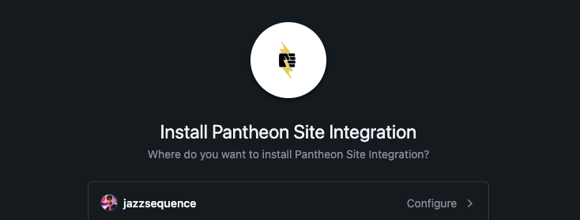
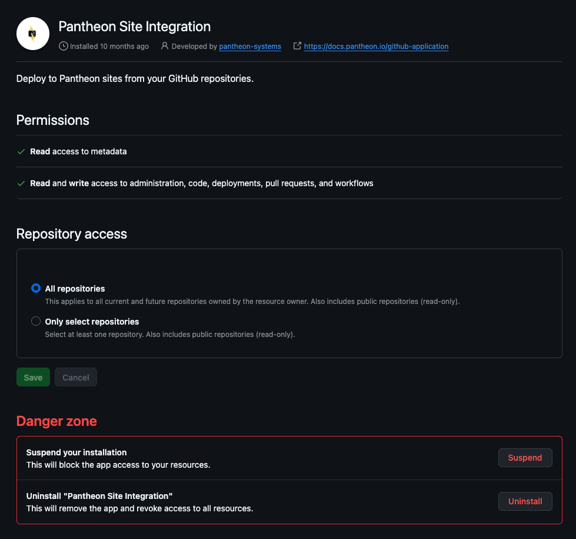

## Creating a new site

Once accepted into the private Beta, there are two main ways of creating a new site with the GitHub Application: through the Pantheon dashboard or through Terminus.

<TabList>

<Tab title="Via the Pantheon Dashboard">

<Alert title="Note" type="info">

Currently, from the dashboard it is only possible to create Next.js sites using the GitHub integration. To create a WordPress or Drupal site with the GitHub Application, you must use Terminus. We plan to add the ability to create WordPress and Drupal sites through the dashboard in the future.

</Alert>

1. Choose Next.js from the Create New Site page



1. Connect your GitHub account. 

	

	<Alert title="Note" type="danger">

	If you are part of a GitHub organization, the application must be installed by an owner of the GitHub organization. The user who installs the application must have the correct permissions. 

	If you have previously connected the GitHub application to a site in a different Pantheon organization, see the instructions below for connecting your GitHub application to another Pantheon organization.

	</Alert>

1. Click the Connect button.

	After authorizing the GitHub application, you may be redirected to the initial site creation step to name the site and choose the region. Once continuing past that, you should see a dropdown with your user or organization listed. Select your user/organization and click Continue.

	

1. You will be prompted to create a new repository or use an existing one. 

	<Alert title="Note" type="info">

	If you choose to use an existing repository, it must already be set up as a Pantheon site repository (e.g. with a pantheon.yml file and a structure that Pantheon sites typically have). If you don’t have an existing repository ready, you can create a new one. This will be created in the GitHub organization or user that was connected to the application.

	</Alert>
	
	

	After naming your repository (the Pantheon site name will be automatically filled in when you click inside the Repository name field), wait for your site to be created. In the background, a Pantheon site environment will be initialized and a new git repository on GitHub will be created with the Next.js starter kit upstream code. This may take several minutes. Be sure to leave this screen up until it changes.
	
	

After the site is created, you will be redirected to the Builds page of your new Next.js site. You should also see a new repository for the site on GitHub and a Pantheon dashboard link to take you there.



</Tab>

<Tab title="Via Terminus">

To create sites via Terminus, you must install the [Terminus Repository Plugin](https://github.com/pantheon-systems/terminus-repository-plugin).
This is a public Terminus plugin that can be installed normally, e.g. `terminus self:plugin:install terminus-repository-plugin`.
Usage instructions for the specific site creation commands are included in the [README](https://github.com/pantheon-systems/terminus-repository-plugin/blob/main/README.md#creating-a-new-site).

1. Use the `terminus site:create` command as normal (see [documentation](/terminus/commands/site-create)) with the following additional flags: 

	* `<upstream ID|machine name>` - Not a flag, this field is required whenever using terminus site:create. Any upstream that your Pantheon user has access to is valid here. For example nextjs16 ,  WordPress or an upstream UUID, e.g. `f9c1a10c-bd05-448f-9c0d-b73839e69e58`. If an upstream is not provided or is unrecognized, a list of available upstreams and their names will be provided.
	* `--org=<organization name|ID>` - The Organization is required for creating a new site via terminus `site:create`.
	* `--vcs-provider=github` - For sites using the GitHub application, the `--vcs-provider` must be included and must be set to `github`. The available parameters are `github` or `pantheon`.
	* `--vcs-org=<GitHub user/organization ID>` - You must pass the GitHub organization or user ID to the command or you will be prompted for it. This is so Terminus knows what GitHub account and connection to use.
	* `--repository-name=<repository name>` - The repository name is the name of the repository that will be created on GitHub. This must be unique to the user/organization.

	The final command should look something like this:

	```bash{promptUser: user}
	terminus site:create <pantheon site name> <site label> <upstream name|ID> --org=<organization name|ID> --vcs-provider=github --vcs-org=<GitHub organization|username> --repository-name=<GitHub repository name>
	```

1. Once the command is issued, the site creation process will begin to initialize the Pantheon site environment and the GitHub repository. This may take several minutes. Be sure not to close your terminal window before the process is complete. The command will output logs to the the terminal output during the process. When you see `Site creation workflow completed successfully.` and `Waiting for site dev environment to become available…` you should be able to see the site in your sites list in the Pantheon dashboard and see the build workflow in progress.

1. When the workflow is complete, you will see `Code repository cloned successfully to the current directory.` and the dashboard link in the log.

</Tab>

</TabList>

### Common issues

If you find yourself at a screen that asks you to *configure* the app, it typically means you’ve already installed the GitHub Application and connected it to another Pantheon organization. You will need to connect the application to this organization using `terminus vcs:connection:link`. See the documentation in [Usage](/guides/github-application/usage).
 
 
 
 