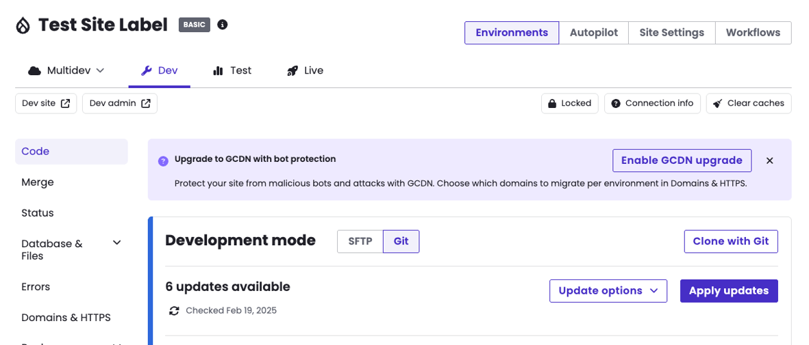

The new GCDN provides the same caching and content delivery you rely on today, plus new security features built into the CDN layer.

## What's Included

### Bot Protection

Bot protection is enabled by default on all migrated sites. There is no additional configuration or cost required.

- **Automated bot detection and scoring** — Incoming traffic is automatically evaluated and scored. Requests identified as malicious receive managed challenges.
- **Verified bot identification** — Legitimate bots (such as Googlebot, Bingbot, and other search engine crawlers) are recognized and allowed through automatically. Unverified malicious bots are challenged.

### Bot Exclusions

If your site relies on a custom bot or automated service that is not on the verified bot list, it may be challenged or blocked. Contact Pantheon support to request an exclusion for your bot's user agent.

After migrating to the GCDN Beta, monitor your automated integrations (CI/CD tools, feed importers, monitoring services, API clients) to ensure they are not being blocked. If a service stops working, check whether its user agent is being challenged and contact support to add an exclusion.

### Client Challenges

When the GCDN identifies a request as potentially automated or malicious, it may present a challenge to the visitor. This is a non-intrusive verification that confirms the visitor is human before allowing access to your site.

### Content Converter

Content Converter (Markdown for Agents) is enabled on all new GCDN zones. When a client sends a request with the `Accept: text/markdown` header, the CDN automatically converts the HTML response to Markdown in real time. This makes it easier for LLMs, AI agents, and other programmatic consumers to process your site's content without needing to parse raw HTML.

To request Markdown from a GCDN Beta site:

```bash{promptUser: user}
curl -H "Accept: text/markdown" https://example.com
```

- This is enabled automatically on all GCDN Beta zones — no action is required.
- Standard browser requests (without the `Accept: text/markdown` header) are not affected and receive normal HTML responses.
- The response includes an `x-markdown-tokens` header indicating the estimated token count of the Markdown document.

### Caching

Caching behavior is the same as the current GCDN. Your existing caching configuration carries over without changes.

- The Pantheon Advanced Page Cache module (Drupal) and plugin (WordPress) work the same way. Granular, surrogate-key-based cache clearing is fully supported.
- `Cache-Control` headers set by your application are respected.
- Static assets are cached at the edge automatically.
- Tracking parameters (`utm_*`, `__*`) are stripped from cache keys, consistent with current GCDN behavior (`PANTHEON_STRIPPED` logic).
- Analytics cookies (Google Analytics, HubSpot, etc.) are excluded from cache key generation so they don't fragment your cache.

### Eligibility

The Beta is open to most GCDN customers running Drupal or WordPress sites. The following configurations are not eligible at this time:

| Configuration | Reason |
| --- | --- |
| Advanced Global CDN (AGCDN) | Separate migration initiative |
| Custom Certificates | Special certificate management not yet supported |
| Multi-Zone Failover | Feature not available in Beta |
| Next.js / Front-End Sites (FES) | Not yet supported |

## Setup

<Alert title="Important" type="danger">

For the best experience, be prepared to update your DNS records as soon as possible after starting the migration. Delaying DNS migration can result in inconsistent behavior, as your site will remain on the old CDN infrastructure until DNS is pointed to the new GCDN.

</Alert>

<Alert title="Note" type="info">

During the Beta, DNS-01 TXT record validation is the only supported method for domain verification. You will need to add TXT records to your DNS provider to verify domain ownership.

</Alert>

<TabList>

<Tab title="Pantheon Dashboard" id="dashboard-setup" active={true}>

### Activation

Eligible sites will see a GCDN Beta banner on the site dashboard in Pantheon.

1. Look for the banner on your site dashboard in Pantheon.
1. Click the banner and follow the guided activation steps.
1. Update your DNS records to point to the new GCDN infrastructure (instructions will be provided in the dashboard).



### Domains and DNS

After activating the GCDN Beta through the dashboard, you will need to update your DNS records to point to the new infrastructure.

1. The dashboard will provide TXT records for domain verification. Add these TXT records to your DNS provider.

1. Once domain verification completes, the dashboard will display the recommended DNS settings (CNAME targets).

1. Update your DNS records with the provided CNAME values at your DNS provider.

- You will receive new CNAME targets pointing to Pantheon's new GCDN infrastructure.
- Set your TTL as low as possible before making changes to minimize propagation delay.
- TLS certificates are automatically provisioned once domain verification completes.

<Alert title="Note" type="info">

DNS changes may take time to propagate depending on your current TTL settings. During propagation, traffic may alternate between the old and new CDN. This is normal and resolves once propagation completes.

</Alert>

</Tab>

<Tab title="Terminus CLI" id="terminus-setup">

<Alert title="Note" type="info">

Before proceeding with Terminus commands, you must first install the GCDN Terminus plugin.

</Alert>

### Install the plugin

```bash{promptUser: user}
terminus self:plugin:install pantheon-systems/terminus-gcdn-plugin
```

If you have existing custom domains on your site, follow all of the steps below to upgrade and migrate your DNS.

### 1. Upgrade your site to GCDN

```bash{promptUser: user}
terminus gcdn:upgrade <site>
```

This migrates the site from Fastly to GCDN across all environments.

### 2. Get your DNS records and TXT verification challenges

```bash{promptUser: user}
terminus gcdn:dns <site>.live
```

This will show the TXT records needed for domain ownership and certificate validation.

### 3. Add TXT records to your DNS provider

Add the TXT records from step 2 to your DNS provider.

### 4. Verify your domains

Wait a few minutes for DNS propagation, then verify each domain. Verification typically takes a few minutes to complete:

```bash{promptUser: user}
terminus gcdn:verify <site>.live example.com
terminus gcdn:verify <site>.live www.example.com
```

### 5. Update your DNS records

Once verification passes, add the CNAME or A/AAAA records shown in the `gcdn:dns` output to point your domains to the new GCDN edge.

- Set your TTL as low as possible before making changes to minimize propagation delay.
- TLS certificates are automatically provisioned once domain verification completes.

<Alert title="Note" type="info">

DNS changes may take time to propagate depending on your current TTL settings. During propagation, traffic may alternate between the old and new CDN. This is normal and resolves once propagation completes.

</Alert>

### Full workflow example

```bash{promptUser: user}
terminus gcdn:upgrade my-site
terminus gcdn:dns my-site.live
# Add TXT records to your DNS provider, wait a few minutes, then verify:
terminus gcdn:verify my-site.live example.com
terminus gcdn:verify my-site.live www.example.com
# Once verified, add the CNAME or A/AAAA records from gcdn:dns output
```

</Tab>

</TabList>

## FAQ

### How do I know if my site is eligible?

Eligible sites will see a GCDN Beta banner on the site dashboard. If you don't see the banner, your site may fall into one of the excluded categories (AGCDN, Custom Certificates, Multi-Zone Failover, or FES). If you aren't sure about your eligibility, please reach out to Pantheon Support.

### I have a Custom Certificate. Can I migrate?

Not yet. Custom certificate management is not supported in the Beta. This will be addressed before General Availability.

### I use AGCDN. What should I do?

No action is required. AGCDN has its own migration initiative and timeline. Your current AGCDN configuration continues to work. AGCDN customers are excluded from the Beta.

### What is the timeline for GCDN GA and new AGCDN?

GCDN GA is late Q2/Early Q3. AGCDN features will be moved to a new self managed AGCDN service beginning late Q2. As feature parity is reached, you will be contacted.

### What changes when I migrate?

Your site's CDN infrastructure is upgraded to the next-generation GCDN. You get bot protection automatically. Caching behavior remains the same, including Pantheon Advanced Page Cache support. You will need to update your DNS records.

### Do I need to change my application code?

No. The migration is transparent to your Drupal or WordPress application. No code changes are required.

### Will my site have downtime during migration?

No. The migration process is designed to avoid downtime. During DNS propagation, traffic may temporarily alternate between the old and new CDN, but your site remains accessible throughout.

### Does the Pantheon Advanced Page Cache module/plugin still work?

Yes. The Drupal module and WordPress plugin for Pantheon Advanced Page Cache work the same way on the new infrastructure. Surrogate-key-based cache clearing is fully supported.

### What is Content Converter?

Content Converter (Markdown for Agents) is a feature enabled on all GCDN Beta zones. When a request includes the `Accept: text/markdown` header, the CDN converts HTML responses to Markdown in real time. This makes your site's content easier for LLMs and AI agents to consume. Standard browser traffic is not affected.

### My automated integration stopped working after migration. What do I do?

Your bot or automated service may be receiving a managed challenge from bot protection. Check whether the service's user agent is being challenged by reviewing its error logs (look for 403 responses or HTML challenge pages). Contact Pantheon support to request a bot exclusion for your user agent.

### I have another CDN or WAF in front of my site. Is that supported?

The new Pantheon GCDN supports Orange-to-Orange (O2O) configurations, allowing you to keep your existing CDN or WAF in front of Pantheon. Your site's DNS entries must use CNAME records pointing to the Pantheon GCDN zone entries (e.g., `fe1.cfp-us-central1-ch-1.edge.pantheon.io`).

O2O requires CNAME records. Using A/AAAA records is not compatible with O2O and may result in site downtime or inaccessibility.

For more information on how O2O works, refer to the [SaaS customer documentation](https://developers.cloudflare.com/cloudflare-for-platforms/cloudflare-for-saas/saas-customers/how-it-works/).

We are actively testing this configuration during the Beta and welcome customer feedback in the `#beta-gcdn` channel in Pantheon Community Slack.

### How do I report issues or give feedback?

Join `#beta-gcdn` in the Pantheon Community Slack to share feedback, report issues, or ask questions. You can also contact Pantheon support through the normal channels.
