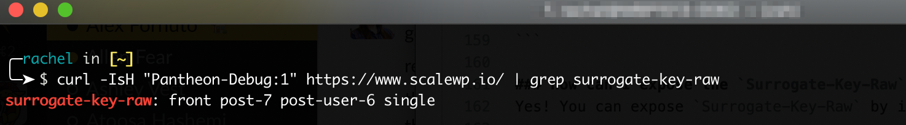

## Global CDN (Fastly-based)

This section provides answers to frequently asked Global CDN questions powered by Fastly.
For information about our next generation GCDN powered by Cloudflare [see the Next Generation GCDN FAQs below](#next-generation-gcdn-cloudflare-based)

### Can I use my current CDN with the Pantheon Global CDN?

Yes, but because it adds additional complexity, we suggest you only do so if you identify a need that the Pantheon Global CDN doesn't address.

To retain your existing CDN, set up a *stacked CDN* configuration. Ensure that you are enforcing HTTPS only at the outer CDN and are assuming HTTPS in the application. Check your CDN for how to redirect all traffic to HTTPS.

While we have some limited documentation for this setup with [Cloudflare](/cloudflare#option-2-use-cloudflares-cdn-stacked-on-top-of-pantheons-global-cdn), this is a largely self-serve practice.

If you need additional features or customization for your CDN, consider our [Advanced Global CDN](/guides/professional-services/advanced-global-cdn) service.

### Is the www-redirector service still available?

No, the www-redirector service is part of the legacy infrastructure. You can choose your primary domain and redirect all traffic to HTTPS by adding [301 redirects](/guides/launch/redirects) to your site's configuration file (`wp-config.php` or `settings.php`).

### Are vanity domains supported?

You can upgrade a site to Global CDN that is using [vanity domains](/guides/domains/vanity-domains), but HTTPS will not be provisioned for the vanity domains. Only custom domains will have HTTPS provisioned.

### Is the CDN configurable?

No, we pre-configured the CDN so you don’t have to hassle with configuration, and we can guarantee performance and uptime. The Global CDN's behavior is the same as our legacy cache which is heavily optimized for Drupal and WordPress sites, and serves billions of pages monthly, except it's globally distributed.

### Do I get access to hit rates or other statistics?

Hit rates are not currently available, but you can measure traffic for the Live environment. For details, see [Metrics in the Site Dashboard](/guides/account-mgmt/traffic).

### Can I use my own Fastly account with the Pantheon Global CDN?

You can, but as mentioned above you should identify a need for adding additional complexity first. If you're using Fastly TLS services with WordPress, you'll want to check for the `HTTP_FASTLY_SSL` header to alloww WordPress to build URLs to your CSS and JS assets correctly. Do this by adding the following to `wp-config.php`:

```php:title=wp-config.php
if (!empty( $_SERVER['HTTP_FASTLY_SSL'])) {
  $_SERVER['HTTPS'] = 'on';
}
```

Review the [Fastly on Pantheon guide](/guides/fastly-pantheon) for more information.

### Can I expose the `Surrogate-Key-Raw` header?

Yes. Expose `Surrogate-Key-Raw` by including `Pantheon-Debug:1` in a curl request, then use `grep` to filter the output. Replace `https://www.example.com/` in the following example:

```bash{promptUser: user}
curl -IsH "Pantheon-Debug:1" https://www.example.com/ | grep surrogate-key-raw
```



To prevent issues with Twitter card validation and to reduce the overall time to load, the `Surrogate-Key-Raw` header is not returned by default. Exposing this header provides context for entities included on a given page.

### How do I switch my site over to HTTPS from HTTP?

To avoid mixed-content browser warnings and excessive redirects, follow the process described in [Switching Sites from HTTP to HTTPS](/http-to-https).

### How do I upgrade my existing Pantheon site?

Make the switch on an existing Pantheon site by updating the DNS for your domains. If your site doesn't have the new combined **Domains/HTTPS** tab, open a support chat to get the upgrade enabled.

### What level of encryption is provided?

High grade TLS 1.3 encryption with up-to-date ciphers. For a deep analysis of the HTTPS configuration on upgraded sites see [this A+ SSL Labs report for https://pantheon.io](https://www.ssllabs.com/ssltest/analyze.html?d=pantheon.io).

### How can I obtain an A+ SSL Labs rating?

Upgrade your site to the Global CDN and then send the [HSTS header](/pantheon-yml/#enforce-https--hsts).

### Can I bring my own certificate?

Yes. See our page on [custom certificates](/custom-certificates) for more information.

But you shouldn't need to buy a custom certificate or worry about renewals in most cases. For example, wildcard certificates aren't necessary to secure communications for multiple domains, because we will automatically deploy certificates for all domains on your site. The certificates provided by Pantheon on the Global CDN provide end-to-end encryption.

Some customers have purchased expensive certificates, often through an upsell from the certificate authority. Unfortunately, an expensive certificate does not mean increased security. If in doubt, we encourage you to test your site with SSL Labs, compare it to this [A+ report](https://www.ssllabs.com/ssltest/analyze.html?d=pantheon.io), and share it with your client.

If bringing your own certificate is a hard requirement, then we recommend terminating HTTPS through a third-party CDN service provider like Cloudflare, CloudFront, StackPath, etc. Configuration differs depending on provider, so please [contact support](/guides/support/contact-support/) to discuss your case.

### Is HTTPS encryption end-to-end?

Yes. HTTPS is terminated at the CDN edge and traffic is encrypted all the way to the individual application container. This is an improvement over our legacy system that terminated all encryption at the load balancer, and a huge upgrade over setups which use a mixed mode strategy of terminating HTTPS at the CDN and then back-ending to the origin over unencrypted clear text communication.

### Will HTTPS be available for my site throughout the upgrade process?

Yes. As long as you are following the Dashboard DNS recommendations before starting the upgrade, you will see no interruption in HTTPS service. The process to provision certificates can take up to an hour, after which you can update DNS records without HTTPS interruption.

Existing sites that are not already hosted on Pantheon can [pre-provision HTTPS](/guides/launch/domains/#avoid-https-interruption) to avoid interruption. If you are unable to prove ownership as described, we recommend a maintenance window.

<Alert title="Note" type="info">

You can pre-provision HTTPS via DNS records, or the Let's Encrypt ACME challenge file. You cannot use the challenge file if:

 - You cannot host the provided verification file on the current site.
 - Your current server doesn't support files without extension names (like IIS with .NET)

Verifying with the provided DNS record is the preferred method for customers who can make new DNS records for their domain(s).

In some cases, such as when the custom domain has an existing third-party CAA, you must manually add the Let's Encrypt CAA.

Let’s Encrypt’s identifying domain name for CAA is letsencrypt.org. For more official information, read Let's Encrypt's [Certification Practice Statement CPS, section 4.2.1.](https://letsencrypt.org/repository/).

This tool can be used to gather more info on how pass the custom domain verification https://letsdebug.net/

If you do not already have HTTPS, you don't need to pre-provision, but doing so will allow you to launch your Pantheon site with HTTPS already enabled, and is recommended.

</Alert>

### How many custom domains are supported?

<Partial file="tables/custom-domains-limit.md" />

### Which browsers and operating systems are supported?

All modern browsers and operating systems are supported. For details, see the **Handshake Simulation** portion of this [report](https://www.ssllabs.com/ssltest/analyze.html?d=pantheon.io).

### How long are Let's Encrypt certificates valid and what happens when they expire?

Let's Encrypt certificates are valid for 90 days and are automatically updated on the platform before they expire.


## Next Generation GCDN (Cloudflare-based)

This section provides answers to frequently asked questions about our Next Generation GCDN powered by Cloudflare.

### How do I know if my site is eligible?

Eligible sites will see a next-generation GCDN banner on the site dashboard. If you don't see the banner, your site may fall into one of the excluded categories (AGCDN, Custom Certificates, or FES). If you aren't sure about your eligibility, please reach out to Pantheon Support.

### Are new sites created on the next-generation GCDN by default?

Not yet. New sites are currently provisioned on the legacy GCDN and receive legacy GCDN IP addresses. The next-generation GCDN will become the default for new sites in a future phase, and a release note will be published when that change happens.

### I have a Custom Certificate. Can I migrate?

Yes. Sites using [customer-provided TLS certificates](/custom-certificates) are supported on GCDN. Migration for these sites is owned by our Professional Services team and coordinated through support — [open a support ticket](/guides/support/contact-support/) to get started.

### I use AGCDN. What should I do?

No action is required. AGCDN has its own migration initiative and timeline. Your current AGCDN configuration continues to work. AGCDN customers are excluded from the current migration phase.

### What is the timeline for AGCDN to be supported?

AGCDN features will be moved to a new self managed AGCDN service beginning late Q2. As feature parity is reached, you will be contacted.

### What changes when I migrate?

Your site's CDN infrastructure is upgraded to the next-generation GCDN. You get bot protection automatically. Caching behavior remains the same, including Pantheon Advanced Page Cache support. You will need to update your DNS records.

### Do I need to change my application code?

No. The migration is transparent to your Drupal or WordPress application. No code changes are required.

### Will my site have downtime during migration?

No. The migration process is designed to avoid downtime. During DNS propagation, traffic may temporarily alternate between the old and new CDN, but your site remains accessible throughout.

### Does the Pantheon Advanced Page Cache module/plugin still work?

Yes. The Drupal module and WordPress plugin for Pantheon Advanced Page Cache work the same way on the new infrastructure. Surrogate-key-based cache clearing is fully supported.

### What is Content Converter?

Content Converter (Markdown for Agents) is a feature enabled on all next-generation GCDN zones. When a request includes the `Accept: text/markdown` header, the CDN converts HTML responses to Markdown in real time. This makes your site's content easier for LLMs and AI agents to consume. Standard browser traffic is not affected.

### My automated integration stopped working after migration. What do I do?

Your bot or automated service may be receiving a managed challenge from bot protection. Check whether the service's user agent is being challenged by reviewing its error logs (look for 403 responses or HTML challenge pages). Contact Pantheon support to request a bot exclusion for your user agent.

### I have Cloudflare in front of my site. Is that supported?

Yes. The new Pantheon GCDN supports Orange-to-Orange (O2O) configurations, allowing you to keep your own Cloudflare zone in front of Pantheon. O2O setup requires the [GCDN Terminus plugin](https://github.com/pantheon-systems/terminus-gcdn-plugin) and a specific DNS record sequence in your Cloudflare zone — see [Using Cloudflare in Front of Pantheon (Orange-to-Orange)](#using-cloudflare-in-front-of-pantheon-orange-to-orange) for the full steps.

For more information on how O2O works, refer to the [SaaS customer documentation](https://developers.cloudflare.com/cloudflare-for-platforms/cloudflare-for-saas/saas-customers/how-it-works/).

### I use a platform vanity domain. Can I migrate?

Yes. Organization-owned [vanity hostnames](/guides/domains/vanity-domains) (e.g., `live-mysite.example-agency.com`) are fully supported. Migration for these sites is owned by our Professional Services team and coordinated through support — [open a support ticket](/guides/support/contact-support/) to get started.

### How are SSL/TLS certificates issued?

SSL/TLS certificates are issued exclusively through DNS TXT record validation. You must add the TXT records provided by the dashboard or the `terminus gcdn:dns` command to your DNS provider. Once the TXT records are verified, your certificate is automatically provisioned. HTTP validation and other certificate issuance methods are not supported at this time.

### My domain hasn't verified yet. What can I do?

The platform re-checks DNS on an automatic backoff schedule that starts at ~60-second intervals and grows to a 4-hour cap. If your TXT records have just propagated, or you stepped away and the next scheduled check is hours out, open the domain on the **Domains** page and use **Force Recheck** in the troubleshooting message. This resets the backoff and triggers an immediate validation attempt. See [Re-running Domain Verification](#re-running-domain-verification) in Setup for details and pre-flight tips.

### How do I report issues or give feedback?

Join the Pantheon Community Slack to share feedback, report issues, or ask questions. You can also contact Pantheon support through the normal channels.

## More Resources

- [Next Generation Global CDN](/guides/global-cdn/next-gen-global-cdn)
- [Custom Certificates](/custom-certificates#option-2-manually-managed-custom-certificates)
- [Bypassing Cache with HTTP Headers](/cache-control)
- [Caching: Advanced Topics](/caching-advanced-topics)