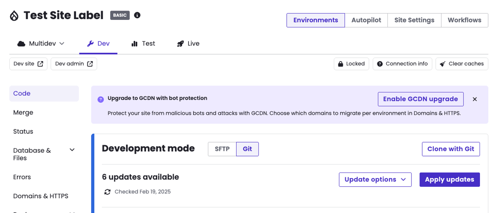

## Setup

<Alert title="Do Not Upgrade Sites That Use AGCDN" type="danger">

The next-generation GCDN is becoming compatible with [Advanced Global CDN (AGCDN)](/guides/agcdn) sites in waves. If your site uses AGCDN, do not start the upgrade from the dashboard or with `terminus gcdn:upgrade` until Pantheon Support or your Account Team confirms your site is compatible. Starting the upgrade automatically moves your site's platform hostnames (`*.pantheonsite.io`) to the next-generation GCDN.

If you've already started the upgrade on an AGCDN site, do not change your DNS records. [Contact Pantheon Support](/guides/support/contact-support/) for next steps.

</Alert>

<Alert title="Important" type="danger">

For the best experience, be prepared to update your DNS records as soon as possible after starting the migration. Delaying DNS migration can result in inconsistent behavior, as your site will remain on the old CDN infrastructure until DNS is pointed to the new GCDN.

</Alert>

<Alert title="Custom Domains Must Not Use CNAMEs to Platform Hostnames" type="danger">

Custom domains that use a CNAME record in their DNS settings that point to a Pantheon platform hostname (for example, `live-yoursite.pantheonsite.io`) are not supported by the next-generation GCDN and will not be supported going forward. Sites configured this way will experience interruptions when migrated.

Before activating the next-generation GCDN, check your custom domain's DNS configuration. It must resolve via A/AAAA records as shown on the site's **Domains** page, not via a CNAME pointed at a `*.pantheonsite.io` hostname. If the **Domains** page shows `Remove this detected record` next to a CNAME, remove it from your DNS provider. See [Custom Domains](/guides/domains/custom-domains) for details.

If your custom domain currently points at a platform hostname via CNAME, contact Pantheon Support before requesting migration.

</Alert>

<TabList>

<Tab title="Pantheon Dashboard" id="dashboard-setup" active={true}>

### Activation

Eligible sites will see a next-generation GCDN banner on the site dashboard in Pantheon.

1. Look for the banner on your site dashboard in Pantheon.
1. Click the banner and follow the guided activation steps.
1. Update your DNS records to point to the new GCDN infrastructure (instructions will be provided in the dashboard).



### Platform Hostnames

After you click upgrade, your platform hostnames (`*.pantheonsite.io`) are automatically migrated to the new GCDN infrastructure. You do not need to take any action for these domains. It is normal to see a few minutes of downtime on platform hostnames while the migration completes.

### Domains and DNS
<Alert title="Domain Verification and Certificate Issuance" type="danger">

**A DNS TXT record is required once to verify domain ownership** — this record can be removed once your domain is active. By default, certificate issuance also uses DNS TXT validation, which lets your certificate be issued before you point DNS to Pantheon, avoiding downtime during cutover. If you'd rather not add that second TXT record, HTTP-01 validation is available through the [GCDN Terminus plugin](https://github.com/pantheon-systems/terminus-gcdn-plugin) (see the **Terminus CLI** tab): once your one domain-ownership TXT record verifies, you just point DNS at Cloudflare and the certificate is issued over HTTP on that hostname. With HTTP-01, the certificate can't be pre-provisioned, so there may be a brief window of downtime during cutover.

</Alert>

After activating the next-generation GCDN through the dashboard, you will need to update your DNS records to point to the new infrastructure.

1. The dashboard will provide a TXT record for domain ownership verification, plus a TXT record for certificate validation. Add both to your DNS provider. **The dashboard flow uses DNS TXT record validation for both steps**, which lets your certificate be issued before you update DNS. If you'd rather skip the second TXT record, HTTP-01 is available as an alternative setup for certificate validation (the domain-ownership TXT record is still required either way) via the Terminus plugin — see the **Terminus CLI** tab.

1. Once domain verification completes and your SSL/TLS certificate has been issued, the dashboard will display the recommended DNS settings (CNAME targets).

1. Update your DNS records with the provided CNAME values at your DNS provider.

- You will receive new CNAME targets pointing to Pantheon's new GCDN infrastructure.
- Set your TTL as low as possible before making changes to minimize propagation delay.
- TLS certificates are automatically provisioned once domain verification completes.

<Alert title="Note" type="info">

DNS changes may take time to propagate depending on your current TTL settings. During propagation, traffic may alternate between the old and new CDN. This is normal and resolves once propagation completes.

</Alert>

### Re-running Domain Verification

If you've added the TXT records and a domain is still pending verification, you can manually trigger a recheck from the dashboard. Open the domain on the **Domains** page; once verification has been attempted, a troubleshooting message appears with a **Force Recheck** action.

The platform retries DNS validation automatically on a backoff schedule:

- The first 10 attempts run roughly every 60 seconds (about 20 minutes total).
- Attempts 10 through 39 stretch from about 4 minutes apart up to 4 hours apart.
- Attempt 40 and beyond stay capped at 4 hours between checks.

**Force Recheck** resets that schedule and triggers an immediate validation attempt. It's useful when you added your TXT records and propagation took a while, or you stepped away during the process and the platform is now deep into the slower part of the backoff — instead of waiting hours for the next scheduled attempt, you can kick off a new check right away.

Before you click:

- Confirm your TXT records have propagated using a DNS lookup tool (for example, `dig TXT _acme-challenge.example.com`).
- ACME TXT challenges are valid for 7–14 days depending on the certificate authority. If yours have expired, regenerate them from the dashboard before forcing a recheck.

</Tab>

<Tab title="Terminus CLI" id="terminus-setup">

<Alert title="Note" type="info">

Before proceeding with Terminus commands, you must first install the GCDN Terminus plugin.

</Alert>

<Alert title="Note" type="info">

DNS-01 TXT record validation is the default method for domain verification and lets your certificate be issued before you update DNS. You will need to add TXT records to your DNS provider to verify domain ownership. If you'd rather not add a second TXT record for the certificate, HTTP-01 is available as an alternative setup — pass `--method=http` to `terminus gcdn:verify` and, once your domain-ownership TXT record verifies, point DNS and the certificate issues over HTTP. With HTTP-01, the certificate can't be pre-provisioned, so there may be brief downtime during cutover.

</Alert>

### Install the plugin

```bash{promptUser: user}
terminus self:plugin:install pantheon-systems/terminus-gcdn-plugin
```

If you have existing custom domains on your site, follow all of the steps below to upgrade and migrate your DNS.

### 1. Upgrade your site to next-generation GCDN

```bash{promptUser: user}
terminus gcdn:upgrade <site>
```

This migrates the site from Fastly to Cloudflare GCDN across all environments. Your platform hostnames (`*.pantheonsite.io`) are automatically migrated as part of this step. It is normal to see a few minutes of downtime on platform hostnames while the migration completes.

### 2. Get your DNS records and TXT verification challenges

```bash{promptUser: user}
terminus gcdn:dns <site>.live
```

This will show the TXT records needed for domain ownership and certificate validation.

### 3. Add TXT records to your DNS provider

Add the TXT records from step 2 to your DNS provider.

### 4. Verify your domains

Wait a few minutes for DNS propagation, then verify each domain. Verification typically takes a few minutes to complete:

```bash{promptUser: user}
terminus gcdn:verify <site>.live example.com
terminus gcdn:verify <site>.live www.example.com
```

Verification uses DNS-01 challenges by default, which lets your certificate be issued before DNS cutover. If you'd rather not add a second TXT record for the certificate, use HTTP-01 instead: once your domain-ownership TXT record verifies, point DNS and the certificate is issued over HTTP. It can't pre-provision the certificate, so there may be brief downtime during cutover. To use it:

```bash{promptUser: user}
terminus gcdn:verify <site>.live example.com --method=http
```

### 5. Update your DNS records

Once verification passes, add the CNAME or A/AAAA records shown in the `gcdn:dns` output to point your domains to the new GCDN edge.

- Set your TTL as low as possible before making changes to minimize propagation delay.
- TLS certificates are automatically provisioned once domain verification completes.

<Alert title="Note" type="info">

DNS changes may take time to propagate depending on your current TTL settings. During propagation, traffic may alternate between the old and new CDN. This is normal and resolves once propagation completes.

</Alert>

### Full workflow example

```bash{promptUser: user}
terminus gcdn:upgrade my-site
terminus gcdn:dns my-site.live
# Add TXT records to your DNS provider, wait a few minutes, then verify:
terminus gcdn:verify my-site.live example.com
terminus gcdn:verify my-site.live www.example.com
# Once verified, add the CNAME or A/AAAA records from gcdn:dns output
```

</Tab>

</TabList>

## Using Cloudflare in Front of Pantheon (Orange-to-Orange)

If your domain is already proxied through your own Cloudflare zone (orange-clouded), the next-generation GCDN supports Cloudflare's [Orange-to-Orange (O2O)](https://developers.cloudflare.com/cloudflare-for-platforms/cloudflare-for-saas/saas-customers/how-it-works/) configuration, which keeps your Cloudflare zone in front of Pantheon's GCDN. See [Migrate a Cloudflare-Proxied Domain (O2O)](/guides/nextgen-gcdn/o2o) for the full walkthrough.

## Using a Third-Party CDN in Front of Pantheon

You can place a third-party CDN or reverse proxy in front of the next-generation GCDN, with one hard requirement: on every request it sends to Pantheon, the fronting service must present a TLS Server Name Indication (SNI) value that matches the HTTP `Host` header.

The next-generation GCDN routes and validates custom domains using the SNI value in the TLS handshake. Requests whose SNI does not match the `Host` header are rejected at the edge with a `403` response before they reach your site. This is intentional security behavior that prevents [domain fronting](https://en.wikipedia.org/wiki/Domain_fronting), and it cannot be disabled for individual domains.

When configuring your CDN, for each custom domain:

- Add the domain to your Pantheon environment and complete [domain verification](#domains-and-dns) so a certificate is provisioned.
- Set the CDN's origin address to the GCDN edge hostname shown in your dashboard DNS values (the `fe.` CNAME target).
- Set both the origin `Host` header and the outbound TLS SNI to the custom domain itself (for example, `www.example.com`), not the `fe.` edge hostname.

If your CDN cannot set the outbound SNI independently of the configured origin hostname, it cannot be used in front of the next-generation GCDN. Azure Front Door currently has this limitation (see [Known Limitations](#known-limitations)).

If the service in front of Pantheon is your own Cloudflare zone, use the [Orange-to-Orange configuration](/guides/nextgen-gcdn/o2o) instead.
