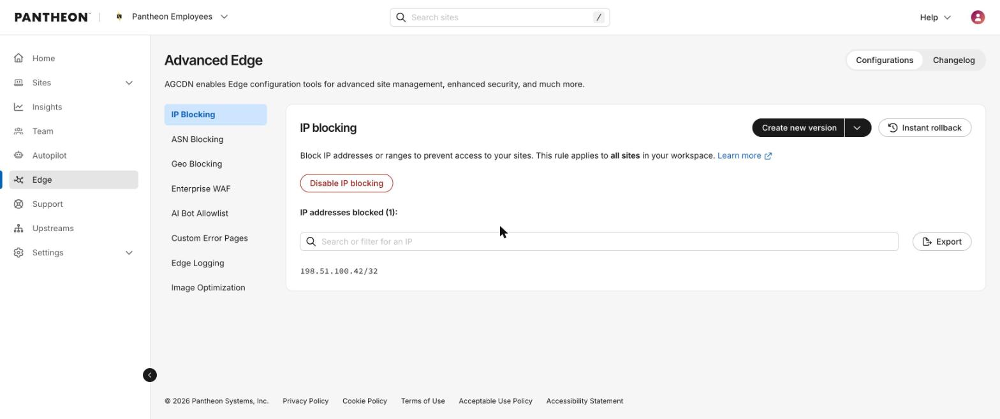
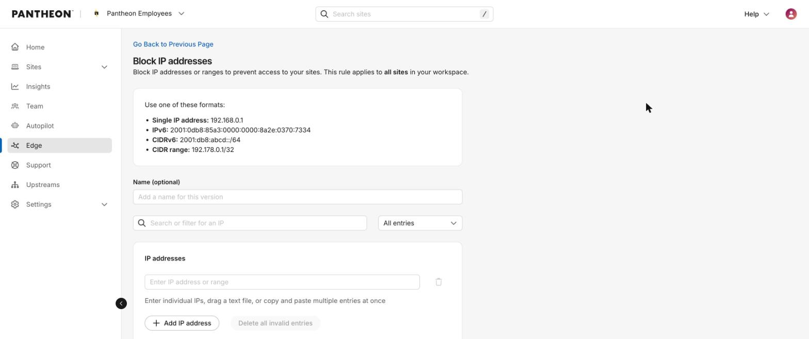
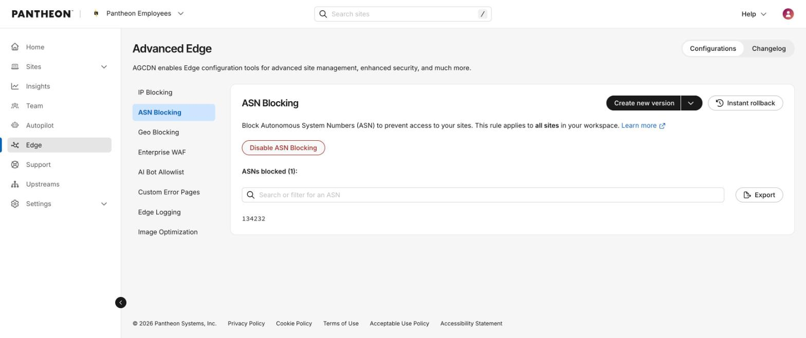
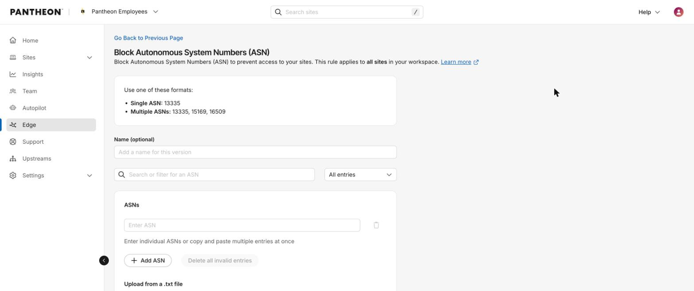
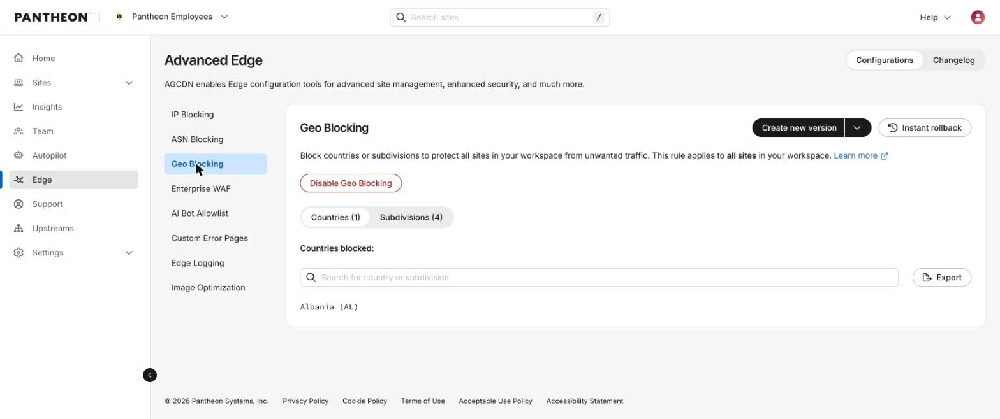
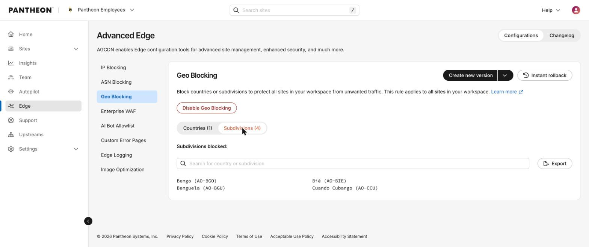
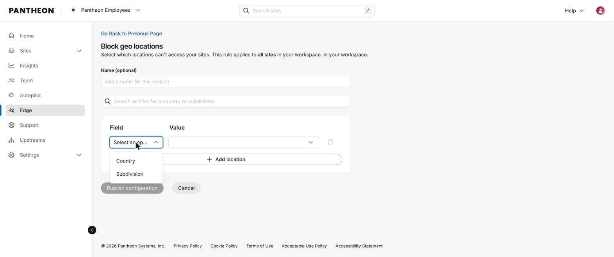

## What is Advanced Edge? 
The Advanced Edge (formerly [Advanced Global CDN](/guides/agcdn)) is a set of workspace-level and YAML/site level edge configuration tools, under the Edge tab in the dashboard, that let customers self-serve CDN-layer changes that previously required a support ticket. 

It currently includes: 
* [IP Blocking](#ip-blocking)
* [ASN Blocking](#asn-blocking)
* [Geo Blocking](#geo-blocking) 

The following features are planned to be added in the future, amongst other features:
* Enterprise WAF
* AI Bot Allowlist, 
* Custom Error Pages
* Edge Logging
* Image Optimization 

### How blocking rules work

* **What a blocked visitor sees**: A blocked request receives an HTTP 403 response. By default the body is the plain text “Forbidden.” If the workspace has a Custom Error Pages configuration for status 403, that custom page is served instead, but only to browser-type requests; API and non-browser clients always receive the plain “Forbidden” response.
* **How long it takes to go live**: A newly published version can take up to 5 minutes to reach all edge locations.
* **Who can publish**: Any workspace member can view these pages. Publishing a new version requires the workspace Admin role.
* **Changelog**: Every publish is recorded on the Changelog tab, next to Configurations, with who published it and when. It is an audit log, not a diff; it does not show which entries were added or removed.

## IP Blocking 
Block specific IP addresses or CIDR ranges from accessing any site in your workspace. This is a workspace-level rule — once published, it applies to every site in the workspace, not a single site.

### Where to find it
Dashboard nav: **Edge** > **IP Blocking**.

URL pattern: `/workspace/{workspaceId}/edge-agcdn/configurations/ip-blocking` 

### How to add IP addresses
1. Click **Create new version**.
1. Optionally name the version (max 255 characters).
1. Enter IPs three ways: type individually via “Add IP address”, paste multiple at once (auto-splits into rows), or drag/upload a .txt file (one entry per line).
1. Accepted formats:

   * Single IP address: 192.168.0.1
   * IPv6: 2001:0db8:85a3:0000:0000:8a2e:0370:7334
   * CIDRv6: 2001:db8:abcd::/64
   * CIDR range: 192.178.0.1/32
1. Duplicate entries are flagged inline as row errors before publishing — they are not silently merged.
1. Click **Publish configuration** — this creates a new immutable version, it does not edit the active version in place.

   

### Limits
Maximum 10,000 entries per version.

### Rolling back
**Instant rollback** restores the previous published version automatically (a true rollback endpoint, not a manual re-entry). Confirmation copy: “You’re about to restore your IP blocking to the last saved configuration. Changes may take a few minutes to become active.” **Disable IP blocking** turns the rule off without discarding its configured entries; re-enabling restores the last published version.

### Scope
Applies to all sites in the workspace — cannot be scoped to a single site from this page.

## ASN Blocking
Block traffic from entire Autonomous Systems (e.g. a hosting provider or ISP associated with abusive traffic) across every site in the workspace.

### Where to find it
Dashboard nav: **Edge** > **ASN Blocking**.

URL pattern: `/workspace/{workspaceId}/edge-agcdn/configurations/asn-blocking` 

### How to add ASNs

1. Click Create new version.
1. Optional name (max 255 characters).
1. Enter ASNs: single (13335), multiple comma-separated (13335, 15169, 16509), or AS-prefixed form (AS15169, case-insensitive); paste or .txt upload supported same as IP blocking.
1. Valid range: 1–4,294,967,295 (32-bit). 
1. Publish creates a new immutable version.

### Limits
10,000 entries per version.
### Rolling back
Same instant-rollback mechanism as IP Blocking. For details, see [this section above](#rolling-back).
### Scope
Applies to all sites in the workspace.

## Geo Blocking
Block traffic by country or by sub-country region (state/province), across every site in the workspace.

### Where to find it
Dashboard nav: **Edge** > **Geo Blocking**. 

URL: `/workspace/{workspaceId}/edge-agcdn/configurations/geo-blocking`. 

Two independent lists live on this page, switchable by tab: Countries and Subdivisions.

### How to add locations
1. Click **Create new version**.
1. Optional name (max 255 characters).
1. Unlike IP/ASN blocking, there’s no free-text or bulk-paste entry — use the combobox: set “Field” to Country or Subdivision, then choose the value from the dropdown (the subdivision picker requires choosing a country first).
1. Format under the hood: ISO 3166-1 alpha-2 country codes (e.g. RU) and/or ISO 3166-2 subdivision codes (e.g. UA-43).
1. Click **Add location** to add more rows before publishing.
1. The publish confirmation groups changes into collapsible “Countries (n)” / “Subdivisions (n)” panels for review.

### Limits
Maximum 8,192 entries per version — lower than IP/ASN blocking’s 10,000 ceiling.

### Rolling back
Same instant-rollback pattern as the other two features. For details, see [this section above](#rolling-back).

### Scope
Applies to all sites in the workspace.
