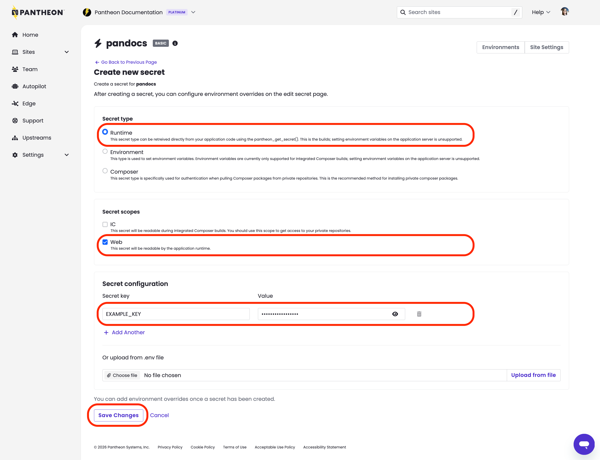
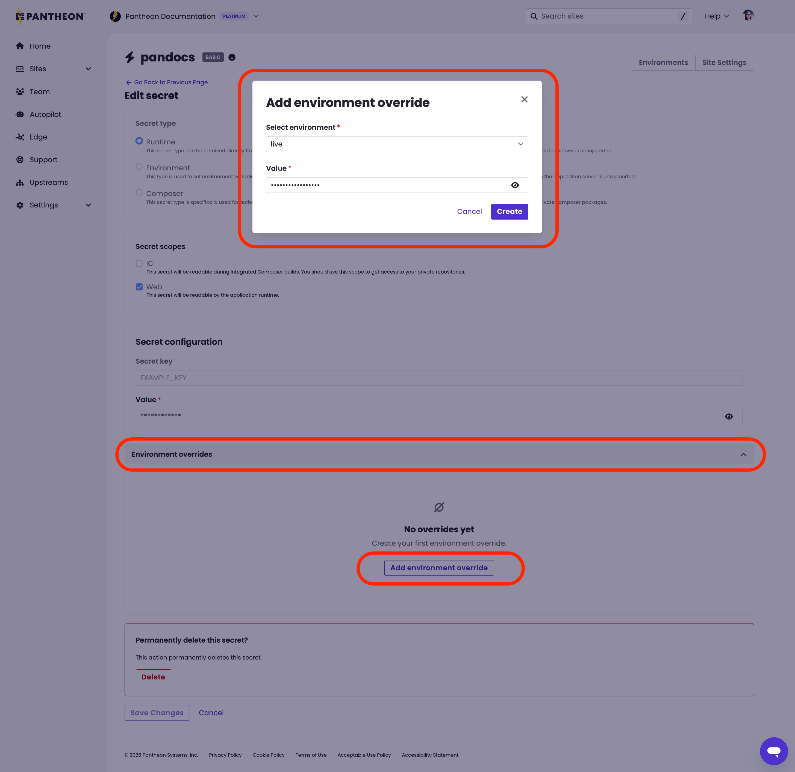

## Before you begin
1. Determine what [owning entity](/guides/secrets/overview#owning-entity) is appropriate for the given secret (site vs org).
    * Only site-level secrets can be managed via the dashboard interface, setting organization-level secrets is only supported [via the command-line](#from-the-command-line).
1. Determine the [secret type](/guides/secrets/overview#secret-type) and [secret scope](/guides/secrets/overview#secret-scope) required for your given scenario:
   * For example, setting an API key for third-party email integration should use the `runtime` type and `web` scope. 
1. Consider whether your scenario requies different values based on the given environment.
   * For example, if you want to use different accounts on live and non-live environments for your site's third party email integration.
     * If yes, first create the secret with your non-live API key and then [add an environment override for that new secret](#add-environment-override) to change the API key for the live environment.

## Create new secret
### From the dashboard

<Alert type="info" title="Note">

Only [site-owned secrets](/guides/secrets/overview#site-owned-secrets) can be managed via the Dashboard interface. Creating and managing [organization-owned secrets](/guides/secrets/overview#organization-owned-secrets) must be done [from the command-line](#from-the-command-line).

</Alert>

1. [Go to the Site Dashboard](/guides/account-mgmt/workspace-sites-teams/sites#site-dashboard) and click **Site Settings**.
1. Click into the **Secrets** tab then click **+ Create new secret**.
1. Select the appropriate `type` and `scope` based on your given scenario, then enter your key name and value.   
   

    <Alert type="info" title="Note">

    You can create one or more secrets at a time via the dashboard interface. After entering your first key/value pairs, click **+ Add another** if you have additional secrets to set.

    Additionally, Developers managing environment variables for Next.js sites through `.env` files can add those variables in bulk when creating secrets.

    </Alert>

1. Click **Save Changes**.

### From the command-line
1. [Install](/terminus/install#installation-and-update-methods) and authenticate [Terminus](/terminus/install#authentication) if you have not done so already. 
1. Install the [Terminus Secrets Manager Plugin](https://github.com/pantheon-systems/terminus-secrets-manager-plugin#installation).
1. Run the following command to set EITHER a [site-wide secret](/guides/secrets/overview#site-owned-secrets) (replace `<site>` `<secret_name>` `<secret_value>` `<secret_type>` and `<secret_scope>`):
    
   ```bash{promptUser: user}
   terminus secret:site:set <site> <secret_name> <secret_value> --type=<secret_type> --scope=<secret_scope>
   ```
   
     * OR set an [organization-wide secret](/guides/secrets/overview#organization-owned-secrets) (replace `<org>` `<secret_name>` `<secret_value>` `<secret_type>` and `<secret_scope>`):  

      
       ```bash{promptUser: user}
       terminus secret:org:set <org> <secret_name> <secret_value> --type=<secret_type> --scope=<secret_scope>
       ```

## Add environment override
Environment overrides are used for scenarios that require different values for a single key based on the given environment detected. Best practice usage is to set the non-production value first as the default during key creation, and then edit the new key by adding an environment override for live. 

### From the dashboard
1. [Create the key using a default value first](#from-the-dashboard) if you have not done so already. 
1. [Go to the Site Dashboard](/guides/account-mgmt/workspace-sites-teams/sites#site-dashboard) and click **Site Settings**.
1. Click into the **Secrets** tab then click **Edit secret**.
1. Open the **Environment overrides** dropdown and click **Add environment override**. 
1. Select which environment this override should apply to, then enter the value and click **Create**:
   

### From the command-line
1. [Create the key using a default value first](#from-the-command-line) if you have not done so already. 
1. Run the following to set an environment override (replace `<site>` `<env>` `<secret_name>` and `<secret_value>`):
  
   ```bash{promptUser: user}
   terminus secret:site:set <site>.<env> <secret_name> <secret_value>
   ```

## Next Steps
This feature works with WordPress, Drupal, and Next.js sites hosted on Pantheon. After secret creation, your application will require additional configuration to make use of these key/value pairs. See the following documentaiton for usage based on your site framework: 
* [WordPress - reading secrets from PHP](/guides/secrets/php)
* [Drupal - using the Key module](/guides/secrets/drupal)

