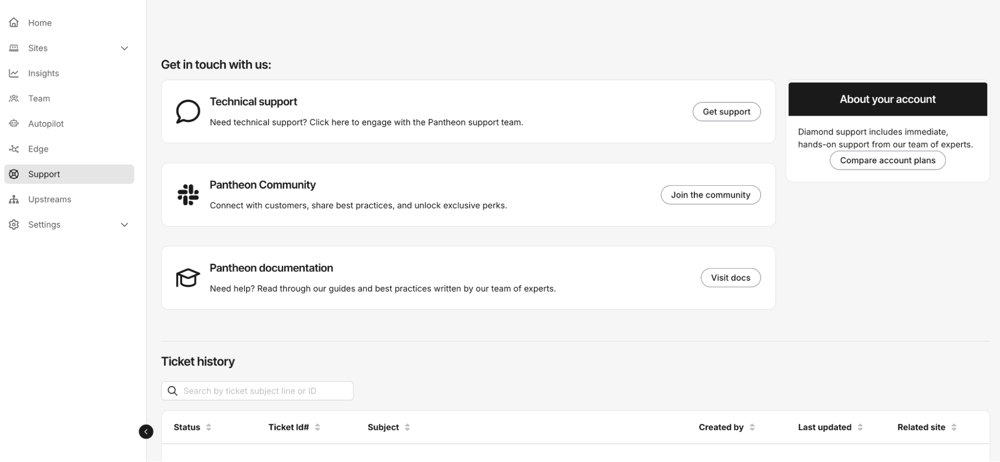

This section provides information on how to open a support ticket as well as other ways to contact support.

<Alert title="Note" type="info" >

We recommend you begin your Support journey from the affected [My Dashboard](/guides/account-mgmt/workspace-sites-teams/workspaces#switch-between-workspaces), [Professional Workspace](/guides/account-mgmt/workspace-sites-teams/workspaces#switch-between-workspaces), or [Site Dashboard](/guides/account-mgmt/workspace-sites-teams/sites#site-dashboard). This ensures that the appropriate Support options are available to you, and simplifies the process of contacting us.

</Alert>

#### Provide a detailed description
For every method of contacting Pantheon Support documented on this page, please prepare and include a **detailed description** for the issue you're experiencing, such as:
- Steps to reproduce the issue (including URLs or paths to files).
- Environments affected (Multidev/Dev/Test/Live), if applicable.
- When the issue began.
- Error messages received, if applicable.
- Links to screenshots or screencasts of the behavior, if necessary.

## General support ticket

The ticket support feature is available to certain Account packages and account types. Tickets are associated with the site from which the ticket is opened. Please be sure that if you maintain several sites, that you open the ticket from the correct site's dashboard.

1. [Go to the workspace](/guides/account-mgmt/workspace-sites-teams/workspaces#switch-between-workspaces).

1. Go to the **Support** tab, then select **Get support**.

1. Enter a subject (summary of your issue).

1. Explain to the agent your issue and it will classify and route the request appropriately. 

After a ticket is submitted, you can view details for your support requests. Support tickets are visible to all members except [Contributors](/guides/account-mgmt/workspace-sites-teams/teams#workspace-level-permissions).

## Call Us
**Diamond** and **Platinum** customers can call the 24/7 Premium Support Hotline for any technical issues, escalations, site, billing, or overages queries. You can find the phone number in the Support tab of your workspace.
