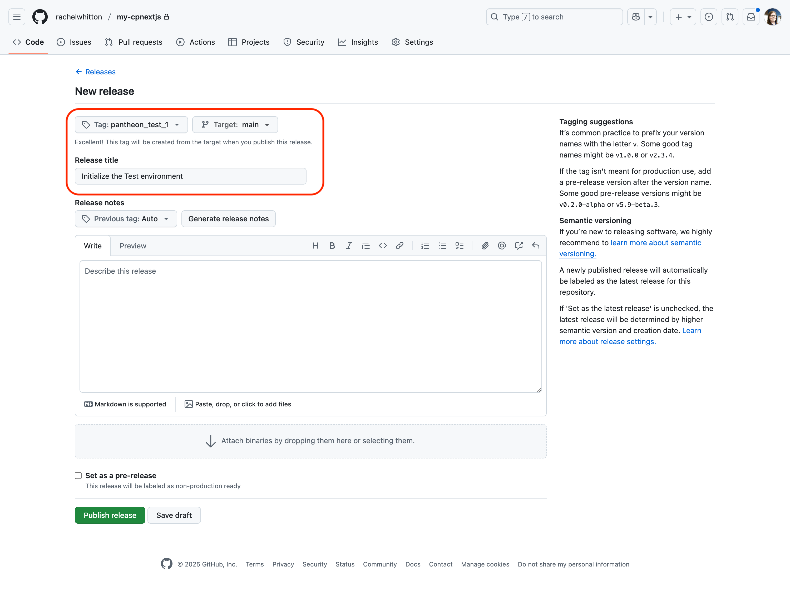

<Partial file="nextjs-pre-ga.md" />

By default, all sites on Pantheon have at least three environments: Dev, Test, and Live. Additionally, Multidev workflows correspond to separate branches or pull requests.
These environments generate unique subdomains in the pattern of `<environment>-<site_machine_name>.pantheonsite.io`.

Sites on paid plans can connect custom domain names to any of these environments, though custom domains are most commonly connected to the Live environment.

## Deploying to Test and Live environments through Git tags

The Test and Live environments are special in that they only receive code changes via Git tags.
Deployments to these environments follow a simple pattern in which integers are incremented for each new deployment. For example deployments to Test can be triggered by tags like

```bash{promptUser: user}
pantheon_test_1
pantheon_test_2
pantheon_test_3
```

Similarly, deployments to Live can be triggered by tags like

```bash{promptUser: user}
pantheon_live_1
pantheon_live_2
pantheon_live_3
```

For sites running Drupal and WordPress, these tags are create automatically when triggering a deploment in the dashboard or via Terminus.

Presently, for Next.js sites, deployments to Test and Live must be triggered by Git tags in the connected GitHub repository.

These tags can be created in a few ways including:

* [Directly via Git on your local machine](#manual-deployment-to-test-and-live)
* [Via GitHub's Releases interface](#manual-creation-via-githubs-releases-interface)
* [Via GitHub Actions](#automating-tagging-via-github-actions)

On Drupal and WordPress sites, the extra Dev and Test environments separating a code in a Multidev from being deployed to Live are valuable for extra testing.
For such sites, the cost of breaking the Live database is high because it may require database restores and content loss in addition to code fixes.

On Next.js sites which may only be displaying data sourced from a headless CMS or Content Publisher, the remediation for deploying broken code to Live is often as simple as pushing a fix to the repository and triggering a new deployment.

Depending on your team's workflow and preferences, you may choose to manually deploy the Test and then to Live, or you may choose to automate deployments to Dev, Test, and Live all at once via GitHub Actions or another CI/CD tool.

### Manual Deployment to Test and Live

To manually deploy to Test or Live, create a Git tag in your local clone of the repository connected to your Pantheon site.
For example, to deploy to Test, you might run

```bash{promptUser: user}
git tag pantheon_test_1 -a -m "Deploying to Test"
git push origin --tags
```

After this tag is pushed to GitHub, Pantheon will detect the new tag and begin building and deploying the code to the Test environment.
The progress of the build and deployment can be monitored via Terminus:

```bash{promptUser: user}
terminus node:logs:build:list my-site-machine-name.test
```

This tactic requires knowing what the next integer tag should be.
To find the latest tag, you can use

```bash{promptUser: user}
git tag --list 'pantheon_live_*' --sort=v:refname | tail -1
```

### Manual creation via GitHub's Releases interface

The manual creation of a tag can also be done via GitHub's Releases interface.

This screenshot shows a new tag named `pantheon_test_1` being created from the `main` branch. For more details, see [related GitHub documentation](https://docs.github.com/en/repositories/releasing-projects-on-github/managing-releases-in-a-repository)



### Automating tagging via GitHub Actions

If you wish to automate deployments to Test and Live, you can use GitHub Actions or another CI/CD tool to create the necessary tags.

Here is an example repository that uses GitHub Actions to automate deployments to Live by running [a workflow on pushes to the `main` branch](https://github.com/stevector/office-artifacts/blob/345a870642fba423e9360482fb7f716c87f79533/.github/workflows/auto-tag.yml) that invokes a [locally defined (but reusable) Action](https://github.com/stevector/office-artifacts/blob/345a870642fba423e9360482fb7f716c87f79533/.github/actions/pantheon-auto-tag/action.yml) to create the necessary Git tag.

If you have input on what guidance we should provide for using GitHub Actions to automate deployments to Test and Live, please share your thoughts in [this issue](https://github.com/pantheon-systems/documentation/issues/9725).

## Connecting a custom domain name

In practice, what makes a Live environment different from Dev or Multidev environments is that only the Live environment is likely to have a custom domain name connected to it.
The custom domain name is what your end users will use to access your site.
Platform domains, those ending in `pantheonsite.io`, are typically only used by members of the web team for testing and development purposes.

To connect a custom domain name to your Live environment, follow the instructions in [Connecting a Custom Domain Name](/nextjs/connecting-custom-domain-name).
