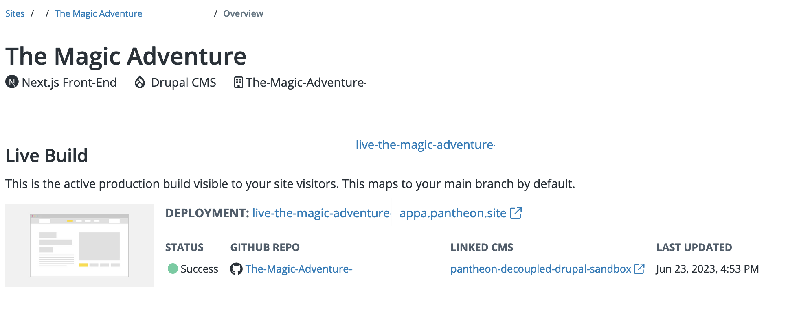
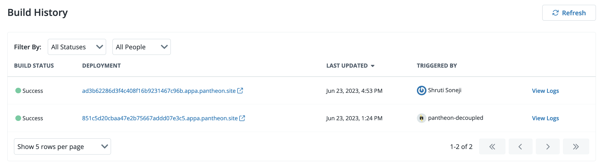

This section provides information on how to view your build and related information, how to trigger a new build manually in the Overview page, how to trigger a build with GitHub merges, build information on Multidev branch builds, and information on pull request builds.

## Build Information

You can view build information on your Front-End Site development and specifications. Build information is provided in the Overview page in four sections:

- Live Build
- Build History
- Multidev Branches
- Pull Requests

Build history includes:

- **Status:** The build’s latest status. Possible status values are:
    - `In Progress`
    - `Success`
    - `Failed`
    - `Queued`

- **Build:** The build number and reference ID.
- **Branch:** The name of the latest GitHub branch.
- **Deployment:** The URL to the environment that the build was deployed to.
- **Last Updated:** The date the site content was last modified.
- **Triggered by:** The name of the user who deployed the site build.

### View Live Build

The Live build shows the active production build visible to your users.

1. [Go to the Site Dashboard](/guides/account-mgmt/workspace-sites-teams/sites#site-dashboard) and then select the **Sites** page.

1. Click the **Front-End Sites** tab and select the site you want to view the Live build for. The Overview page displays with the Live Build section at the top.

    


### View Build History and Build Details

The Build History section provides a brief overview of the build history for your site. Each build entry has a View Logs button that opens the Build Details page where you can find more granular details about each build.

1. [Go to the Site Dashboard](/guides/account-mgmt/workspace-sites-teams/sites#site-dashboard) and then select the **Sites** page.

1. Click the **Front-End Sites** tab and select the site you want to view the build history or details for.

1. Navigate to the **Build History** section and then click **View Logs** for the site build you want to review details for. The Build Details page displays.

    

1. Click the drop-down menus under **Build Log**, click the **Download** button, or click the **Copy to Clipboard** button as desired.

### View Build Deployments

Each successful build has a link with for a deployment preview. You can follow the link to review specific changes pushed to the site.

1. [Go to the Site Dashboard](/guides/account-mgmt/workspace-sites-teams/sites#site-dashboard) and then select the **Sites** page.

1. Click the **Front-End Sites** tab and select the site you want to view the build deployment for.

1. Navigate to the **Build History** section and then click the link in the **deployment** column for the site build you want to review the deployment for.

    


## Trigger a Build

You can trigger builds manually in the dashboard or automatically when you merge GitHub changes. You cannot trigger a build from a [linked CMS](/guides/decoupled/overview/manage-settings#cms-settings).

### Trigger a Build in the Dashboard

You can save time by quickly triggering a build from your Overview page.

1. Log in to your Front-End Site workspace and select the **Sites** page.

1. Click the **Front-End Sites** tab and select the site you want to trigger a build for.

1. Click the **Trigger Build** button in the top left corner.

### Trigger a Build with GitHub Merges

A build and deploy process is automatically triggered when you
push code to the default branch of your repository or merge a pull
request to that branch.

You can follow the steps below to observe the build and deployment process in real time. Note that the steps below assume that you have already cloned your Front-End Site repository from GitHub to your local.

1. Check out the `main` branch of your repository.

    ```bash{promptUser: user}
    git checkout main
    ```

1. Make a change to a file in your repository.

1. Add and commit the change to the `main` branch.

    ```bash{promptUser: user}
    git add .
    git commit -m <message>
    ```

1. Push the new commit.

    ```bash{promptUser: user}
    git push
    ```

1. Open your Site Dashboard, navigate to the **Overview** page and locate the **Live Build** section to observe the new build in progress.

## Multidev Branch Builds

Refer to [Multidev Workflow and Configuration](/guides/decoupled/overview/fes-multidev) for information on Multidev Branch Builds.

## Build Hooks

Refer to [WordPress Build Hooks](/guides/decoupled/wp-backend-starters/build-hooks) or [Drupal Build Hooks](/guides/decoupled/drupal-backend-starters/build-hooks) if you are interested in triggering builds in one or more Front-End Sites projects when content is created, updated, or deleted.