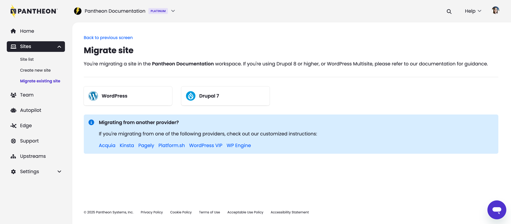
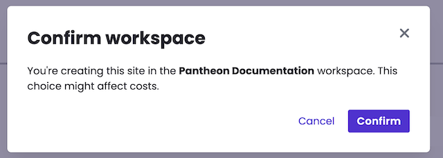
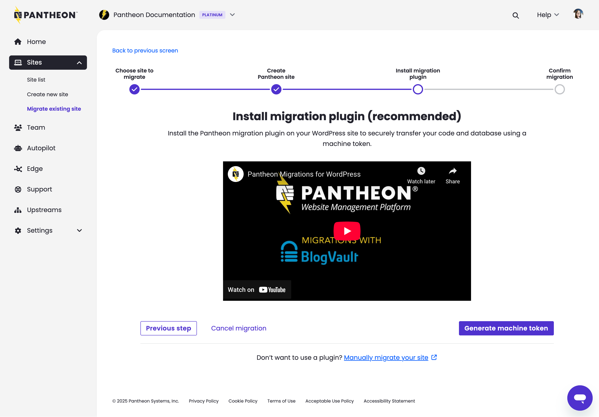
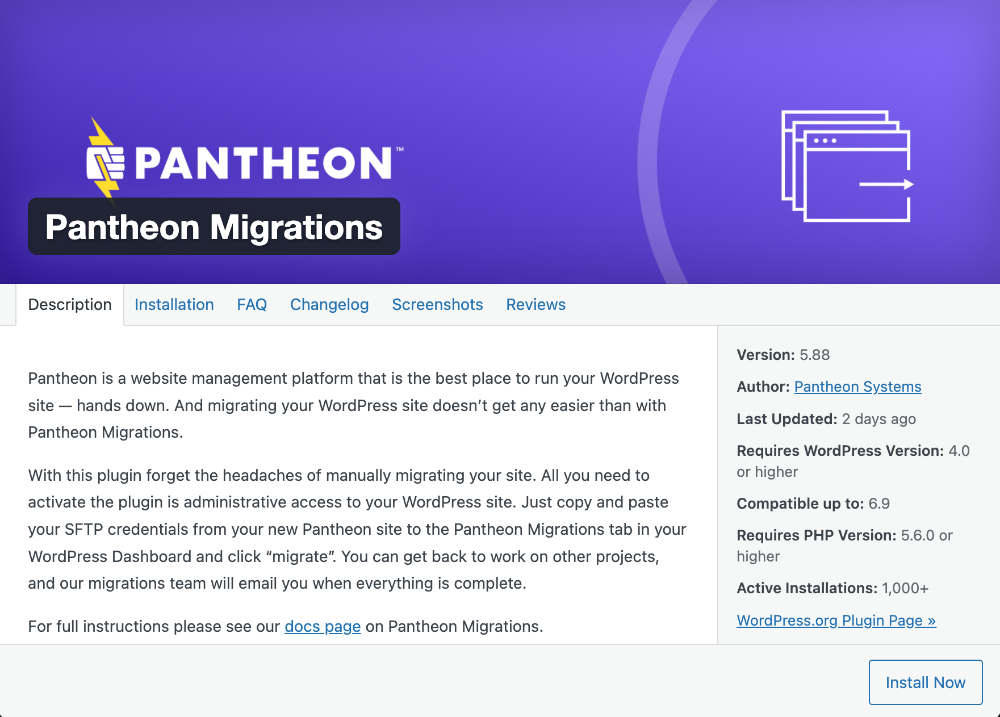
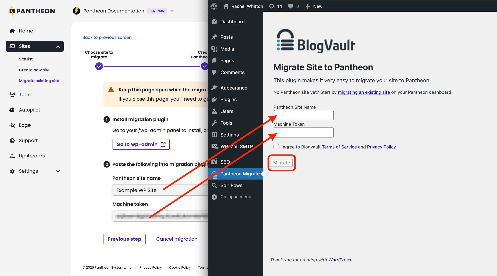

The recommended way to migrate WordPress sites from another host is to use the [Pantheon Migration](https://wordpress.org/plugins/bv-pantheon-migration/) plugin, developed by [BlogVault](https://blogvault.net/).

<Accordion title="Watch: Guided WordPress Migrations" id="wp-video" icon="facetime-video">

<Youtube src="ksg1XkH1da8" title="Guided WordPress Migrations" />

</Accordion>

1. Open your Personal or Professional Workspace dashboard and select the **Migrate Existing Site** button on the lower right side of the page:

   

1. Select **WordPress**:

   

   Then enter your existing production URL for the site you want to migrate (e.g., `example.com`) and click **Continue**:
   
   
   
1. Enter the name of your new Pantheon site, select a workspace for the site (optional), and click **Create Site**:
   
   
   
   When a workspace is selected, you will be prompted to confirm your selection. Review your selection and when ready click **Confirm** in the popup to continue: 

   
   
1. Click **Generate Machine Token** and re-authenticate if prompted:

   

   Copy the token to your clipboard now or in the following step. Click the **Continue to Migration** button.

1. Click **Go to wp-admin**, and a new tab will open for your WordPress admin dashboard. Do not close the Pantheon Site Dashboard tab in your browser.
   
   

1. Log into your existing site as an admin, the button from the above step sends you directly to our plugin page. Click **Install Now**, then click **Activate**.
   
   

1. Copy and paste your machine token and site name from the Pantheon Site Dashboard into the plugin form: 
   
   

   You will see a new page where BlogVault validates the information provided (site name and token), then updates once the migration is in progress and updates once again when completed. You'll also receive an email upon migration completion.
   
   

1. Go back to the Pantheon tab and click **Confirm migration progress**.  Your site's dashboard appears.

<Alert title="Note" type="info">

The [WordPress Native PHP Sessions](https://wordpress.org/plugins/wp-native-php-sessions) plugin is automatically installed during the migration process. For more details on this plugin, see [WordPress and PHP Sessions](/guides/php/wordpress-sessions).

</Alert>
