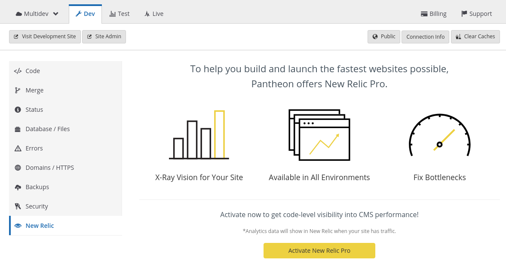

1. Select the <Icon icon="eye" /> **New Relic** tab on your Site Dashboard, and then click **Activate New Relic Pro**:

  

   It may take several moments for the activation to complete.

1. Visit your site in the browser and make some un-cached requests to generate data in New Relic&reg;. It will take a few minutes for your information to become available in New Relic.
