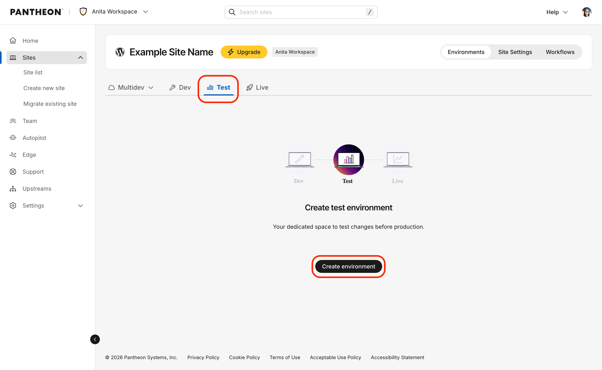

To create your Test environment:

1. [Go to the Site Dashboard](/guides/account-mgmt/workspace-sites-teams/sites#site-dashboard).
1. Click the <Icon icon="equalizer" text="Test"/> tab, then click **Create environment** to create your Test environment.

   

   This takes a few moments.
