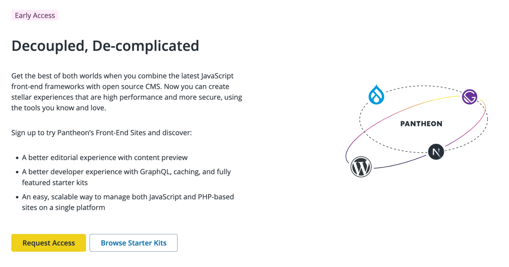

We released version 1.0.5 of the [WP Decoupled Preview plugin](https://wordpress.org/plugins/decoupled-preview/) which contains a bug fix specific to WordPress 6.3. WP Decoupled Preview enables content editors to see their changes in the context of a front-end framework (served through [Pantheon's Front-End Sites](/guides/decoupled/overview)) like Next.js. To try this functionality, request access to Front-End Sites and [follow our tutorial for spinning up our WordPress + Next.js starter](/guides/decoupled/wp-nextjs-frontend-starters).

Can you tell we want more teams to sign up for Front-End Sites? If you don't yet have access, as of the last month you'll now see callouts in the site creation flow that lead to Front-End Sites Access:

Thanks to efforts in the last month, once you spin up new codebases in Front-End Sites, you will also find:
- Newly improved readme files in your fresh projects.
- Health checks that fire early in the build process if your Front-End Site may be likely to fail due to missing variables for a back-end CMS
- A better navigation and search functionality for [the Decoupled Kit project documentation](https://decoupledkit.pantheon.io/docs).

Want to chat more about these kinds of sites? Join the [#front-end-frameworks](https://pantheon-community.slack.com/archives/C01DXGMFZFB) Slack Channel.
