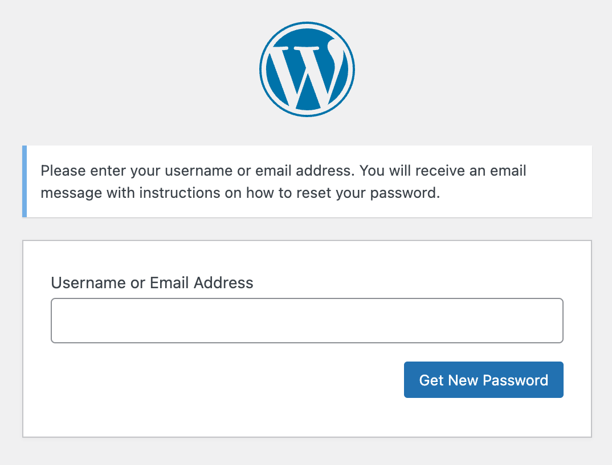

Beginning this week, Pantheon will start transitioning individual WordPress and Drupal sites to use Sendgrid's API for the delivery of outgoing email initiated by these CMSes. We expect all sites to be fully transitioned by May 31, 2024. This change is happening at the platform level, not within the CMS code or configuration, and therefore requires no action by customers. 

## Reason for transition
The transition aims to enhance the reliability and deliverability of transactional emails. Historically, Pantheon has relied on a local MTA (postfix) to send these messages, which has led to common issues such as emails being categorized as spam or failing to deliver. By switching to SendGrid's API, we aim to reduce these issues and enhance the overall email delivery experience for our customers.

WordPress and Drupal core can trigger transactional emails for actions such as "Forgot Password", which allows users to reset their password after receiving an email.

For teams for whom the delivery of such transactional emails is critical to operation, we have recommended using third-party services and continue to do so even as we enhance the reliability of our platform-level emails with this switch to SendGrid.

This change should not be noticeable by most customers aside from the increased reliability of emails initiated by WordPress and Drupal.
