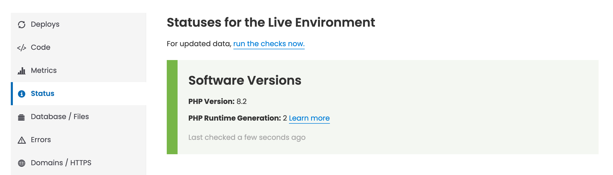

**PHP Runtime Generation** is now reported for each environment by the Site Dashboard under the Status tab in the **Software Versions** block.

This new data point provides immediate, at-a-glance confirmation of your site's underlying PHP configuration, making it simpler to track your stack and prepare for platform updates.

Alternatively, you may use the `terminus env:info <site>.<env>` command using [Terminus](/terminus) 4.0.2+ to see the current PHP Runtime Generation.

To understand what PHP Runtime Generation means for your site and learn more about the rollout timeline, see [related documentation](/php-runtime-generation-2).