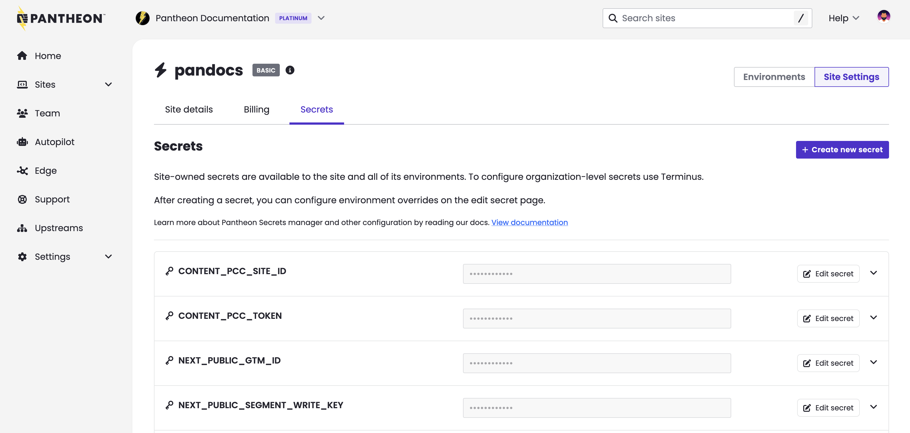

Teams using [Pantheon's Secrets Manager](/guides/secrets) to set variables like API tokens can now do so through the site dashboard. Previously this feature only had a command line user interface through [a Terminus plugin](https://github.com/pantheon-systems/terminus-secrets-manager-plugin). Secrets Manager works with WordPress, Drupal, and Next.js sites hosted on Pantheon. It does not work with [the sunsetting Front-End Sites product](https://docs.pantheon.io/release-notes/2025/11/nextjs-private-beta).

Secrets Managers encrypts values at rest and then makes them available to your application's code as it runs. Secrets Manager is suitable for setting variables that are truly sensitive like a password, token, or key that allows Next.js to read from a back-end CMS as well as variables that might not be sensitive like a Google Tag Manager ID.

## What's new? 
* Create new site-level secrets from the site dashboard
* Create new site-level secrets **in bulk** from the site dashboard by either: 
  * manually adding multiple keys at once of the same type and scope
  * or importing secrets from `.env` files (e.g., Next.js sites)
* Manage existing site-level secrets from the site dashboard:
  * Edit default secret value and/or secret scope
  * Add/edit/delete environment overrides 

For details, see [related documentation](/guides/secrets/create).

  